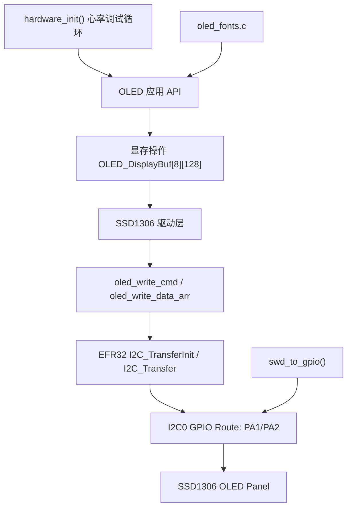
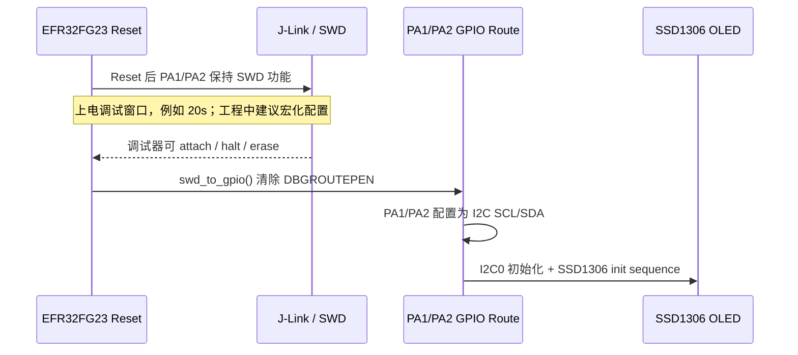
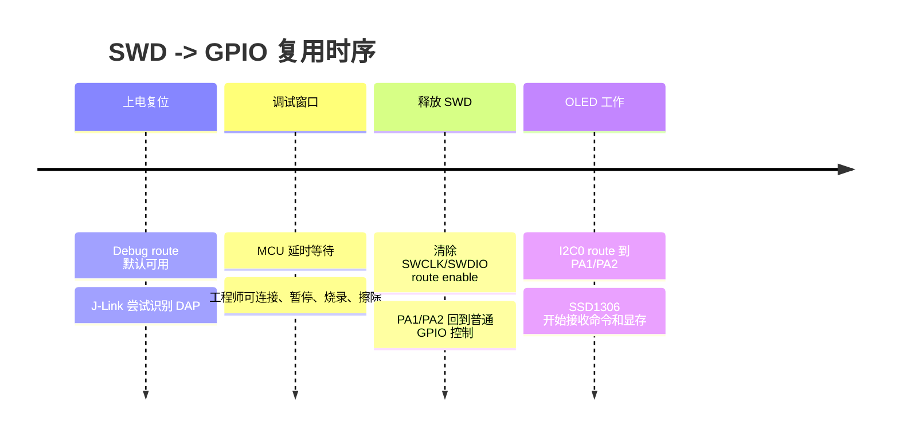
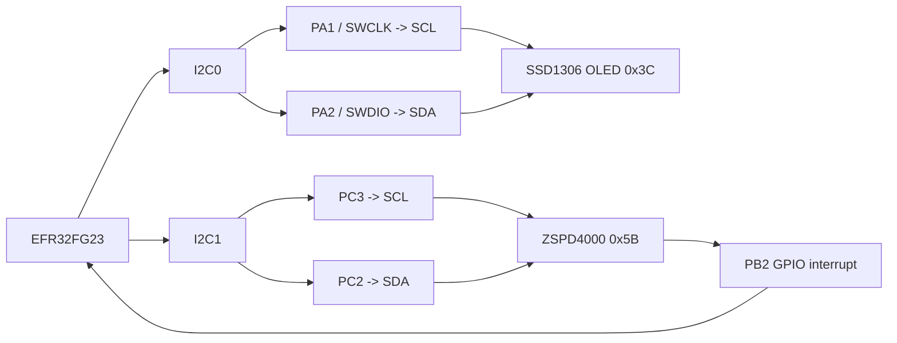
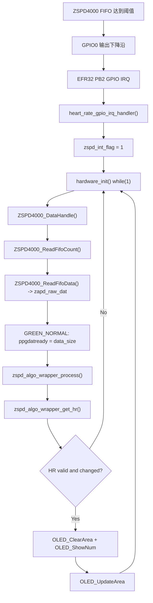

# 001 — EFR32FG23 SSD1306 OLED / SWD PinMux / HR Display 工程实践

## 背景

本笔记来自 EFR32FG23 可穿戴定位标签工程的一次心率调试实践。工程原本是室内外定位标签固件，但当前调试阶段故意让 `hardware_init()` 不返回，在函数内部 `while(1)` 独占运行 ZSPD4000 心率采集、PPG 算法和 OLED 显示链路。

这不是简单地“加一块屏幕”。它解决的是嵌入式 bring-up 过程中最常见的问题：传感器链路已经在跑，但工程师缺少一个低成本、实时、脱离串口日志的观测窗口。SSD1306 OLED 在这里承担的是本地调试仪表盘角色，用来观察心率算法输出是否持续刷新。

本次实践涉及三个层面的设计：

- 驱动层：把 OLED_UI_Core 中的 SSD1306 驱动移植为 EFR32FG23 的硬件 I2C 版本。
- 板级资源层：释放 PA1/PA2 的 SWD 调试功能，复用为 OLED I2C。
- 应用数据流层：把 ZSPD4000 采集、算法 wrapper、HR 值和 OLED 局部刷新串成闭环。

## 硬件资源分配

| 资源 | 当前用途 | 外设/引脚 | 设计原因 |
| --- | --- | --- | --- |
| SSD1306 OLED | 本地心率显示 | `I2C0`, `PA1=SCL`, `PA2=SDA` | OLED 只需要低速命令和显存写入，适合独占一条简单 I2C 总线 |
| ZSPD4000 | PPG 心率采集 | `I2C1`, `PC3=SCL`, `PC2=SDA` | 传感器寄存器读写和 FIFO 读取与 OLED 隔离，降低互相阻塞风险 |
| ZSPD4000 GPIO0 | FIFO/数据就绪中断 | `PB2` | ISR 只置位 `zspd_int_flag`，主循环再读 FIFO |
| SWD Debug Port | 上电早期调试入口 | `PA1=SWCLK`, `PA2=SWDIO` | 上电窗口内保留调试能力，之后释放给 OLED I2C |
| OLED 显存 | 128x64 单色 framebuffer | `uint8_t OLED_DisplayBuf[8][128]` | 按 SSD1306 page 模型组织，每页 8 像素高 |

I2C 拆成两路不是为了“外设数量好看”，而是为了减少调试耦合。OLED 刷新是慢速显示行为，ZSPD4000 是采集链路的一部分。两者如果挤在同一条总线上，OLED 全屏刷新或异常 ACK 可能影响传感器 FIFO 读取节奏。

## 软件架构

当前运行路径可以理解为一个裸机调试 harness：

```c
hardware_init()
  ├─ sl_system_init()
  ├─ init_led()
  ├─ write_read_partnum()
  ├─ init_heart_rate_i2c()
  ├─ ZSPD4000_Init(HR_MODE)
  ├─ OLED_Init()
  ├─ OLED_ShowString("HR:")
  └─ while (1)
       ├─ ZSPD4000_DataHandle()
       ├─ if (ppgdatready > 0)
       │    ├─ zspd_algo_wrapper_init()
       │    └─ zspd_algo_wrapper_process(zapd_raw_dat, samples)
       └─ if (HR changed)
            ├─ OLED_ClearArea(...)
            ├─ OLED_ShowNum(...)
            └─ OLED_UpdateArea(...)
```

这条路径的关键点是：主工程 superloop 暂时不运行。OTA、LF、IR、L660、GNSS、射频、腕带检测等模块在这个阶段不是失败，而是被刻意排除。这样做可以把调试变量收敛到 OLED、I2C、ZSPD4000、算法 wrapper 和 GPIO 中断。

## 驱动分层

OLED 驱动被拆成三个相对稳定的层：

| 层级 | 典型文件 | 职责 |
| --- | --- | --- |
| 应用显示 API | `oled.h`, `oled.c` | 字符、数字、清屏、区域清除、绘图等显存操作 |
| SSD1306 硬件驱动 | `oled_driver.h`, `oled_driver.c` | SSD1306 初始化命令、I2C 写命令/数据、全屏/局部刷新 |
| 字库资源 | `oled_fonts.h`, `oled_fonts.c` | 6x8 和 8x16 ASCII 点阵 |
| 板级路由 | `oled_driver.c` 内 I2C/SWD 初始化 | EFR32FG23 GPIO route、I2C0 初始化、SWD 释放 |



这种分层的价值是：`oled.c` 不关心底层是 SPI 还是 I2C，也不关心 EFR32 的 route 寄存器；`oled_driver.c` 不关心业务显示“HR”还是电量；字库可以独立替换。移植时真正变化最大的是硬件通信层。

## SSD1306 刷新机制

SSD1306 常见 128x64 单色屏的显存模型是 page-based：

- 屏幕高度 64 像素，被拆成 8 个 page。
- 每个 page 高 8 像素，宽 128 字节。
- 一个字节对应同一列的 8 个垂直像素。
- 全屏显存大小是 `128 * 64 / 8 = 1024` 字节。

工程中的 `OLED_DisplayBuf[OLED_HEIGHT / 8][OLED_WIDTH]` 正好对应这个模型。应用层先改 RAM 中的 framebuffer，再通过 `OLED_Update()` 或 `OLED_UpdateArea()` 写到 SSD1306。

全屏刷新路径：

```c
for each page in 0..7:
    OLED_SetCursor(page, 0)
    write 128 bytes to SSD1306
```

局部刷新路径：

```c
for each touched page:
    OLED_SetCursor(page, X)
    write Width bytes from OLED_DisplayBuf[page][X]
```

这意味着显示文本时有两个动作：

1. `OLED_ShowString()` / `OLED_ShowNum()` 修改本地 framebuffer。
2. `OLED_Update()` / `OLED_UpdateArea()` 把 framebuffer 的变化同步到 OLED。

如果只做第一步，屏幕不会变化；如果每次都做全屏刷新，I2C 会被不必要地占用。

## SWD 复用设计

EFR32FG23 的 SWD 调试口占用 `PA1(SWCLK)` 和 `PA2(SWDIO)`。本次 OLED 也需要这两个脚作为 I2C0 的 SCL/SDA，因此必须设计一个“先调试、后复用”的上电策略。

核心思想：

- 上电或复位早期保留 SWD，使 J-Link 有时间识别芯片。
- 延时窗口结束后，清除 SWD debug route。
- 把 PA1/PA2 配成 open-drain pull-up 风格的 I2C 引脚。
- 再初始化 I2C0 route 和 SSD1306。



这里最重要的不是具体延时多少秒，而是“必须留窗口”。没有窗口时，一旦固件启动后立刻释放 SWD，调试器可能无法稳定连接，尤其在程序又进入死循环或低功耗模式时，恢复会变得很麻烦。

## 上电调试窗口原理

SWD 复用的风险来自时序竞争：



这个窗口本质上是给外部调试器一个抢占启动流程的机会。它不改变最终产品行为，只服务于 bring-up 和救砖。

工程上建议把窗口写成宏，而不是散落 magic number：

```c
#define DEBUG_ATTACH_WINDOW_SECONDS 20
```

如果某个调试板需要更短启动时间，可以改为 5s 或 10s；如果正在调 SWD 复用风险，可以临时拉长到 20s。知识库、注释和源码中的数值要保持一致，避免“文档写 20s、源码实际 10s”的漂移。

## I2C 总线规划



EFR32FG23 的 I2C route 机制允许把外设信号映射到指定 GPIO。移植时不能只写 `I2C_Init(I2C0, ...)`，还必须配置：

- `CMU_ClockEnable(cmuClock_I2C0, true)`
- `GPIO->I2CROUTE[0].ROUTEEN`
- `GPIO->I2CROUTE[0].SCLROUTE`
- `GPIO->I2CROUTE[0].SDAROUTE`

ZSPD4000 使用 I2C1 时，同样要使用 `I2CROUTE[1]`。这类 route index 必须和外设实例一致，否则表现会像“外设初始化成功但总线没有波形”。

I2C 总线规划原则：

- 显示器和采集传感器尽量分离。
- 需要中断驱动的数据源不要被低优先级显示刷新阻塞。
- 每条总线都要有总线释放逻辑，例如初始化前给 SCL 打 9 个脉冲。
- 每个 I2C 轮询传输都应保留超时，避免从机无响应时卡死在 bring-up 循环里。

## OLED 局部刷新优化

心率显示只占第一行的一小块区域。如果每次 HR 改变都刷新 1024 字节全屏，显示链路会制造不必要的 I2C 流量。

当前优化策略：

```c
if (hr_valid && hr != last_hr) {
    last_hr = hr;
    OLED_ClearArea(24, 0, 24, 16);
    OLED_ShowNum(24, 0, hr, 3, OLED_8X16_HALF);
    OLED_UpdateArea(24, 0, 24, 16);
}
```

这段逻辑有三个设计点：

- 只在 `hr_valid` 成立时显示，避免把无效算法输出写到屏幕。
- 只在 HR 值变化时刷新，避免重复 I2C 传输。
- 只刷新数字所在区域，避免全屏刷新造成闪烁和总线占用。

局部刷新不只是性能优化，也是系统稳定性优化。裸机调试循环里 OLED 和 ZSPD4000 都靠轮询推进，OLED 占用时间越短，传感器 FIFO 被及时处理的概率越高。

## 心率数据显示流程



这里的中断设计是正确的嵌入式习惯：ISR 不做 I2C、不跑算法、不刷屏，只置位软件标志。真正耗时的 FIFO 读取、PPG 计算、OLED I2C 刷新都放在主循环中完成。

在没有 RTOS 的 superloop 工程里，这相当于一个简化的 event loop：

- GPIO ISR 负责“事件到达”。
- `ZSPD4000_DataHandle()` 负责“消费事件”。
- `ppgdatready` 负责“数据就绪”。
- `zspd_algo_wrapper_get_hr()` 负责“业务输出”。
- OLED 局部刷新负责“可视化输出”。

## 遇到的问题

### 1. SWD 与 OLED I2C 争用同一组引脚

PA1/PA2 同时承担 SWD 和 OLED I2C 时，最大的风险不是 OLED 不亮，而是调试器失联。解决思路不是永久禁用 SWD，而是做上电调试窗口，等 J-Link 有机会 attach 后再释放引脚。

恢复方法：

- 断电重上电，在调试窗口内连接 J-Link。
- 使用 connect under reset。
- 临时烧录一个不释放 SWD 的固件。
- 必要时使用芯片擦除恢复。

### 2. EFR32 GPIO route 配置容易漏掉 index

`I2C0` 应写 `GPIO->I2CROUTE[0]`，`I2C1` 应写 `GPIO->I2CROUTE[1]`。如果外设实例和 route index 不一致，代码可能看起来初始化成功，但 SCL/SDA 没有被路由到目标引脚。

### 3. OLED 显示 API 和硬件刷新是两件事

`OLED_ShowNum()` 只是改显存，不会自动传到屏幕。必须显式调用 `OLED_UpdateArea()` 或 `OLED_Update()`。这类 framebuffer 模型很容易让初次移植者误以为“显示函数没生效”。

### 4. I2C 轮询传输必须保留超时

bring-up 阶段从机地址、供电、上拉、电平、route 任意一个不对，都可能导致 I2C 传输无法完成。轮询 `I2C_Transfer()` 时应保留 timeout，并把错误路径暴露出来。否则系统会卡死在驱动层，表面看像 `hardware_init()` 没继续执行。

### 5. 注释、文档和源码数值要同步

SWD 调试窗口可以是 10s、20s 或其他调试策略，但不应该让源码、注释和知识库出现不同说法。建议统一为宏，例如 `DEBUG_ATTACH_WINDOW_SECONDS`，并在注释里说明为什么需要这个窗口。

## 后续可优化方向

- 将 SWD 调试窗口秒数宏化，区分 debug/release 配置。
- 为 OLED I2C 和 ZSPD4000 I2C 的轮询传输统一增加 timeout 错误处理。
- 增加 OLED 使能宏，例如 `OLED_DEBUG_ENABLE`，让无屏版本可以编译裁剪。
- 把 OLED 刷新封装成 dirty rectangle 机制，避免应用层手动计算刷新区域。
- 增加心率显示状态：`---`、`WAIT`、`NO SIG`、`HR xxx`，区分算法未收敛和传感器无数据。
- 在心率调试完成后，把 `ZSPD4000_DataHandle()` 从 `hardware_init()` 独占循环迁回主 superloop 或独立任务。
- 为 SWD 复用保留硬件逃生方案，例如测试点、BOOT strap 或备用固件。

## TODO

- [ ] 在知识库中补一篇 EFR32 GPIO Route 机制专题。
- [ ] 在 Debug 目录补一篇“SWD 复用后的救砖方法”。
- [ ] 在 Drivers/I2C 目录补一篇“裸机 I2C 轮询、超时与总线恢复”。
- [ ] 把 ZSPD4000 心率状态机整理成单独驱动分析文档。

## Related Topics

- `Drivers/I2C`: I2C route、总线恢复、ACK 超时。
- `Architecture/PinMux`: SWD/JTAG 与普通 GPIO 复用策略。
- `Debug`: connect under reset、mass erase、bring-up 可观测性。
- `RTOS`: 如果后续迁移到 RTOS，可把 GPIO ISR -> semaphore -> display task 的链路作为事件驱动案例。

