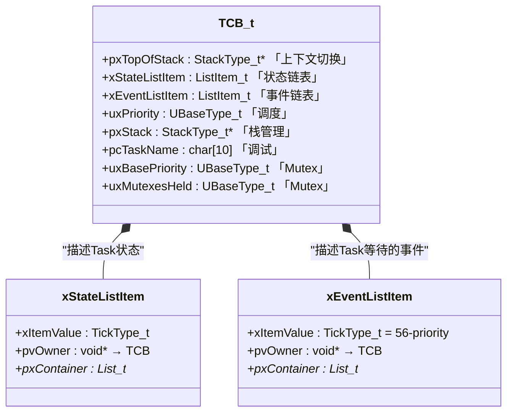
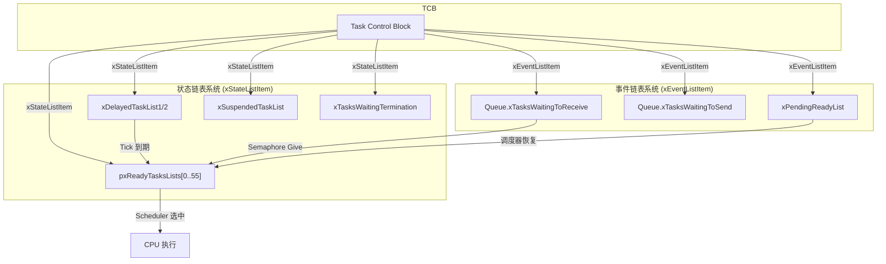
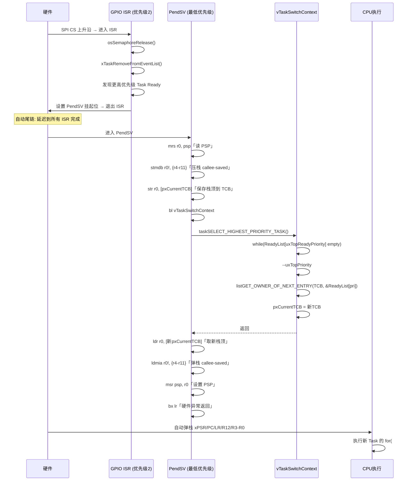
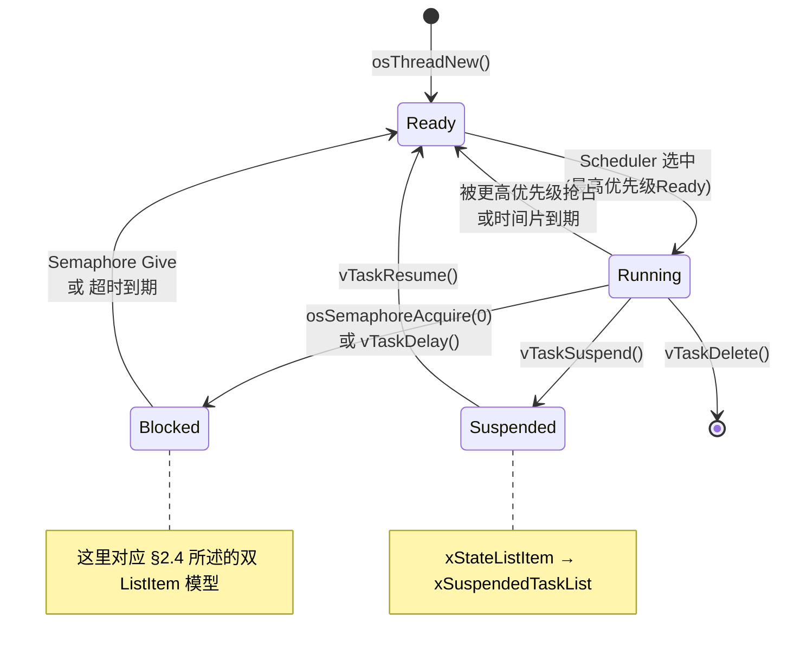

# 002 — FreeRTOS Task / TCB / Scheduler 内核深度分析

> **Kernel Internal Deep Dive | FreeRTOS 10.4.3 | Cortex-M33 (ARM_CM33_NTZ) | EFR32FG23**

---

## 目录

- [模型：Task 是 TCB 的状态流动](#模型task-是-tcb-的状态流动)
- [§1 Task 的诞生：osThreadNew → Task 创建调用链](#1-task-的诞生osthreadnew--task-创建调用链)
- [§2 TCB — 被调度的是数据结构](#2-tcb--被调度的是数据结构)
- [§3 调度器模型：ReadyList → PendSV → 上下文切换](#3-调度器模型readylist--pendsv--上下文切换)
- [§4 Task 生命周期：从 for(;;) 的视角](#4-task-生命周期从-for-的视角)
- [Appendix A: TCB 字段速查表](#appendix-a-tcb-字段速查表)
- [Appendix B: 工程实例 — 四个 Task 的诞生](#appendix-b-工程实例--四个-task-的诞生)
- [Appendix C: 关键数据结构参考](#appendix-c-关键数据结构参考)

---

## 模型：Task 是 TCB 的状态流动

RTOS 不调度"Task 函数"。它调度的是 `TCB_t` 结构体。

```
Task 函数（C 代码）
    ↓ 被封装进
TCB_t（内核数据结构）
    ↓ 被插入
ReadyList
    ↓ 被选中
pxCurrentTCB（指针切换）
    ↓ 被恢复
CPU 执行 Task 栈中保存的现场
```

核心认知：**"Task"在用户视角是一个 `for(;;)` 循环函数，在内核视角是 `TCB_t` 在多个链表之间的流动。**

---

## §1 Task 的诞生：osThreadNew → Task 创建调用链

### 1.0 系统流图


> 上图使用静态 SVG，避免 GitHub Mermaid 资源加载失败时只显示源码。

### 1.1 调用链总览

```c
FG14_ReceiveHandle = osThreadNew(FG14_Receive_Task, NULL, &FG14_Receive_attributes);
```

实际路径：

```
osThreadNew(FG14_Receive_Task, NULL, &FG14_Receive_attributes)
  └─ 解析 attr:
       name       = "FG14_Receive"
       priority   = 15
       stack_size = 4096 bytes
  └─ stack = attr->stack_size / sizeof(StackType_t) = 1024
  └─ xTaskCreate(FG14_Receive_Task, "FG14_Receive", 1024, NULL, 15, &hTask)
       ├─ pxStack = pvPortMalloc(1024 * sizeof(StackType_t)) = 4096 bytes
       ├─ pxNewTCB = pvPortMalloc(sizeof(TCB_t))
       └─ pxNewTCB->pxStack = pxStack
  └─ prvInitialiseNewTask(...)
       ├─ 填充 stack
       ├─ 初始化 TCB 字段
       └─ pxPortInitialiseStack(...) 伪造初始栈帧
  └─ prvAddNewTaskToReadyList(pxNewTCB)
       └─ Task 进入 Ready 状态（ReadyList 见 §3）
```

### 1.2 动态分配 Stack + TCB

```c
// tasks.c:786, xTaskCreate() - 向下生长分支
pxStack = pvPortMalloc(usStackDepth * sizeof(StackType_t));  // 先栈
pxNewTCB = (TCB_t *) pvPortMalloc(sizeof(TCB_t));            // 再 TCB
pxNewTCB->pxStack = pxStack;
```

本工程没有提供 `cb_mem` 和 `stack_mem`，所以 `osThreadNew()` 走动态创建路径。

CMSIS-RTOS2 的 `attr.stack_size` 单位是**字节**：

```c
// FreeRTOSEntry.c:52
.stack_size = 256 * 16    // = 4096 bytes
```

进入 FreeRTOS 前转换为 `StackType_t` 数量：

```c
stack = attr->stack_size / sizeof(StackType_t);  // 4096 / 4 = 1024
```

实际分配：

```c
pvPortMalloc(1024 * sizeof(StackType_t))  // = 1024 × 4 = 4096 bytes = 4KB
```

两块 RAM 的职责：

| RAM 块 | 大小 | 作用 |
|------|------|------|
| Task Stack | 4KB | 保存函数调用、局部变量、寄存器现场 |
| TCB | `sizeof(TCB_t)` | 保存调度元信息，字段详见 §2 |

### 1.3 prvInitialiseNewTask

该函数只做 Task 出生时的初始化，不负责调度选择。

```c
prvInitialiseNewTask(
    (TaskFunction_t)FG14_Receive_Task,
    "FG14_Receive",
    (uint32_t)1024,
    NULL,
    15,
    &hTask,
    pxNewTCB,
    NULL
);
```

主要动作：

```c
memset(pxNewTCB->pxStack, 0xa5, ulStackDepth * sizeof(StackType_t));
pxTopOfStack = &(pxNewTCB->pxStack[ulStackDepth - 1]);
pxTopOfStack = (StackType_t *)((uint32_t)pxTopOfStack & ~0x07);
```

`0xA5` 用于栈水位检测。`pxTopOfStack` 从栈最高地址开始，因为 Cortex-M 栈向低地址增长。

随后初始化任务名、优先级、两个 ListItem、Task Notification 字段，并调用：

```c
pxNewTCB->pxTopOfStack =
    pxPortInitialiseStack(pxTopOfStack,
                          pxNewTCB->pxStack,
                          pxTaskCode,
                          pvParameters);
```

初始栈帧的关键内容：

```
高地址 ┌────────────────────────┐
      │  0xa5a5a5a5 ...        │ ← memset 填充
      │  (未使用的栈空间)        │
      ├────────────────────────┤ ← pxTopOfStack 初始值
      │  pxEndOfStack          │ ← PSPLIM 值（栈底地址）
      ├────────────────────────┤
      │  EXC_RETURN            │ ← 0xFFFFFFFD (Thread Mode + PSP)
      ├────────────────────────┤
      │  R11 = 0x11111111      │
      │  R10 = 0x10101010      │
      │  R9  = 0x09090909      │
      │  R8  = 0x08080808      │
      │  R7  = 0x07070707      │  ← 伪造的 callee-saved 寄存器
      │  R6  = 0x06060606      │
      │  R5  = 0x05050505      │
      │  R4  = 0x04040404      │
      ├────────────────────────┤
      │  R0  = pvParameters    │ ← 任务参数 (此处 NULL)
      │  R1  = 0x01010101      │
      │  R2  = 0x02020202      │
      │  R3  = 0x03030303      │
      │  R12 = 0x12121212      │
      │  LR  = portTASK_RETURN_ADDRESS
      │  PC  = FG14_Receive_Task│ ← 入口函数地址
      │  xPSR = 0x01000000     │ ← Thumb 位
低地址 └────────────────────────┘ ← pxNewTCB->pxTopOfStack (更新后)
```

这一步不是调用 `FG14_Receive_Task()`，而是让该 Task 第一次被恢复时能从 `PC = FG14_Receive_Task` 开始执行。

同样关键的细节：`LR = portTASK_RETURN_ADDRESS`。Cortex-M 的 EXC_RETURN 值告诉处理器退出异常时：
- 返回 Thread Mode
- 使用 PSP

### 1.4 prvAddNewTaskToReadyList

```c
// tasks.c:1092
prvAddNewTaskToReadyList(pxNewTCB) {
    taskENTER_CRITICAL();

    uxCurrentNumberOfTasks++;

    if (pxCurrentTCB == NULL) {
        pxCurrentTCB = pxNewTCB;
        if (uxCurrentNumberOfTasks == 1) {
            prvInitialiseTaskLists();
        }
    } else if (!xSchedulerRunning) {
        if (pxCurrentTCB->uxPriority <= pxNewTCB->uxPriority) {
            pxCurrentTCB = pxNewTCB;
        }
    }

    prvAddTaskToReadyList(pxNewTCB);
    portSETUP_TCB(pxNewTCB);
    taskEXIT_CRITICAL();

    if (xSchedulerRunning && pxCurrentTCB->uxPriority < pxNewTCB->uxPriority) {
        taskYIELD();
    }
}
```

这里完成两件事：

1. 如果这是第一个 Task，初始化内核链表。
2. 把当前 Task 交给 ReadyList 系统。ReadyList 与调度选择只在 §3 展开。

---

## §2 TCB — 被调度的是数据结构

### 2.1 TCB_t 核心字段

```c
// tasks.c:266-343 (FreeRTOS 10.4.3)
typedef struct tskTaskControlBlock
{
    volatile StackType_t *pxTopOfStack;    // 必须是第一个字段

    ListItem_t xStateListItem;             // 状态链表项
    ListItem_t xEventListItem;             // 事件链表项

    UBaseType_t uxPriority;                // 当前优先级

    StackType_t *pxStack;                  // 栈空间起始地址
    char pcTaskName[configMAX_TASK_NAME_LEN];

    // ... 其他条件编译字段 ...
} tskTCB;
```

字段职责：

| 字段 | 作用 |
|------|------|
| `pxTopOfStack` | 当前保存现场的位置，PendSV 保存/恢复时直接访问 |
| `xStateListItem` | 表示 Task 当前调度状态 |
| `xEventListItem` | 表示 Task 正在等待的事件 |
| `uxPriority` | 决定 Task 所属优先级 |
| `pxStack` | 指向 Task 专属栈 RAM 的起始地址 |
| `pcTaskName` | 调试名 |

### 2.2 TCB 结构图



### 2.3 为什么 pxTopOfStack 必须是第一个字段

```asm
; portasm.c:243, PendSV_Handler
ldr r2, pxCurrentTCBConst       ; r2 = &pxCurrentTCB
ldr r1, [r2]                    ; r1 = pxCurrentTCB (TCB 指针)
str r0, [r1]                    ; *r1 = r0  → pxCurrentTCB->pxTopOfStack = r0
```

汇编直接写 `*pxCurrentTCB`，没有字段偏移量。因此 `pxTopOfStack` 必须位于 TCB 偏移 0。

### 2.4 双 ListItem 模型

```c
ListItem_t xStateListItem  → 描述 "Task 处于什么状态"
ListItem_t xEventListItem  → 描述 "Task 在等待什么事件"
```

| 场景 | xStateListItem 所在链表 | xEventListItem 所在链表 |
|------|------------------------|------------------------|
| Running | 无 | 无 |
| Ready | `pxReadyTasksLists[pri]` | 无 |
| Blocked on Semaphore | `xDelayedTaskList` / `xSuspendedTaskList` | `Queue.xTasksWaitingToReceive` |
| Suspended | `xSuspendedTaskList` | 无 |
| Blocked + Delay | `xDelayedTaskList` | 无 |
| Blocked on Semaphore (有超时) | `xDelayedTaskList` | `Queue.xTasksWaitingToReceive` |

关键差异：

| | xStateListItem | xEventListItem |
|---|---|---|
| 初始 xItemValue | 0（等待具体状态设置） | `configMAX_PRIORITIES - uxPriority` |
| 排序方式 | ReadyList 按插入顺序 | EventList 按优先级逆序 |
| 使用链表 | Ready / Delayed / Suspended / Termination | Queue / Semaphore / PendingReady |
| pvOwner | TCB | TCB |

一个 ListItem 只能属于一个链表。带超时的信号量等待需要同时表达：

```
xStateListItem → xDelayedTaskList     ← 用于 timeout 唤醒
xEventListItem → Semaphore 等待链表   ← 用于 Give 唤醒
```

内核链表全景：



---

## §3 调度器模型：ReadyList → PendSV → 上下文切换

### 3.1 Scheduler 到底在调度什么？

```c
// tasks.c:351
PRIVILEGED_DATA TCB_t * volatile pxCurrentTCB = NULL;
```

切换 Task = 修改 `pxCurrentTCB` 指向另一个 TCB，再恢复该 TCB 的 `pxTopOfStack`。

### 3.2 ReadyList

`prvInitialiseTaskLists()` 在第一个 Task 创建时初始化内核链表：

```c
for (uxPriority = 0; uxPriority < 56; uxPriority++) {
    vListInitialise(&pxReadyTasksLists[uxPriority]);
}
vListInitialise(&xDelayedTaskList1);
vListInitialise(&xDelayedTaskList2);
vListInitialise(&xPendingReadyList);
vListInitialise(&xSuspendedTaskList);
vListInitialise(&xTasksWaitingTermination);
```

`prvAddTaskToReadyList`：

```c
traceMOVED_TASK_TO_READY_STATE(pxTCB);

if (15 > uxTopReadyPriority) { uxTopReadyPriority = 15; }

vListInsertEnd(&pxReadyTasksLists[15], &pxTCB->xStateListItem);

tracePOST_MOVED_TASK_TO_READY_STATE(pxTCB);
```

ReadyList 存的是 `xStateListItem`。通过 `pvOwner` 反查 TCB，见 §2.4。

### 3.3 taskSELECT_HIGHEST_PRIORITY_TASK

由于本工程 `configUSE_PORT_OPTIMISED_TASK_SELECTION = 0`，使用通用 C 版本：

```c
// tasks.c:147 (通用 C 版本)
#define taskSELECT_HIGHEST_PRIORITY_TASK()
{
    UBaseType_t uxTopPriority = uxTopReadyPriority;

    while (listLIST_IS_EMPTY(&pxReadyTasksLists[uxTopPriority]))
    {
        configASSERT(uxTopPriority);
        --uxTopPriority;
    }

    listGET_OWNER_OF_NEXT_ENTRY(pxCurrentTCB, &pxReadyTasksLists[uxTopPriority]);

    uxTopReadyPriority = uxTopPriority;
}
```

`uxTopReadyPriority` 缓存当前最高 Ready 优先级。插入或移除 Ready Task 时更新它。

### 3.4 PendSV

**PendSV = Pendable Service Call**，用于把上下文切换延迟到 ISR 之后执行。

```
高优先级 ──────────────────────────────→ 低优先级
SYSTICK > IRQ_GPIO(2) > IRQ_TIMER(5) > PendSV > Thread Mode
```

ISR 中只置位 PendSV；真正保存/恢复 Task 现场在 PendSV 中完成。

### 3.5 PendSV 完整上下文切换流程



汇编级对照：

```
┌─────────────────────────────────────────────────────────────────┐
│  PendSV_Handler (portasm.c:219)                                  │
│                                                                  │
│  ① 保存当前上下文                                                 │
│     mrs r0, psp              ; r0 = 当前 PSP                     │
│     stmdb r0!, {r4-r11}      ; 压栈 callee-saved 寄存器           │
│     ldr r2, pxCurrentTCBConst                                   │
│     ldr r1, [r2]             ; r1 = pxCurrentTCB                 │
│     str r0, [r1]             ; *TCB = 新栈顶  (保存)              │
│                                                                  │
│  ② 选新任务                                                       │
│     bl  vTaskSwitchContext   ; 切换 pxCurrentTCB 指针             │
│       └→ taskSELECT_HIGHEST_PRIORITY_TASK()                      │
│                                                                  │
│  ③ 恢复新上下文                                                   │
│     ldr r2, pxCurrentTCBConst                                   │
│     ldr r1, [r2]             ; r1 = 新 pxCurrentTCB              │
│     ldr r0, [r1]             ; r0 = 新栈顶  (恢复)                │
│     ldmia r0!, {r4-r11}      ; 弹出 callee-saved 寄存器           │
│     msr psp, r0              ; PSP = 新栈顶                       │
│     bx  lr                   ; 硬件异常返回 → 弹出 PC/xPSR/R0-R3  │
│                               ; CPU 跳到新 Task 继续执行            │
└─────────────────────────────────────────────────────────────────┘
```

硬件异常进入时自动压栈 `{xPSR, PC, LR, R12, R3, R2, R1, R0}`；软件保存 `{R4-R11, PSPLIM, EXC_RETURN}`。

---

## §4 Task 生命周期：从 for(;;) 的视角

### 4.1 状态机



### 4.2 FG14_Receive_Task 的完整生命周期

```c
void FG14_Receive_Task(void *argument)
{
  for(;;)
  {
    if(osOK == osSemaphoreAcquire(FG14ReceiveSemaphoreHandle, portMAX_DELAY))
    {
      FG14ReceiveProcess();
    }
  }
}
```

#### 阶段 A: Ready → Running

```
1. Scheduler 启动 → prvStartFirstTask → SVC → vRestoreContextOfFirstTask
2. 首个任务由 SVC 启动路径恢复；后续任务切换主要由 PendSV 完成
3. PC = FG14_Receive_Task 入口 → CPU 开始执行 for(;;)
4. 状态: READY → RUNNING
```

#### 阶段 B: Running → Blocked

假设信号量为 0：

```
osSemaphoreAcquire(sem, portMAX_DELAY)
  → xQueueSemaphoreTake(sem, portMAX_DELAY)
```

关键代码路径（queue.c）：

```c
if (prvIsQueueEmpty(pxQueue) != pdFALSE)
{
    if (xTicksToWait == 0) { return errQUEUE_EMPTY; }

    vTaskPlaceOnEventList(&pxQueue->xTasksWaitingToReceive, xTicksToWait);
}
```

`vTaskPlaceOnEventList`（tasks.c）：

```c
void vTaskPlaceOnEventList(List_t *pxEventList, TickType_t xTicksToWait)
{
    vListInsert(pxEventList, &pxTCB->xEventListItem);

    // portMAX_DELAY 且 INCLUDE_vTaskSuspend=1：
    // xStateListItem 不挂 DelayedList，而是挂 xSuspendedTaskList
    prvAddCurrentTaskToDelayedList(xTicksToWait, pdTRUE);
}
```

此处链表变化对应 §2.4；ReadyList 移除和后续调度对应 §3。

```
FG14_Receive_Task:
  xStateListItem  → xSuspendedTaskList
  xEventListItem  → Semaphore.xTasksWaitingToReceive
  Task 状态: BLOCKED
```

#### 阶段 C: Blocked → Ready

当 RAIL 收到完整 RF 包后，`app_process_action()` 释放 `FG14ReceiveSemaphoreHandle`：

```
osSemaphoreRelease(sem)
  → xQueueGenericSend(sem, NULL, 0, queueSEND_TO_BACK)
```

关键代码（queue.c）：

```c
if (listLIST_IS_EMPTY(&pxQueue->xTasksWaitingToReceive) == pdFALSE)
{
    xTaskRemoveFromEventList(&pxQueue->xTasksWaitingToReceive);
}
```

`xTaskRemoveFromEventList`（tasks.c）：

```c
BaseType_t xTaskRemoveFromEventList(List_t *pxEventList)
{
    TCB_t *pxUnblockedTCB;
    pxUnblockedTCB = listGET_OWNER_OF_HEAD_ENTRY(pxEventList);

    uxListRemove(&pxUnblockedTCB->xEventListItem);

    if (listLIST_ITEM_CONTAINER(&pxUnblockedTCB->xStateListItem) != NULL) {
        uxListRemove(&pxUnblockedTCB->xStateListItem);
    }

    if (uxSchedulerSuspended == pdFALSE) {
        prvAddTaskToReadyList(pxUnblockedTCB);
    } else {
        vListInsertEnd(&xPendingReadyList, &pxUnblockedTCB->xEventListItem);
    }

    if (pxUnblockedTCB->uxPriority > pxCurrentTCB->uxPriority) {
        return pdTRUE;
    }
}
```

RAIL 收包后的实际流动：

```
RAIL RX callback / app_process_action()
  → osSemaphoreRelease(FG14ReceiveSemaphoreHandle)
  → xTaskRemoveFromEventList()
  → FG14_Receive 回到 ReadyList[15]（ReadyList 见 §3）
  → 如果优先级高于当前 Running Task，触发 PendSV（见 §3.4）
  → FG14_Receive_Task 恢复后执行 FG14ReceiveProcess()
```

### 4.3 与 001 信号量文档的接口

`001_FreeRTOS_Semaphore_Kernel_Deep_Dive_v2.md` 主要从 `Queue_t` 视角解释 Semaphore；本文从 `TCB_t` 视角解释 Task。

| 视角 | Semaphore 文档关注 | Task 文档关注 |
|------|-------------------|---------------|
| 等待发生 | `Queue_t.xTasksWaitingToReceive` 接收等待者 | `TCB.xEventListItem` 挂入等待链表 |
| 任务不可运行 | 信号量为空，Take 方不能继续 | `TCB.xStateListItem` 离开 Ready 状态 |
| 无限期等待 | `portMAX_DELAY` 表示不靠 tick 超时 | 本工程复用 `xSuspendedTaskList` |
| 事件到达 | Give/Release 检查等待链表 | `xTaskRemoveFromEventList()` 通过 `pvOwner` 找回 TCB |
| 恢复运行 | 等待链表摘除 | Task 回到 Ready，等待 Scheduler 选中 |

---

## Appendix A: TCB 字段速查表

| 字段 | 所属子系统 | 作用 | 何时读/写 |
|------|-----------|------|----------|
| `pxTopOfStack` | 上下文切换 | 当前栈顶指针 | PendSV 读/写 |
| `xStateListItem` | 状态链表 | 所处状态链表项 | 创建/阻塞/恢复/挂起/删除 |
| `xEventListItem` | 事件链表 | 等待事件链表项 | 阻塞在 Semaphore/Queue/Mutex |
| `uxPriority` | 调度 | 当前优先级 | 创建/优先级继承/恢复 |
| `pxStack` | 栈管理 | 栈起始地址 | 创建和删除 |
| `pcTaskName` | 栈管理/调试 | 可读名字 | 创建时写入，调试时读取 |
| `uxBasePriority` | 调度(Mutex) | 原始优先级 | 优先级继承时保存/恢复 |
| `uxMutexesHeld` | 调度(Mutex) | 持有互斥量数 | 获取/释放 Mutex |
| `ucStaticallyAllocated` | 内存管理 | 标记静态/动态分配 | 删除时判断是否 free |
| `uxCriticalNesting` | 临界区 | 嵌套深度 | 进出临界区 |
| `pxEndOfStack` | 栈管理 | 栈最高地址 | 栈溢出检测 |

## Appendix B: 工程实例 — 四个 Task 的诞生

本工程创建 4 个 Task（app_entry 中）：

```c
// FreeRTOSEntry.c:478-484
FG14_ReceiveHandle = osThreadNew(FG14_Receive_Task, NULL, &FG14_Receive_attributes);
FG14_SendHandle    = osThreadNew(FG14_Send_Task,    NULL, &FG14_Send_attributes);
BG22_ReceiveHandle = osThreadNew(BG22_Receive_Task, NULL, &BG22_Receive_attributes);
apploader_Handle   = osThreadNew(apploader_Task,     NULL, &apploader_attributes);
```

创建顺序与调度启动前的 `pxCurrentTCB` 变化：

```
1. 创建 FG14_Receive(15):  pxCurrentTCB = FG14_Receive
2. 创建 FG14_Send(14):     pxCurrentTCB 不变
3. 创建 BG22_Receive(13):  pxCurrentTCB 不变
4. 创建 apploader(12):     pxCurrentTCB 不变，随后 vTaskSuspend(apploader_Handle)
```

`MX_FREERTOS_Init()` 结束、调度器启动前：

```
pxReadyTasksLists[15]: [FG14_Receive.xStateListItem]
pxReadyTasksLists[14]: [FG14_Send.xStateListItem]
pxReadyTasksLists[13]: [BG22_Receive.xStateListItem]
pxReadyTasksLists[12]: [空]
xSuspendedTaskList: [apploader.xStateListItem]
pxReadyTasksLists[0]: [空]  ← Idle Task 尚未创建

uxTopReadyPriority = 15
pxCurrentTCB = FG14_ReceiveHandle
```

启动后的第一段运行：

```
FG14_Receive(15) → Acquire失败 → BLOCKED
  → FG14_Send(14) 运行
    → 可能也进入 BLOCKED
      → BG22_Receive(13) 运行
        → Acquire失败(BLE还没来) → BLOCKED
          → Idle(0) 运行
```

## Appendix C: 关键数据结构参考

### ListItem_t

```c
// list.h:155
struct xLIST_ITEM {
    TickType_t xItemValue;
    struct xLIST_ITEM *pxNext;
    struct xLIST_ITEM *pxPrevious;
    void *pvOwner;
    struct xLIST *pxContainer;
};
```

### List_t

```c
// list.h:179
typedef struct xLIST {
    UBaseType_t uxNumberOfItems;
    ListItem_t *pxIndex;
    MiniListItem_t xListEnd;
} List_t;
```

### 关键配置 (FreeRTOSConfig.h)

```c
#define configMAX_PRIORITIES                    56
#define configMAX_TASK_NAME_LEN                 10
#define configTOTAL_HEAP_SIZE                   32768
#define configTICK_RATE_HZ                      1000
#define configUSE_PORT_OPTIMISED_TASK_SELECTION 0
#define configUSE_PREEMPTION                    1
#define configUSE_TIME_SLICING                  1
```

---

> **内核版本:** FreeRTOS 10.4.3 | **移植层:** ARM_CM33_NTZ (Cortex-M33 Non-Secure)  
> **目标芯片:** EFR32FG23 | **工程:** FG23_BLE_MicroStation_LF  
> **分析日期:** 2026-05-25
