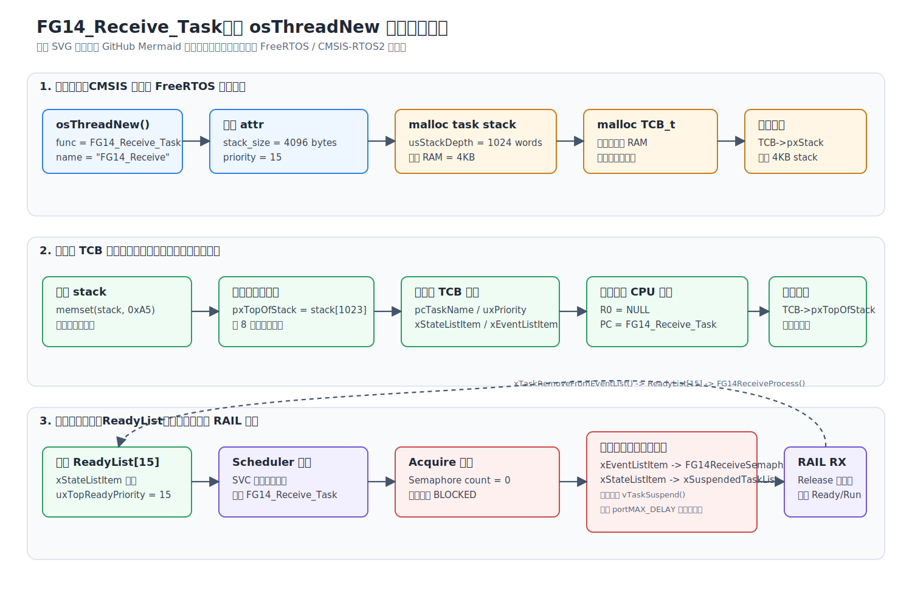
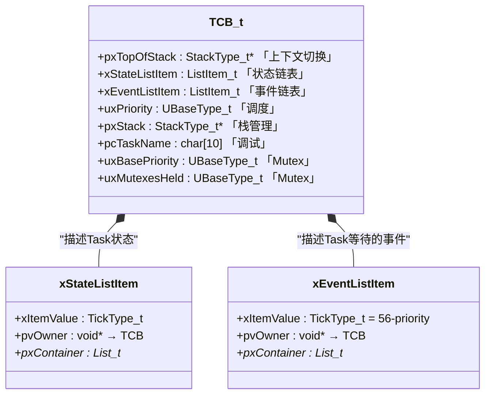
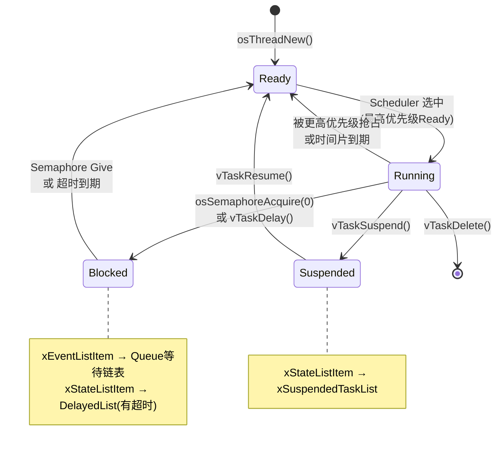
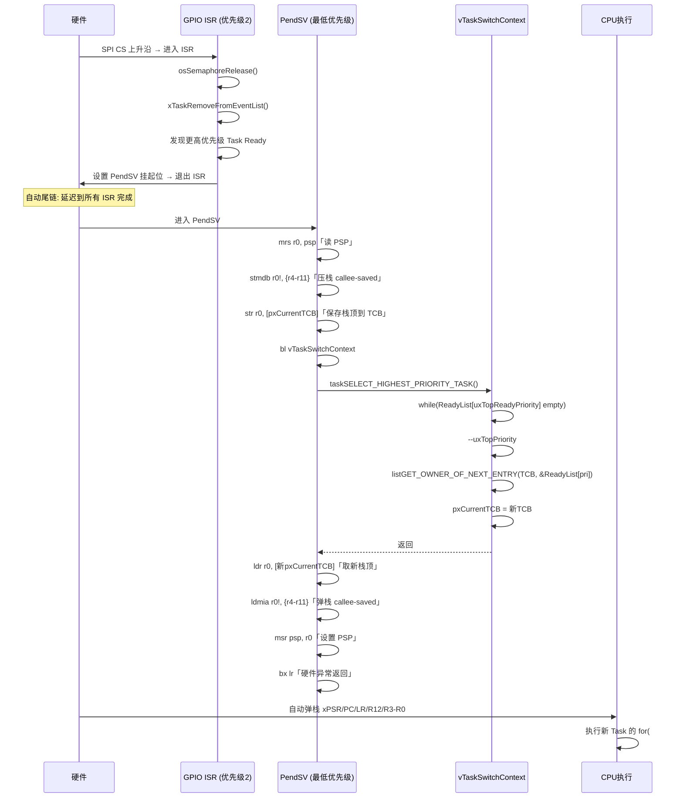
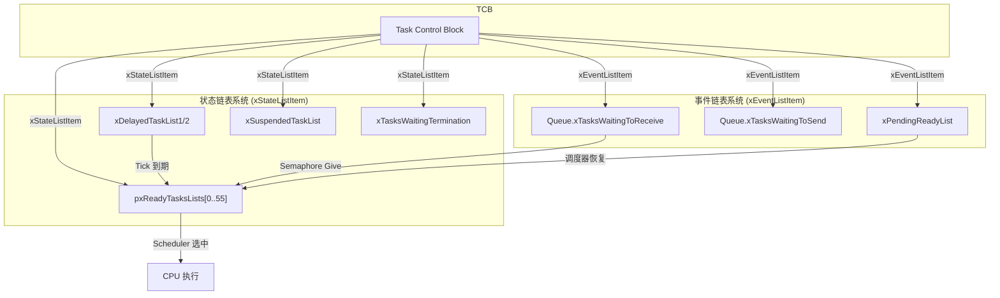

# 002 — FreeRTOS Task / TCB / Scheduler 内核深度分析

> **Kernel Internal Deep Dive | FreeRTOS 10.4.3 | Cortex-M33 (ARM_CM33_NTZ) | EFR32FG23**

---

## 目录

- [模型：Task 是 TCB 的状态流动](#模型task-是-tcb-的状态流动)
- [§1 Task 的诞生：osThreadNew → ReadyList 完整调用链](#1-task-的诞生osthreadnew--readylist-完整调用链)
- [§2 TCB — 被调度的是数据结构](#2-tcb--被调度的是数据结构)
- [§3 Task 状态流动：从 for(;;) 的视角](#3-task-状态流动从-for-的视角)
- [§4 调度器模型：ReadyList → PendSV → 上下文切换](#4-调度器模型readylist--pendsv--上下文切换)
- [§5 多链表系统：一个 Task 为何有两个 ListItem](#5-多链表系统一个-task-为何有两个-listitem)
- [Appendix A: TCB 字段速查表](#appendix-a-tcb-字段速查表)
- [Appendix B: 工程实例 — 四个 Task 的诞生](#appendix-b-工程实例--四个-task-的诞生)
- [Appendix C: 关键数据结构参考](#appendix-c-关键数据结构参考)

---

## 模型：Task 是 TCB 的状态流动

RTOS 不调度"Task 函数"。它调度的是 `TCB_t` 结构体。

```
Task 函数（C 代码）
    ↓ 被封装进
TCB_t（内核数据结构）
    ↓ 被插入
pxReadyTasksLists[priority]（链表）
    ↓ 被选中
pxCurrentTCB（指针切换）
    ↓ 被恢复
PendSV 弹出栈帧 → CPU 执行
```

核心认知：**"Task"在用户视角是一个 `for(;;)` 循环函数，在内核视角是 `TCB_t` 在多个链表之间的流动。** 调度器只做三件事：选 TCB、切 TCB、恢复 TCB 的栈。

---

## §1 Task 的诞生：osThreadNew → ReadyList 完整调用链

### 1.0 系统流图



> 上图使用静态 SVG，避免 GitHub Mermaid 资源加载失败时只显示源码。

### 1.1 调用链总览

```
osThreadNew(FG14_Receive_Task, NULL, &FG14_Receive_attributes)
  └─ stack = attr->stack_size / sizeof(StackType_t) = 1024
  └─ xTaskCreate(..., usStackDepth = 1024, ...)
       ├─ pxStack = pvPortMalloc(1024 * sizeof(StackType_t)) = 4096 bytes
       ├─ pxNewTCB = pvPortMalloc(sizeof(TCB_t))
       └─ pxNewTCB->pxStack = pxStack
  └─ prvInitialiseNewTask(...)                        ③ 初始化 TCB + 伪造栈帧
       ├─ memset(stack, 0xa5, 4096 bytes)            ③a 栈填充已知值
       ├─ pxTopOfStack = &stack[ulStackDepth - 1]    ③b 计算栈顶
       ├─ pxTopOfStack 8 字节对齐                     ③c
       ├─ 复制 pcTaskName                             ③d
       ├─ pxNewTCB->uxPriority = 15                   ③e
       ├─ vListInitialiseItem(&xStateListItem)        ③f
       ├─ vListInitialiseItem(&xEventListItem)        ③g
       ├─ xEventListItem.xItemValue = 56-15 = 41      ③h EventList 按优先级逆序
       ├─ OWNER(xStateListItem) = pxNewTCB            ③i 反向指针
       ├─ OWNER(xEventListItem) = pxNewTCB            ③j
       └─ pxPortInitialiseStack(...)                  ③k 伪造异常栈帧
  └─ prvAddNewTaskToReadyList(pxNewTCB)               ④ 插入就绪链表
       ├─ uxCurrentNumberOfTasks++
       ├─ pxCurrentTCB = pxNewTCB (首次)
       ├─ prvInitialiseTaskLists() (首次)
       ├─ prvAddTaskToReadyList(pxNewTCB)
       │    ├─ taskRECORD_READY_PRIORITY(15)
       │    └─ vListInsertEnd(&pxReadyTasksLists[15], &xStateListItem)
       └─ portSETUP_TCB(pxNewTCB)
```

### 1.2 逐段展开

#### ① 分配 Stack + TCB — 为什么动态分配

```c
// tasks.c:786, xTaskCreate() - 向下生长分支
pxStack = pvPortMalloc(usStackDepth * sizeof(StackType_t));  // 先栈
pxNewTCB = (TCB_t *) pvPortMalloc(sizeof(TCB_t));
pxNewTCB->pxStack = pxStack;
```

在 FreeRTOS 10.4.3 中，`configSUPPORT_DYNAMIC_ALLOCATION = 1`，所以 `xTaskCreate` 走动态分配路径。`pvPortMalloc` 从 FreeRTOS 自己的 heap_4.c 中分配（本项目 `configTOTAL_HEAP_SIZE = 32768`）。

**注意顺序：** Cortex-M 栈向下生长（`portSTACK_GROWTH < 0`），所以**先分配栈、再分配 TCB**，防止 TCB 被栈溢出踩到：

#### ② 栈大小 — 字 vs 字节

```c
// FreeRTOSEntry.c:52
.stack_size = 256 * 16    // = 4096
```

CMSIS-RTOS2 的 `attr.stack_size` 单位是**字节**，所以这里的 4096 表示 **4096 bytes = 4KB**。

`osThreadNew()` 再把它转换成 FreeRTOS 的 `usStackDepth`：

```c
stack = attr->stack_size / sizeof(StackType_t);  // 4096 / 4 = 1024
```

进入 `xTaskCreate()` 后，`usStackDepth` 的单位才是 `StackType_t`。

实际分配：
```c
pvPortMalloc(1024 * sizeof(StackType_t))  // = 1024 × 4 = 4096 bytes = 4KB
```

#### ③ 栈顶计算与对齐

```c
// tasks.c:880-883
pxTopOfStack = &(pxNewTCB->pxStack[ulStackDepth - 1]);       // 指向数组末尾
pxTopOfStack = (StackType_t *)((uint32_t)pxTopOfStack & ~0x07);  // 8 字节对齐
```

Cortex-M 栈向下生长，所以"栈顶"是数组的最高地址。对齐要求来自 AAPCS（ARM Architecture Procedure Call Standard）。

#### ③f~③j xStateListItem 与 xEventListItem 初始化

```c
// tasks.c:959-968
vListInitialiseItem(&(pxNewTCB->xStateListItem));
vListInitialiseItem(&(pxNewTCB->xEventListItem));

listSET_LIST_ITEM_OWNER(&(pxNewTCB->xStateListItem), pxNewTCB);
// → xStateListItem.pvOwner = pxNewTCB

listSET_LIST_ITEM_VALUE(&(pxNewTCB->xEventListItem),
    configMAX_PRIORITIES - uxPriority);   // 56 - 15 = 41
// → xEventListItem.xItemValue = 41
listSET_LIST_ITEM_OWNER(&(pxNewTCB->xEventListItem), pxNewTCB);
```

**关键差异：**
| | xStateListItem | xEventListItem |
|---|---|---|
| 初始 xItemValue | 0（无意义，等待被设置） | `configMAX_PRIORITIES - uxPriority` = 41 |
| 排序方式 | ReadyList: 按插入顺序（FIFO） | EventList: **按优先级逆序**（高优先级数值小，先被取出） |
| 被哪个链表使用 | ReadyList / DelayedList / SuspendedList | EventList（Semaphore/Queue 等待链表） |
| pvOwner | pxNewTCB | pxNewTCB |

`xEventListItem.xItemValue = 56 - 15 = 41` 的含义：EventList 按 `xItemValue` **升序**排列。优先级越高的 Task，`xItemValue` 越小 → 排得越靠前 → 被唤醒时优先取出。这就是"总是唤醒等待队列中最高优先级的任务"的实现。

#### ③k 栈帧伪造 — 让新 Task 看起来"被中断过"

这是 Task 创建最精妙的部分。内核**伪造了一个异常栈帧**，让新 Task 的栈看起来就像一个正在运行的任务被 PendSV 中断后保存的状态。

当调度器第一次"恢复"这个 Task 时，PendSV 的 `ldmia r0!, {...}` 会把这些伪造的值弹出到真实寄存器中，然后 `bx r3`（或 `bx lr`）跳转到 Task 入口函数执行。

```
高地址 ┌────────────────────────┐
      │  0xa5a5a5a5 ...        │ ← memset 填充
      │  (未使用的栈空间)        │
      ├────────────────────────┤ ← pxTopOfStack 初始值
      │  pxEndOfStack          │ ← PSPLIM 值（栈底地址）
      ├────────────────────────┤
      │  EXC_RETURN            │ ← 0xFFFFFFFD (Thread Mode + PSP)
      ├────────────────────────┤
      │  R11 = 0x11111111      │
      │  R10 = 0x10101010      │
      │  R9  = 0x09090909      │
      │  R8  = 0x08080808      │
      │  R7  = 0x07070707      │  ← 伪造的 callee-saved 寄存器
      │  R6  = 0x06060606      │    (portPRELOAD_REGISTERS == 1 时)
      │  R5  = 0x05050505      │
      │  R4  = 0x04040404      │
      ├────────────────────────┤
      │  R0  = pvParameters    │ ← 任务参数 (此处 NULL)
      │  R1  = 0x01010101      │
      │  R2  = 0x02020202      │
      │  R3  = 0x03030303      │  ← 硬件自动保存的寄存器
      │  R12 = 0x12121212      │
      │  LR  = portTASK_RETURN_ADDRESS │ ← 0xFFFFFFFD (EXC_RETURN)
      │  PC  = FG14_Receive_Task│ ← **入口函数地址！**
      │  xPSR = 0x01000000     │ ← Thumb 位
低地址 └────────────────────────┘ ← pxNewTCB->pxTopOfStack (更新后)
```

**关键：PC = Task 入口函数地址**。这意味着 PendSV 的硬件异常返回流程（`bx lr`）会让 CPU "返回"到 Task 函数的第一条指令执行。

同样关键的细节：`LR = portTASK_RETURN_ADDRESS` (0xFFFFFFFD)。Cortex-M 的 EXC_RETURN 值告诉处理器退出异常时：
- 返回 Thread Mode（0xFFFF...D）
- 使用 PSP（0xFFFF...D，bit 2 = 1 表示 PSP）

#### ④ 插入 ReadyList — prvAddNewTaskToReadyList

```c
// tasks.c:1092
prvAddNewTaskToReadyList(pxNewTCB) {
    taskENTER_CRITICAL();               // 关中断，保护链表操作

    uxCurrentNumberOfTasks++;

    if (pxCurrentTCB == NULL) {
        pxCurrentTCB = pxNewTCB;        // 第一个任务 → 设为当前
        if (uxCurrentNumberOfTasks == 1) {
            prvInitialiseTaskLists();   // **初始化所有内核链表**
        }
    } else if (!xSchedulerRunning) {
        if (pxCurrentTCB->uxPriority <= pxNewTCB->uxPriority) {
            pxCurrentTCB = pxNewTCB;    // **跟踪最高优先级的"预运行"任务**
        }
    }

    // ① 更新 uxTopReadyPriority（如果需要）
    // ② vListInsertEnd 插入 pxReadyTasksLists[priority]
    prvAddTaskToReadyList(pxNewTCB);

    portSETUP_TCB(pxNewTCB);           // 平台特定：设置 MPU/TrustZone
    taskEXIT_CRITICAL();

    if (xSchedulerRunning && pxCurrentTCB->uxPriority < pxNewTCB->uxPriority) {
        taskYIELD();                    // 新任务优先级更高 → 触发 PendSV
    }
}
```

**`prvInitialiseTaskLists()`** 只被调用一次（第一个 Task 创建时），初始化所有全局链表：

```c
// tasks.c:3698
for (uxPriority = 0; uxPriority < 56; uxPriority++) {
    vListInitialise(&pxReadyTasksLists[uxPriority]);  // 56 个就绪链表
}
vListInitialise(&xDelayedTaskList1);
vListInitialise(&xDelayedTaskList2);
vListInitialise(&xPendingReadyList);
vListInitialise(&xSuspendedTaskList);       // (如果 config 开启)
vListInitialise(&xTasksWaitingTermination); // (如果 config 开启)
```

**`prvAddTaskToReadyList` 宏展开：**

```c
// tasks.c:232
traceMOVED_TASK_TO_READY_STATE(pxTCB);

// 如果新优先级 > uxTopReadyPriority，更新 uxTopReadyPriority
// 这使得 taskSELECT_HIGHEST_PRIORITY_TASK 可以快速定位最高优先级
if (15 > uxTopReadyPriority) { uxTopReadyPriority = 15; }

// 插到该优先级链表的末尾
vListInsertEnd(&pxReadyTasksLists[15], &pxTCB->xStateListItem);

tracePOST_MOVED_TASK_TO_READY_STATE(pxTCB);
```

### 1.3 prvalInitialiseTaskLists 创建的链表全景图

```
pxReadyTasksLists[55]  → [ ]   (空链表)
pxReadyTasksLists[54]  → [ ]   (空链表)
...
pxReadyTasksLists[15]  → [ ]   ← FG14_Receive 将在此
pxReadyTasksLists[14]  → [ ]   ← FG14_Send 将在此
pxReadyTasksLists[13]  → [ ]   ← BG22_Receive 将在此
pxReadyTasksLists[12]  → [ ]   ← apploader 将在此
...
pxReadyTasksLists[0]   → [ ]   ← Idle Task 将在此

xDelayedTaskList1 → [ ]
xDelayedTaskList2 → [ ]
xPendingReadyList → [ ]
xSuspendedTaskList → [ ]
xTasksWaitingTermination → [ ]

pxDelayedTaskList       → xDelayedTaskList1
pxOverflowDelayedTaskList → xDelayedTaskList2

uxTopReadyPriority = 0  (tskIDLE_PRIORITY)
pxCurrentTCB = NULL
xSchedulerRunning = pdFALSE
```

---

## §2 TCB — 被调度的是数据结构

### 2.1 TCB_t 完整定义

```c
// tasks.c:266-343 (FreeRTOS 10.4.3)
typedef struct tskTaskControlBlock
{
    // ─── 上下文切换 ───────────────────────────
    volatile StackType_t *pxTopOfStack;    // ← THIS MUST BE FIRST!
    // 指向栈中"最后一个入栈的数据"
    // PendSV 通过 ldr r0, [r1] (TCB 首字段) 直接取到栈顶

    #if (portUSING_MPU_WRAPPERS == 1)
        xMPU_SETTINGS xMPUSettings;       // THIS MUST BE SECOND
    #endif

    // ─── 调度/状态链表 ────────────────────────
    ListItem_t xStateListItem;             // 状态链表项
    // 所在链表 → 决定任务状态:
    //   在 pxReadyTasksLists  → Ready
    //   在 xDelayedTaskList    → Blocked (延时)
    //   在 xSuspendedTaskList  → Suspended
    //   在 xTasksWaitingTermination → Deleted

    // ─── 事件/阻塞链表 ────────────────────────
    ListItem_t xEventListItem;             // 事件链表项
    // 所在链表 → 阻塞在哪个事件上:
    //   在 Queue/Semaphore 的等待链表 → Blocked on Semaphore
    //   在 xPendingReadyList → 等待调度器恢复(挂起状态下被唤醒)

    // ─── 调度 ──────────────────────────────────
    UBaseType_t uxPriority;                // 任务当前优先级 (0=最低, 55=最高)
    // 决定被放入哪个 pxReadyTasksLists[n]

    // ─── 栈管理 ──────────────────────────────
    StackType_t *pxStack;                  // 栈空间起始地址（最低地址）
    char pcTaskName[10];                   // 调试名 (configMAX_TASK_NAME_LEN=10)

    // ... 其他条件编译字段 ...
} tskTCB;
```

### 2.2 TCB 结构图



### 2.3 核心字段分类

每个 TCB 字段属于以下 5 个"子系统"之一：

```
       ┌─────────────────────────────────────┐
       │            TCB_t (tskTCB)            │
       ├─────────────────────────────────────┤
       │                                     │
       │  ┌─────────────────────────────┐    │
       │  │ 上下文切换子系统              │    │
       │  │  pxTopOfStack ────────────→ │    │ ← PendSV 唯一需要的字段
       │  │  [xMPUSettings]              │    │
       │  └─────────────────────────────┘    │
       │                                     │
       │  ┌─────────────────────────────┐    │
       │  │ 调度子系统                    │    │
       │  │  uxPriority                   │    │ ← 决定在哪个 ReadyList
       │  │  uxBasePriority [Mutex]       │    │ ← 优先级继承时记录原始值
       │  │  uxMutexesHeld [Mutex]        │    │
       │  └─────────────────────────────┘    │
       │                                     │
       │  ┌─────────────────────────────┐    │
       │  │ 状态子系统 (xStateListItem)   │    │
       │  │  所在链表 = Task 当前状态     │    │
       │  │  pxReadyTasksLists[] → Ready │    │
       │  │  xDelayedTaskList    → Blocked│   │
       │  │  xSuspendedTaskList  → Susp'd│    │
       │  │  xTasksWaitingTerm   → Deleted│   │
       │  └─────────────────────────────┘    │
       │                                     │
       │  ┌─────────────────────────────┐    │
       │  │ 事件子系统 (xEventListItem)   │    │
       │  │  所在链表 = 阻塞在哪个事件    │    │
       │  │  Queue.xTasksWaitingToReceive │   │ ← Semaphore 的等待队列
       │  │  Queue.xTasksWaitingToSend   │    │
       │  │  xPendingReadyList            │    │ ← 调度器挂起时的暂存区
       │  └─────────────────────────────┘    │
       │                                     │
       │  ┌─────────────────────────────┐    │
       │  │ 栈管理子系统                  │    │
       │  │  pxStack (栈起始地址)         │    │ ← delete 时 free()
       │  │  pxEndOfStack (栈最高地址)    │    │ ← 栈溢出检测
       │  │  pcTaskName (调试)            │    │
       │  └─────────────────────────────┘    │
       │                                     │
       └─────────────────────────────────────┘
```

### 2.4 为什么 pxTopOfStack 必须是 TCB 的第一个字段

```asm
; portasm.c:243, PendSV_Handler
ldr r2, pxCurrentTCBConst       ; r2 = &pxCurrentTCB
ldr r1, [r2]                    ; r1 = pxCurrentTCB (TCB 指针)
str r0, [r1]                    ; *r1 = r0  → 等价于 pxCurrentTCB->pxTopOfStack = r0
```

汇编代码直接做 `str r0, [r1]`，**没有偏移量**。这要求 `pxTopOfStack` 在 TCB 的偏移量 0 处。这是硬编码的 ABI 约定，让上下文保存/恢复路径零偏移、零计算。

### 2.5 xStateListItem vs xEventListItem — 双 ListItem 的设计动机

```c
ListItem_t xStateListItem  → 描述 "Task 处于什么状态"
ListItem_t xEventListItem  → 描述 "Task 在等待什么事件"
```

**为什么需要两个？** 因为 Task 可以同时"处于 Blocked 状态"且"等待特定事件"。

| 场景 | xStateListItem 所在链表 | xEventListItem 所在链表 |
|------|------------------------|------------------------|
| Running | 无(不在任何链表中) | 无 |
| Ready | `pxReadyTasksLists[pri]` | 无（pxContainer = NULL） |
| Blocked on Semaphore | `xDelayedTaskList` 或 无 | `Queue.xTasksWaitingToReceive` |
| Suspended | `xSuspendedTaskList` | 无 |
| Blocked + Delay | `xDelayedTaskList` | 无 |
| Blocked on Semaphore (有超时) | `xDelayedTaskList` | `Queue.xTasksWaitingToReceive` |

**同时挂入两个链表的典型场景：** `osSemaphoreAcquire(sem, 1000)` — 带超时的等待。

```
xStateListItem → xDelayedTaskList     ← 用于 timeout 唤醒（1000ms 到期）
xEventListItem  → Semaphore 等待链表   ← 用于 Give 唤醒（信号量到达）
```

任一路径先触发就唤醒 Task，另一条路径的 ListItem 会被移除。这就是"先到先得"的竞速机制。

---

## §3 Task 状态流动：从 for(;;) 的视角

### 3.1 状态机



### 3.2 FG14_Receive_Task 的完整生命周期

```c
void FG14_Receive_Task(void *argument)
{
  for(;;)
  {
    if(osOK == osSemaphoreAcquire(FG14ReceiveSemaphoreHandle, portMAX_DELAY))
    {
      FG14ReceiveProcess();
    }
  }
}
```

#### 阶段 A: Ready → Running

```
1. Scheduler 启动 → prvStartFirstTask → SVC → vRestoreContextOfFirstTask
2. 首个任务由 SVC 启动路径恢复；后续任务切换主要由 PendSV 完成
3. PC = FG14_Receive_Task 入口 → CPU 开始执行 for(;;)
4. 状态: READY → RUNNING
```

#### 阶段 B: Running → Blocked (osSemaphoreAcquire)

假设信号量为 0（还没收到 BLE 数据）：

```
osSemaphoreAcquire(sem, portMAX_DELAY)
  → xQueueSemaphoreTake(sem, portMAX_DELAY)
```

关键代码路径（queue.c）：

```c
// ① 检查队列（信号量）是否为空
if (prvIsQueueEmpty(pxQueue) != pdFALSE)
{
    if (xTicksToWait == 0) { return errQUEUE_EMPTY; }  // 不等待

    // ② 没有令牌 → 需要把 Task 从 ReadyList 移除，并挂入事件等待链表
    vTaskPlaceOnEventList(&pxQueue->xTasksWaitingToReceive, xTicksToWait);
}
```

`vTaskPlaceOnEventList`（tasks.c）：

```c
void vTaskPlaceOnEventList(List_t *pxEventList, TickType_t xTicksToWait)
{
    // ① 把 xEventListItem 挂入 EventList（这里即 Semaphore 的等待接收队列）
    vListInsert(pxEventList, &pxTCB->xEventListItem);
    //    按 xItemValue（优先级逆序）插入 → 高优先级 Task 排在前面

    // ② 把当前任务从 ReadyList 移除
    // ③ portMAX_DELAY 且 INCLUDE_vTaskSuspend=1：
    //    xStateListItem 不挂 DelayedList，而是挂 xSuspendedTaskList
    //    含义是“无限期阻塞，不由 tick 超时唤醒”
    prvAddCurrentTaskToDelayedList(xTicksToWait, pdTRUE);
}
```

**此时 TCB 的链表状态：**

```
FG14_Receive_Task:
  xStateListItem  → xSuspendedTaskList (portMAX_DELAY 无限期阻塞复用该链表)
  xEventListItem  → Semaphore.xTasksWaitingToReceive (按优先级排序)
  Task 状态: BLOCKED
```

**系统影响：**
- `pxReadyTasksLists[15]` 变空
- `uxTopReadyPriority` 可能下降到 14（FG14_Send_Task 的优先级）
- 调度器选择 FG14_Send_Task 作为 `pxCurrentTCB`
- CPU 切换到运行 FG14_Send_Task

#### 阶段 C: Blocked → Ready (信号量被 Give)

当 RAIL 收到完整 RF 包后，`app_process_action()` 释放 `FG14ReceiveSemaphoreHandle`：

```
osSemaphoreRelease(sem)
  → xQueueGenericSend(sem, NULL, 0, queueSEND_TO_BACK)
    → xQueueGenericSend(...)
```

关键代码（queue.c）：

```c
// 检查是否有 Task 在等待
if (listLIST_IS_EMPTY(&pxQueue->xTasksWaitingToReceive) == pdFALSE)
{
    // 有 Task 在等待 → 不增加计数，直接唤醒 Task
    xTaskRemoveFromEventList(&pxQueue->xTasksWaitingToReceive);
}
```

`xTaskRemoveFromEventList`（tasks.c）：

```c
BaseType_t xTaskRemoveFromEventList(List_t *pxEventList)
{
    // ① 取出 EventList 中第一个 ListItem（优先级最高的等待者）
    TCB_t *pxUnblockedTCB;
    pxUnblockedTCB = listGET_OWNER_OF_HEAD_ENTRY(pxEventList);
    //   通过 xEventListItem.pvOwner 反查 TCB

    // ② 从 EventList 摘除
    uxListRemove(&pxUnblockedTCB->xEventListItem);

    // ③ 是否还在 DelayedList（带超时的阻塞）？
    if (listLIST_ITEM_CONTAINER(&pxUnblockedTCB->xStateListItem) != NULL) {
        uxListRemove(&pxUnblockedTCB->xStateListItem);  // 从 DelayedList 移除
    }

    // ④ 如果调度器没有挂起 → 直接放回 ReadyList
    if (uxSchedulerSuspended == pdFALSE) {
        prvAddTaskToReadyList(pxUnblockedTCB);
        // → taskRECORD_READY_PRIORITY → vListInsertEnd(ReadyList[15], xStateListItem)
    } else {
        // 调度器挂起 → 放入 xPendingReadyList（暂存）
        vListInsertEnd(&xPendingReadyList, &pxUnblockedTCB->xEventListItem);
    }

    // ⑤ 如果唤醒的 Task 优先级比当前 Running 的高 → 返回 pdTRUE
    if (pxUnblockedTCB->uxPriority > pxCurrentTCB->uxPriority) {
        return pdTRUE;  // 触发 PendSV
    }
}
```

**RAIL 收包→释放信号量→恢复任务的时序：**

```
RAIL RX callback / app_process_action()
  → osSemaphoreRelease(FG14ReceiveSemaphoreHandle)
      → xTaskRemoveFromEventList
        → 从 Semaphore.xTasksWaitingToReceive 摘除 FG14_Receive.xEventListItem
        → 从 xSuspendedTaskList 摘除 FG14_Receive.xStateListItem
        → prvAddTaskToReadyList → FG14_Receive 重新 ReadyList[15]
        → 返回 pdTRUE (如果 FG14_Receive 优先级高于当前 Running Task)

  ↓ PendSV 被触发（ISR 退出时硬件自动尾链）
PendSV_Handler (最低异常优先级)
  → 保存当前任务上下文 (pxCurrentTCB->pxTopOfStack = PSP)
  → vTaskSwitchContext()
    → taskSELECT_HIGHEST_PRIORITY_TASK()
       → 扫描 pxReadyTasksLists[] → 选优先级 15 (FG14_Receive)
       → pxCurrentTCB = FG14_ReceiveHandle
  → 恢复 FG14_Receive 的上下文 (PSP = pxCurrentTCB->pxTopOfStack)
  → bx lr → CPU 执行 FG14_Receive_Task 的 for(;;)
```

**此时 TCB 的链表状态：**

```
FG14_Receive_Task:
  xStateListItem  → pxReadyTasksLists[15] ← 重新 Ready
  xEventListItem  → pxContainer = NULL ← 已从 Semaphore 等待链表摘除
  Task 状态: READY (等待调度器选中)
```

### 3.3 状态转换总结

```
            osSemaphoreAcquire (count==0)
RUNNING ─────────────────────────────────→ BLOCKED
  ↑                                            │
  │ Scheduler 选中                              │ osSemaphoreRelease (Give)
  │ (最高优先级 Ready)                           │ 或 超时到期
  │                                            │
  └────────────────────────────────────────────┘
                   READY ←────────────────

从 xStateListItem 在 ReadyList → 不再在 ReadyList → 回到 ReadyList

从 xEventListItem 不在 EventList → 在 Semaphore.xTasksWaitingToReceive → 摘除
```

### 3.4 与 001 信号量文档的接口

`001_FreeRTOS_Semaphore_Kernel_Deep_Dive_v2.md` 主要从 `Queue_t` 视角解释 Semaphore；本文从 `TCB_t` 视角解释 Task。两个视角在这里接上：

| 视角 | Semaphore 文档关注 | Task 文档关注 |
|------|-------------------|---------------|
| 等待发生 | `Queue_t.xTasksWaitingToReceive` 接收一个等待者 | `TCB.xEventListItem` 挂入该等待链表 |
| 任务不可运行 | 信号量为空，Take 方不能继续 | `TCB.xStateListItem` 从 ReadyList 移走 |
| 无限期等待 | `portMAX_DELAY` 表示不靠 tick 超时 | 本工程 `INCLUDE_vTaskSuspend=1`，`xStateListItem` 挂入 `xSuspendedTaskList` |
| 事件到达 | Give/Release 检查等待链表 | `xTaskRemoveFromEventList()` 通过 `pvOwner` 找回 TCB |
| 恢复运行 | 等待链表摘除 | `xStateListItem` 插回 `ReadyList[15]`，等待 PendSV/Scheduler 选中 |

工程对应关系：

```
RAIL RX 事件
  → osSemaphoreRelease(FG14ReceiveSemaphoreHandle)
  → Queue_t.xTasksWaitingToReceive 找到 FG14_Receive.xEventListItem
  → xEventListItem.pvOwner 反查 FG14_Receive 的 TCB
  → xStateListItem 从 xSuspendedTaskList 移回 ReadyList[15]
  → FG14_Receive_Task 恢复后执行 FG14ReceiveProcess()
```

---

## §4 调度器模型：ReadyList → PendSV → 上下文切换

### 4.1 Scheduler 到底在调度什么？

**Scheduler 不调度"代码"，它调度 TCB 指针。**

```c
// tasks.c:351
PRIVILEGED_DATA TCB_t * volatile pxCurrentTCB = NULL;
```

整个调度器的核心就是一个全局变量 `pxCurrentTCB`。切换 Task = 修改 `pxCurrentTCB` 指向另一个 TCB。

### 4.2 ReadyList 中存的是什么？

```
pxReadyTasksLists[15]: List_t
  xListEnd → [MiniListItem]
               ↑
              pxNext → [xStateListItem of FG14_Receive_Task]
                         ↑
                        pxNext → [xStateListItem of LF_Send_Task] (同优先级)
                                   ↑
                                  pxNext → [xListEnd] (尾标记)
```

**ReadyList 存的是 `ListItem_t`（`xStateListItem`），不是 TCB。** 但通过 `pvOwner` 指针可以反向定位 TCB。

`vListInsertEnd` 把新 Task 插到链表末尾（Round-Robin 同优先级时间片轮转的基础）。

### 4.3 选任务：taskSELECT_HIGHEST_PRIORITY_TASK

由于本工程 `configUSE_PORT_OPTIMISED_TASK_SELECTION = 0`（56 个优先级太多，CLZ 查表法不适用），使用通用 C 版本：

```c
// tasks.c:147 (通用 C 版本)
#define taskSELECT_HIGHEST_PRIORITY_TASK()
{
    UBaseType_t uxTopPriority = uxTopReadyPriority;

    // 从最高 Ready 优先级向下扫描
    // 找到第一个非空的 ReadyList
    while (listLIST_IS_EMPTY(&pxReadyTasksLists[uxTopPriority]))
    {
        configASSERT(uxTopPriority);
        --uxTopPriority;
    }
    // uxTopPriority 现在 = 有 Ready Task 的最高优先级

    // 从该链表取下一个 Task（Round-Robin: 返回 pxIndex->pxNext 指向的 TCB）
    listGET_OWNER_OF_NEXT_ENTRY(pxCurrentTCB, &pxReadyTasksLists[uxTopPriority]);

    uxTopReadyPriority = uxTopPriority;  // 缓存最高优先级
}
```

**关键优化：`uxTopReadyPriority`** 记录了当前系统中最高 Ready 优先级。插入 Task 时如果新优先级更高就更新它（`taskRECORD_READY_PRIORITY`），移除 Task 时如果该优先级链表变空就降级查找。这样 `taskSELECT_HIGHEST_PRIORITY_TASK` 通常不需要扫描。

### 4.4 PendSV 为什么存在

**PendSV = Pendable Service Call，可挂起服务调用。**

Cortex-M 的中断优先级机制：
```
高优先级 ──────────────────────────────→ 低优先级
SYSTICK > IRQ_GPIO(2) > IRQ_TIMER(5) > PendSV > Thread Mode
```

**PendSV 的本质：** 一个**可以被更高优先级中断延迟执行**的上下文切换请求。

没有 PendSV 的世界：
```
IRQ 中直接切换 Task → 危险
  - 高优先级 IRQ 正在处理硬件 → 突然切走 → 硬件状态不可预测
  - IRQ 被阻塞等待 Task 上下文 → 延迟增加
```

有 PendSV 的世界：
```
IRQ GPIO 触发
  → ISR 执行 osSemaphoreRelease
    → xTaskRemoveFromEventList → 发现更高优先级 Task Ready
    → 设置 PendSV 挂起位 (portNVIC_INT_CTRL_REG = 1<<28)
  → ISR 返回

硬件自动尾链:
  → 如果还有待处理同级/低级 IRQ → 先执行它们
  → 最后执行 PendSV（因为它优先级最低）
    → 保存当前上下文
    → vTaskSwitchContext() 选新 Task
    → 恢复新 Task 上下文
    → bx lr → CPU 执行新 Task
```

**PendSV 保证上下文切换发生在所有 ISR 都完成之后**，且不会被其他 ISR 打断（因为它是最低优先级的异常）。

### 4.5 PendSV 完整上下文切换流程



**汇编级对照：**

```
┌─────────────────────────────────────────────────────────────────┐
│  PendSV_Handler (portasm.c:219)                                  │
│                                                                  │
│  ① 保存当前上下文                                                 │
│     mrs r0, psp              ; r0 = 当前 PSP                     │
│     stmdb r0!, {r4-r11}      ; 压栈 callee-saved 寄存器           │
│     ldr r2, pxCurrentTCBConst                                   │
│     ldr r1, [r2]             ; r1 = pxCurrentTCB                 │
│     str r0, [r1]             ; *TCB = 新栈顶  (保存)              │
│                                                                  │
│  ② 选新任务                                                       │
│     bl  vTaskSwitchContext   ; 切换 pxCurrentTCB 指针             │
│       └→ taskSELECT_HIGHEST_PRIORITY_TASK()                      │
│                                                                  │
│  ③ 恢复新上下文                                                   │
│     ldr r2, pxCurrentTCBConst                                   │
│     ldr r1, [r2]             ; r1 = 新 pxCurrentTCB              │
│     ldr r0, [r1]             ; r0 = 新栈顶  (恢复)                │
│     ldmia r0!, {r4-r11}      ; 弹出 callee-saved 寄存器           │
│     msr psp, r0              ; PSP = 新栈顶                       │
│     bx  lr                   ; 硬件异常返回 → 弹出 PC/xPSR/R0-R3  │
│                               ; CPU 跳到新 Task 继续执行            │
└─────────────────────────────────────────────────────────────────┘
```

**注意：** 硬件异常进入时自动压栈 `{xPSR, PC, LR, R12, R3, R2, R1, R0}`，异常退出时自动弹栈。软件只需要处理 `{R4-R11, PSPLIM, EXC_RETURN}`。

### 4.6 调度器总结

```
系统模型:

pxCurrentTCB ──→ TCB_t { pxTopOfStack, xStateListItem, xEventListItem, ... }
                      │                   │                 │
                      ▼                   ▼                 ▼
                   栈 (Stack)      pxReadyTasksLists[]   Queue.xTasksWaitingToReceive
                   CPU 执行        决定"谁可以跑"         决定"谁在等什么事件"
                   pxCurrentTCB
                   的上下文
```

---

## §5 多链表系统：一个 Task 为何有两个 ListItem

### 5.1 内核链表全景



### 5.1b 传统版全景

```
┌────────────────────────────────────────────────────────────────────┐
│                        FreeRTOS 链表系统                            │
│                                                                    │
│  pxReadyTasksLists[55]                                             │
│  pxReadyTasksLists[54]      56 个就绪链表                           │
│  ...                       (每个优先级一个)                          │
│  pxReadyTasksLists[0]       ← Idle Task                            │
│                                                                    │
│  xDelayedTaskList1 / xDelayedTaskList2                             │
│     延时链表（双缓冲处理 tick 溢出）                                    │
│     Task 通过 xStateListItem 挂入                                    │
│                                                                    │
│  xPendingReadyList                                                 │
│     调度器挂起期间的暂存区                                             │
│     Task 通过 xEventListItem 挂入（复用！）                            │
│                                                                    │
│  xSuspendedTaskList                                                │
│     挂起链表                                                        │
│     Task 通过 xStateListItem 挂入                                    │
│                                                                    │
│  xTasksWaitingTermination                                          │
│     待回收链表（Idle Task 负责 free）                                  │
│     Task 通过 xStateListItem 挂入                                    │
│                                                                    │
│  Queue.xTasksWaitingToReceive                                      │
│  Queue.xTasksWaitingToSend                                         │
│     事件等待链表（每个 Queue/Semaphore/Mutex 各有一对）                  │
│     Task 通过 xEventListItem 挂入                                    │
└────────────────────────────────────────────────────────────────────┘
```

### 5.2 双 ListItem 设计：同时存在于两个链表系统

```
                         ┌──────────────┐
                         │    TCB_t     │
                         │              │
         状态管理系统 ────│ xStateListItem│──── 调度/延时/挂起 链表
         事件管理系统 ────│ xEventListItem│──── 信号量/队列 等待链表
                         │              │
                         └──────────────┘
```

**为什么不能合二为一？** 因为"Task 处于 Blocked 状态"和"Task 阻塞在 Semaphore A"是两层信息：

- 前者告诉调度器：这个 Task 不能跑（不要把它放进 ReadyList）
- 后者告诉信号量：这个 Task 在等我，Give 时该唤醒谁

一个 ListItem 只能属于一个链表。如果 Task 同时"Blocked + 等待 Semaphore + 有超时"，需要三个维度的信息：
1. **状态**：不在 ReadyList（→ 调度器不选它）
2. **事件**：在 Semaphore 等待队列（→ Give 能找到它）
3. **超时**：在 DelayedList（→ Tick 到期能唤醒它）

这时 `xStateListItem` 挂在 DelayedList（超时），`xEventListItem` 挂在 Semaphore 等待队列（事件）。两个 Item，两个链表，两个唤醒路径。

### 5.3 关键设计规则

1. **xStateListItem.pvOwner = 自己** — 永远指向本 TCB
2. **xEventListItem.pvOwner = 自己** — 同上
3. **xEventListItem.xItemValue = configMAX_PRIORITIES - uxPriority** — 保证高优先级在 EventList 中排前面
4. **xItemValue 复用** — DelayedList 中 `xItemValue = 唤醒时刻的 tick 值`（升序排列，最近到期的在前）
5. **xPendingReadyList 复用 xEventListItem** — 调度器挂起时作为暂存区

### 5.4 链表流动全景（FG14_Receive_Task 示例）

```
时间线: 创建 → 就绪 → 运行 → 阻塞 → 唤醒 → 运行

T0: osThreadNew()
    创建 pxReadyTasksLists[15]:
      [... → FG14_Receive.xStateListItem → ...]
    xEventListItem: 不在任何链表中

T1: vTaskStartScheduler()
    pxCurrentTCB = FG14_ReceiveHandle
    状态: READY → RUNNING

T2: osSemaphoreAcquire(FG14ReceiveSemaphoreHandle, portMAX_DELAY)
    Semaphore count = 0
    xStateListItem: 从 pxReadyTasksLists[15] 移除
    xEventListItem: 挂入 Semaphore.xTasksWaitingToReceive
    状态: RUNNING → BLOCKED
    pxCurrentTCB → 切换到下一个 Ready Task

T3: RAIL RX 事件触发
    osSemaphoreRelease(FG14ReceiveSemaphoreHandle)
    从 Semaphore.xTasksWaitingToReceive 找到 FG14_Receive.xEventListItem
    xEventListItem: 从 Semaphore 等待链表摘除
    xStateListItem: 插回 pxReadyTasksLists[15]
    状态: BLOCKED → READY
    触发 PendSV → 如果 FG14_Receive(15) > 当前 Running 的优先级:
      PendSV 选中 FG14_Receive → pxCurrentTCB = FG14_ReceiveHandle

T4: FG14_Receive_Task 恢复执行
    状态: READY → RUNNING
    osSemaphoreAcquire 返回 osOK
    执行 FG14ReceiveProcess()
```

---

## Appendix A: TCB 字段速查表

| 字段 | 所属子系统 | 作用 | 何时读/写 |
|------|-----------|------|----------|
| `pxTopOfStack` | 上下文切换 | 当前栈顶指针 | PendSV 读/写 (每个 tick 或抢占) |
| `xStateListItem` | 状态链表 | 所处状态链表项 | 创建/阻塞/恢复/挂起/删除 |
| `xEventListItem` | 事件链表 | 等待事件链表项 | 阻塞在 Semaphore/Queue/Mutex |
| `uxPriority` | 调度 | 当前优先级 | 创建/优先级继承/恢复 |
| `pxStack` | 栈管理 | 栈起始地址 | 仅创建和删除时使用 |
| `pcTaskName` | 栈管理/调试 | 可读名字 | 仅创建时写入，调试时读取 |
| `uxBasePriority` | 调度(Mutex) | 原始优先级 | 优先级继承时保存/恢复 |
| `uxMutexesHeld` | 调度(Mutex) | 持有互斥量数 | 获取/释放 Mutex |
| `ucStaticallyAllocated` | 内存管理 | 标记静态分配 | 创建时设置，删除时判断是否 free |
| `uxCriticalNesting` | 临界区 | 嵌套深度 | 进出临界区 |
| `pxEndOfStack` | 栈管理 | 栈最高地址 | 栈溢出检测 |

## Appendix B: 工程实例 — 四个 Task 的诞生

本工程创建 4 个 Task（app_entry 中）：

```c
// FreeRTOSEntry.c:478-484
FG14_ReceiveHandle = osThreadNew(FG14_Receive_Task, NULL, &FG14_Receive_attributes);
FG14_SendHandle    = osThreadNew(FG14_Send_Task,    NULL, &FG14_Send_attributes);
BG22_ReceiveHandle = osThreadNew(BG22_Receive_Task, NULL, &BG22_Receive_attributes);
apploader_Handle   = osThreadNew(apploader_Task,     NULL, &apploader_attributes);
```

创建顺序与调度启动前的 `pxCurrentTCB` 变化：

```
1. 创建 FG14_Receive(15):  pxCurrentTCB = FG14_Receive (第一个, uxTopReadyPriority=15)
2. 创建 FG14_Send(14):     pxCurrentTCB 不变 (14 < 15, 不是最高)
3. 创建 BG22_Receive(13):  pxCurrentTCB 不变 (13 < 15)
4. 创建 apploader(12):     pxCurrentTCB 不变 (12 < 15)，随后 vTaskSuspend(apploader_Handle)
```

`MX_FREERTOS_Init()` 结束、调度器启动前的链表状态：

```
pxReadyTasksLists[15]: [FG14_Receive.xStateListItem]
pxReadyTasksLists[14]: [FG14_Send.xStateListItem]
pxReadyTasksLists[13]: [BG22_Receive.xStateListItem]
pxReadyTasksLists[12]: [空]  ← apploader 已被 vTaskSuspend() 移走
pxReadyTasksLists[11..1]: [空]
xSuspendedTaskList: [apploader.xStateListItem]
pxReadyTasksLists[0]: [空]  ← Idle Task 尚未创建，vTaskStartScheduler() 后才出现

uxTopReadyPriority = 15
pxCurrentTCB = FG14_ReceiveHandle
```

调度器启动后，FG14_Receive 是第一个运行的 Task。它的第一件事是 `osSemaphoreAcquire(FG14ReceiveSemaphoreHandle, portMAX_DELAY)` → 信号量为 0 → BLOCKED → 调度器选择 FG14_Send(14) → FG14_Send 开始运行。

**系统启动后实际的 Task 运行顺序：**
```
FG14_Receive(15) → Acquire失败 → BLOCKED
  → FG14_Send(14) 开始运行
    → 处理 Send 逻辑 → 可能也进入 BLOCKED
      → BG22_Receive(13) 开始运行
        → Acquire失败(BLE还没来) → BLOCKED
          → Idle(0) 运行
            → ... 等待 SPI 中断唤醒 BG22_Receive
```

## Appendix C: 关键数据结构参考

### ListItem_t
```c
// list.h:155
struct xLIST_ITEM {
    TickType_t xItemValue;       // 排序键值
    struct xLIST_ITEM *pxNext;   // 后继
    struct xLIST_ITEM *pxPrevious; // 前驱
    void *pvOwner;               // 反向指针 → TCB (或 Queue)
    struct xLIST *pxContainer;   // 所属链表 (NULL = 不在任何链表)
};
```

### List_t
```c
// list.h:179
typedef struct xLIST {
    UBaseType_t uxNumberOfItems;  // 链表长度 (不含 xListEnd)
    ListItem_t *pxIndex;          // 遍历游标 (用于 Round-Robin)
    MiniListItem_t xListEnd;      // 哨兵节点 (xItemValue = 0xFFFF...)
} List_t;
```

### 关键配置 (FreeRTOSConfig.h)
```c
#define configMAX_PRIORITIES                    56
#define configMAX_TASK_NAME_LEN                 10
#define configTOTAL_HEAP_SIZE                   32768
#define configTICK_RATE_HZ                      1000
#define configUSE_PORT_OPTIMISED_TASK_SELECTION 0
#define configUSE_PREEMPTION                    1
#define configUSE_TIME_SLICING                  1
```

---

> **内核版本:** FreeRTOS 10.4.3 | **移植层:** ARM_CM33_NTZ (Cortex-M33 Non-Secure)  
> **目标芯片:** EFR32FG23 | **工程:** FG23_BLE_MicroStation_LF  
> **分析日期:** 2026-05-25
