# 003 — FreeRTOS Scheduler / ReadyList 内核调度路径分析

> **How FreeRTOS Chooses The Next Task**
> **Kernel Internal Deep Dive | FreeRTOS 10.4.3 | Cortex-M33 (ARM_CM33_NTZ) | EFR32FG23**

---

## 一图速览：本文主线

[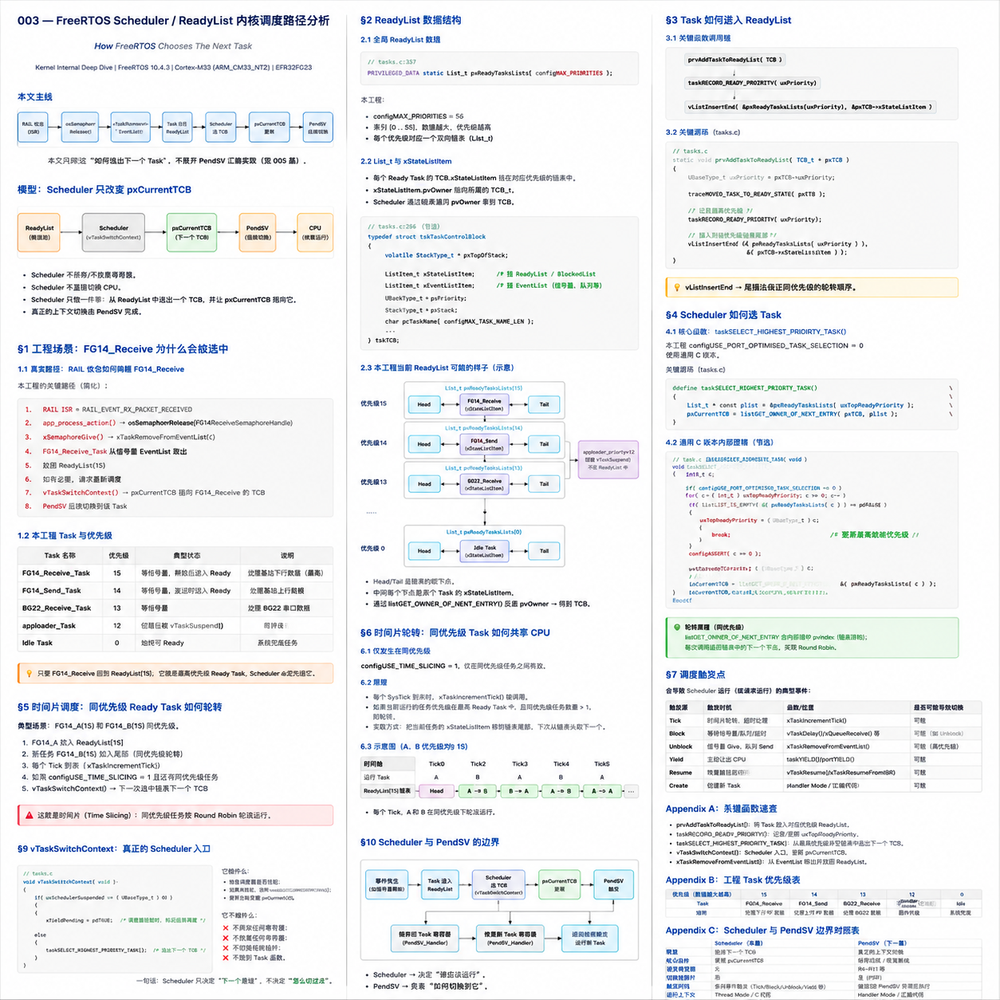](./003_scheduler_readylist_overview.png)

> 上图是本文的阅读地图：先看 RAIL RX 如何让 `FG14_Receive` 回到 ReadyList，再看 Scheduler 如何把 `pxCurrentTCB` 指向它。点击图片可以在 GitHub 中查看大图。

---

## 目录

- [模型：Scheduler 只改变 pxCurrentTCB](#模型scheduler-只改变-pxcurrenttcb)
- [§1 工程场景：FG14_Receive 为什么会被选中](#1-工程场景fg14_receive-为什么会被选中)
- [§2 ReadyList 数据结构](#2-readylist-数据结构)
- [§3 Task 如何进入 ReadyList](#3-task-如何进入-readylist)
- [§4 Scheduler 如何选 Task](#4-scheduler-如何选-task)
- [§5 抢占式调度：高优先级 Ready Task 出现时发生什么](#5-抢占式调度高优先级-ready-task-出现时发生什么)
- [§6 时间片轮转：同优先级 Task 如何共享 CPU](#6-时间片轮转同优先级-task-如何共享-cpu)
- [§7 调度触发点](#7-调度触发点)
- [§8 Idle Task：为什么系统永远有任务可运行](#8-idle-task为什么系统永远有任务可运行)
- [§9 vTaskSwitchContext：真正的 Scheduler 入口](#9-vtaskswitchcontext真正的-scheduler-入口)
- [§10 Scheduler 与 PendSV 的边界](#10-scheduler-与-pendsv-的边界)
- [Appendix A：关键函数速查](#appendix-a关键函数速查)
- [Appendix B：工程 Task 优先级表](#appendix-b工程-task-优先级表)
- [Appendix C：Scheduler 与 PendSV 边界对照表](#appendix-cscheduler-与-pendsv-边界对照表)

---

## 模型：Scheduler 只改变 pxCurrentTCB

先建立本文的核心模型：

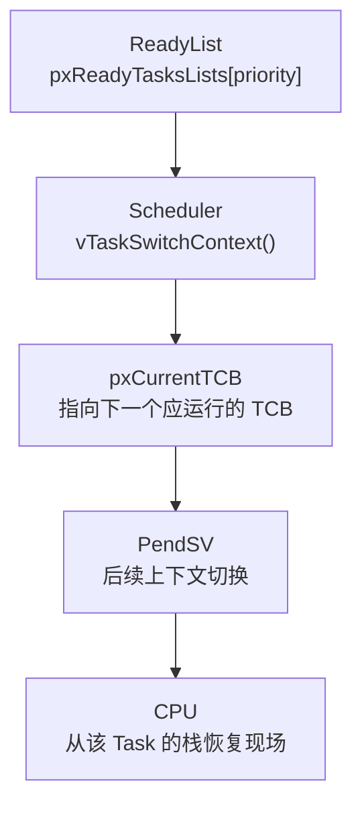

本文只研究上图前半段：

```
ReadyList
  ↓
Scheduler
  ↓
pxCurrentTCB
```

Scheduler 不保存寄存器。
Scheduler 不恢复寄存器。
Scheduler 不直接把 CPU 切到另一个函数。

Scheduler 真正做的事情只有一句话：

> 从 ReadyList 中选出一个 `TCB_t`，然后让 `pxCurrentTCB` 指向它。

后面 CPU 为什么会真的跑到这个 Task，是 PendSV 负责的事情。PendSV 会在第 005 篇继续拆，这里只把边界讲清楚。

所以本文不要把 Scheduler 想成“CPU 切换器”。在 FreeRTOS 里，Scheduler 更像一个“TCB 选择器”：

```
候选池：pxReadyTasksLists[]
选择规则：最高优先级优先，同优先级轮转
选择结果：pxCurrentTCB = 被选中的 TCB
执行动作：交给 PendSV
```

---

## §1 工程场景：FG14_Receive 为什么会被选中

### 1.0 Scheduler 总览

本文只研究一条链：

```
ReadyList -> Scheduler -> pxCurrentTCB -> PendSV
```

其中 Scheduler 的职责停在 `pxCurrentTCB`：

| 阶段 | 本文关注点 | 是否真正切 CPU |
|---|---|---|
| ReadyList | 哪些 Task 已经 Ready | 否 |
| Scheduler | 从 ReadyList 选出下一个 TCB | 否 |
| `pxCurrentTCB` | 指向被选中的 TCB | 否 |
| PendSV | 后续保存/恢复上下文 | 是 |

所以后面看到“触发调度”“抢占”“时间片轮转”时，先不要理解成“寄存器已经切了”。在本文里，它们的核心结果都是：

```
pxCurrentTCB 指向谁
```

### 1.1 从真实收包路径进入

本工程中，`FG14_Receive_Task` 的职责是处理基站下行 RF 数据。它不是一直跑，而是在没有 RF 包时阻塞在信号量上：

```c
// FreeRTOSEntry.c:221
void FG14_Receive_Task(void *argument)
{
  (void) argument;

  for(;;)
  {
    if(osOK == osSemaphoreAcquire(FG14ReceiveSemaphoreHandle, portMAX_DELAY))
    {
      FG14ReceiveProcess();
    }
  }
}
```

也就是说，绝大多数时间里，`FG14_Receive_Task` 不在 ReadyList 中。它在等：

```
FG14ReceiveSemaphoreHandle
```

当 RAIL 收到一包数据后，本工程路径是：

```c
// app_process.c:441
if (events & RAIL_EVENT_RX_PACKET_RECEIVED) {
    RAIL_RxPacketHandle = RAIL_HoldRxPacket(rail_handle);

    if(RAIL_RX_PACKET_HANDLE_INVALID != RAIL_RxPacketHandle)
    {
        packet_recieved = true;

        if(apploader_flag != true)
        {
            app_process_action(rail_handle);
        }
    }
}
```

进入 `app_process_action()` 后释放信号量：

```c
// app_process.c:379
void app_process_action(RAIL_Handle_t rail_handle)
{
  if (packet_recieved) {
    packet_recieved = false;
    state = S_PACKET_RECEIVED;
  }

  switch (state) {
    case S_PACKET_RECEIVED:
      if(System_Init_Finished_Flag == 1)
      {
          stat = osSemaphoreRelease(FG14ReceiveSemaphoreHandle);
      }
      state = S_IDLE;
      break;
  }
}
```

从内核角度看，这次 `osSemaphoreRelease()` 做的不是“调用 FG14_Receive_Task 函数”。它做的是：

```
信号量计数 +1
  ↓
发现有 Task 正在等这个信号量
  ↓
从该信号量的 EventList 取出最高优先级等待者
  ↓
把该 Task 放回 ReadyList
  ↓
如有必要，请求重新调度
```

本文主线就是这条：

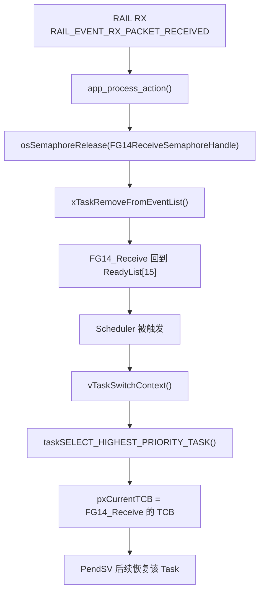

### 1.2 工程里的优先级事实

本工程实际创建的应用 Task：

```c
// FreeRTOSEntry.c:480
FG14_ReceiveHandle = osThreadNew(FG14_Receive_Task, NULL, &FG14_Receive_attributes);
FG14_SendHandle    = osThreadNew(FG14_Send_Task,    NULL, &FG14_Send_attributes);
BG22_ReceiveHandle = osThreadNew(BG22_Receive_Task, NULL, &BG22_Receive_attributes);
apploader_Handle   = osThreadNew(apploader_Task,    NULL, &apploader_attributes);

// FreeRTOSEntry.c:490
vTaskSuspend(apploader_Handle);
```

属性定义：

```c
// FreeRTOSEntry.c:49
const osThreadAttr_t FG14_Receive_attributes = {
  .name = "FG14_Receive",
  .priority = (osPriority_t) 15,
  .stack_size = 256 * 16
};

const osThreadAttr_t FG14_Send_attributes = {
  .name = "FG14_Send",
  .priority = (osPriority_t) 14,
  .stack_size = 256 * 16
};

const osThreadAttr_t BG22_Receive_attributes = {
  .name = "BG22_Receive",
  .priority = (osPriority_t) 13,
  .stack_size = 256 * 16
};

const osThreadAttr_t apploader_attributes = {
  .name = "apploader",
  .priority = (osPriority_t) 12,
  .stack_size = 256 * 16
};
```

配置事实：

```c
// config/FreeRTOSConfig.h
#define configUSE_PREEMPTION                    1
#define configUSE_TIME_SLICING                  1
#define configUSE_PORT_OPTIMISED_TASK_SELECTION 0
#define configMAX_PRIORITIES                    56
#define configTICK_RATE_HZ                      1000
#define INCLUDE_vTaskSuspend                    1
```

所以调度器面对的是这样的候选池：

| Task | 优先级 | 常见状态 |
|---|---:|---|
| `FG14_Receive_Task` | 15 | 等 RF 下行信号量；被释放后进入 Ready |
| `FG14_Send_Task` | 14 | 等发送信号量；需要发送时进入 Ready |
| `BG22_Receive_Task` | 13 | 等 SPI/BG22 接收信号量 |
| `apploader_Task` | 12 | 创建后被 `vTaskSuspend()` |
| `Idle Task` | 0 | 系统兜底任务，始终可 Ready |

问题来了：

> 当 `FG14_Send_Task` 正在运行时，如果 RAIL RX 唤醒了 `FG14_Receive_Task`，为什么下一个被选中的一定是 `FG14_Receive_Task`？

答案不是因为函数名字叫 Receive，也不是因为它被 RAIL 回调直接调用了。答案在 ReadyList：

```
FG14_Receive priority = 15
FG14_Send    priority = 14
BG22_Receive priority = 13
Idle         priority = 0
```

只要 `FG14_Receive` 回到 ReadyList[15]，Scheduler 扫到最高非空 ReadyList 时，就会优先选它。

---

## §2 ReadyList 数据结构

### 2.1 ReadyList 是 Scheduler 的候选池

`tasks.c` 中有一个全局数组：

```c
// tasks.c:357
PRIVILEGED_DATA static List_t pxReadyTasksLists[ configMAX_PRIORITIES ];
```

本工程：

```c
#define configMAX_PRIORITIES 56
```

所以内核实际有 56 条 ReadyList：

```
pxReadyTasksLists[0]
pxReadyTasksLists[1]
...
pxReadyTasksLists[55]
```

每一条链表对应一个优先级。优先级数值越大，调度优先级越高。

在本工程常见状态下，可以这样看：

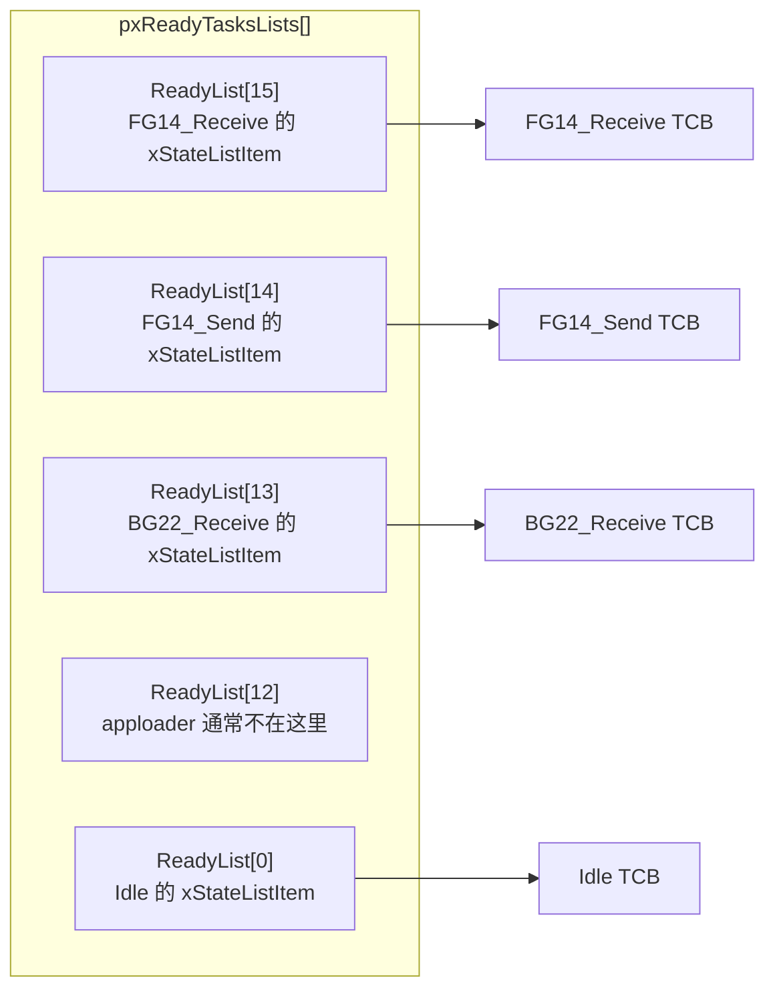

注意这里保存的不是 Task 函数指针。

ReadyList 里挂的是：

```
TCB_t.xStateListItem
```

也就是 §002 已经讲过的状态链表节点。Scheduler 通过这个节点的 `pvOwner` 反推出 TCB：

```c
// list.h:155
struct xLIST_ITEM
{
    TickType_t xItemValue;
    struct xLIST_ITEM * pxNext;
    struct xLIST_ITEM * pxPrevious;
    void * pvOwner;
    struct xLIST * pxContainer;
};
```

`pvOwner` 指向拥有这个 ListItem 的对象，在 Task 调度场景里就是 `TCB_t`。

所以 ReadyList 与 TCB 的关系是：

```
ReadyList[prio]
  ↓ 保存
TCB.xStateListItem
  ↓ pvOwner
TCB_t
  ↓ pxTopOfStack / pxStack / uxPriority / pcTaskName ...
Task 的运行现场与调度元数据
```

### 2.2 pxReadyTasksLists[] 与内核状态链表都是 List_t

`pxReadyTasksLists[]` 不是一个普通数组，它是“56 个 `List_t` 链表头”的数组：

```c
// tasks.c:357
PRIVILEGED_DATA static List_t pxReadyTasksLists[ configMAX_PRIORITIES ];
```

这些链表是在第一次创建 Task 时，由 `prvInitialiseTaskLists()` 统一初始化的：

```c
// tasks.c:3680
static void prvInitialiseTaskLists( void )
{
    UBaseType_t uxPriority;

    for( uxPriority = ( UBaseType_t ) 0U; uxPriority < ( UBaseType_t ) configMAX_PRIORITIES; uxPriority++ )
    {
        vListInitialise( &( pxReadyTasksLists[ uxPriority ] ) );
    }

    vListInitialise( &xDelayedTaskList1 );
    vListInitialise( &xDelayedTaskList2 );
    vListInitialise( &xPendingReadyList );

    #if ( INCLUDE_vTaskDelete == 1 )
        {
            vListInitialise( &xTasksWaitingTermination );
        }
    #endif

    #if ( INCLUDE_vTaskSuspend == 1 )
        {
            vListInitialise( &xSuspendedTaskList );
        }
    #endif

    pxDelayedTaskList = &xDelayedTaskList1;
    pxOverflowDelayedTaskList = &xDelayedTaskList2;
}
```

所以这里要看的不是“FreeRTOS 有一个叫 `List_t` 的抽象链表类型”这么泛泛的一句话，而是：

```
pxReadyTasksLists[0]   是一个 List_t
pxReadyTasksLists[1]   是一个 List_t
...
pxReadyTasksLists[55]  是一个 List_t

xDelayedTaskList1      是一个 List_t
xDelayedTaskList2      是一个 List_t
xPendingReadyList      是一个 List_t
xTasksWaitingTermination 是一个 List_t
xSuspendedTaskList     是一个 List_t
```

区别只在于“这些 `List_t` 被内核拿来表示什么状态”：

| 链表 | 类型 | 表示的 Task 状态 |
|---|---|---|
| `pxReadyTasksLists[priority]` | `List_t` | Ready，按优先级分桶 |
| `xDelayedTaskList1/2` | `List_t` | Blocked/Delayed，按唤醒 tick 排序 |
| `xPendingReadyList` | `List_t` | 调度器 suspended 时暂存的待 Ready 任务 |
| `xTasksWaitingTermination` | `List_t` | 等 Idle Task 回收的已删除任务 |
| `xSuspendedTaskList` | `List_t` | Suspended，或 `portMAX_DELAY` 下的无限期等待任务 |

每个 `List_t` 链表头内部长这样：

```c
// list.h:179
typedef struct xLIST
{
    volatile UBaseType_t uxNumberOfItems;
    ListItem_t * pxIndex;
    MiniListItem_t xListEnd;
} List_t;
```

对 Scheduler 来说，这三个字段的运行意义是：

| 字段 | 在 ReadyList 中的作用 |
|---|---|
| `uxNumberOfItems` | 当前优先级下有几个 Ready Task |
| `pxIndex` | 同优先级轮转时的游标 |
| `xListEnd` | 哨兵节点，维持双向循环链表 |

本文不会重复展开 TCB 的字段设计，`pxTopOfStack`、`pxStack`、`xStateListItem`、`xEventListItem` 的完整解释见第 002 篇。这里要抓住一点：

> Scheduler 只关心 ReadyList 中的 `xStateListItem`，并通过它拿到 TCB。

### 2.3 ReadyList 是按优先级分桶，不是在一条链表里排序

FreeRTOS 没有把所有 Ready Task 放在一条大链表里，然后每次按优先级排序。

它直接做了一个数组：

```
priority 0  -> pxReadyTasksLists[0]
priority 1  -> pxReadyTasksLists[1]
...
priority 15 -> pxReadyTasksLists[15]
...
priority 55 -> pxReadyTasksLists[55]
```

Scheduler 选择时看到的是“空/非空”的优先级桶：

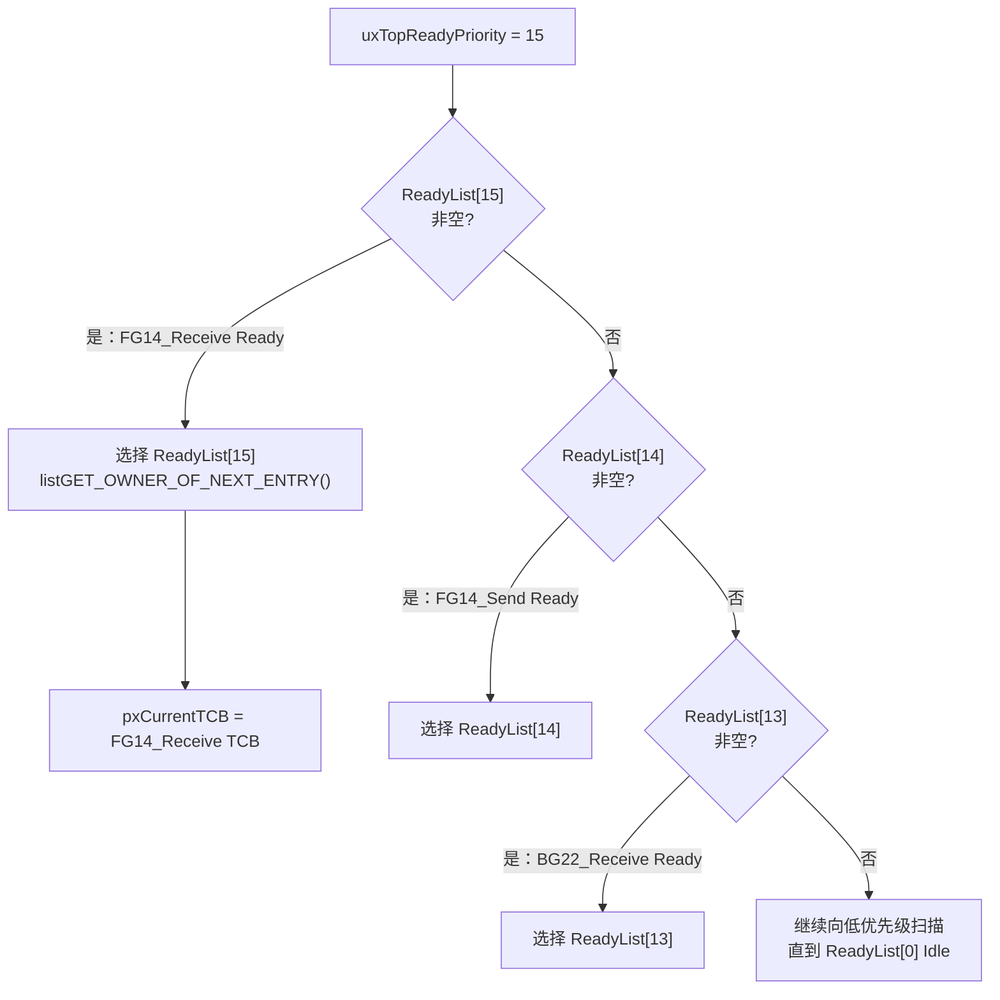

这就像按优先级提前分好桶：

```
Ready Task 出现
  ↓
看它的 uxPriority
  ↓
插入 pxReadyTasksLists[uxPriority]
```

这样 Scheduler 选择任务时，不需要比较每一个 Task 的优先级。它只需要找到“最高的非空桶”。

本工程中，当 RF 包唤醒 `FG14_Receive_Task` 后：

```
FG14_Receive.uxPriority = 15
  ↓
插入 pxReadyTasksLists[15]
```

只要 ReadyList[15] 非空，就不会去选 ReadyList[14]、ReadyList[13] 或 ReadyList[0]。

---

## §3 Task 如何进入 ReadyList

### 3.1 创建时进入 ReadyList

Task 创建流程在第 002 篇已经完整拆过。这里只看最后一步：

```c
// tasks.c:827
prvInitialiseNewTask(...);
prvAddNewTaskToReadyList(pxNewTCB);
```

`prvAddNewTaskToReadyList()` 内部最终调用：

```c
// tasks.c:232
#define prvAddTaskToReadyList( pxTCB )                                                                 \
    traceMOVED_TASK_TO_READY_STATE( pxTCB );                                                           \
    taskRECORD_READY_PRIORITY( ( pxTCB )->uxPriority );                                                \
    vListInsertEnd( &( pxReadyTasksLists[ ( pxTCB )->uxPriority ] ), &( ( pxTCB )->xStateListItem ) ); \
    tracePOST_MOVED_TASK_TO_READY_STATE( pxTCB )
```

这三句就是 ReadyList 入池动作：

```
记录当前最高 Ready 优先级
  ↓
把 TCB.xStateListItem 插入 ReadyList[uxPriority] 尾部
  ↓
这个 Task 进入 Scheduler 的候选池
```

### 3.2 被信号量唤醒时进入 ReadyList

本文主线不是 Task 创建，而是 RF 包到达后，信号量唤醒 `FG14_Receive_Task`。

`osSemaphoreRelease()` 底层会进入 Queue/Semaphore 释放路径。第 001 篇已经展开过信号量本质是 Queue，这里只看它唤醒等待 Task 时调用的关键函数：

```c
// tasks.c:3210
BaseType_t xTaskRemoveFromEventList( const List_t * const pxEventList )
{
    TCB_t * pxUnblockedTCB;
    BaseType_t xReturn;

    pxUnblockedTCB = listGET_OWNER_OF_HEAD_ENTRY( pxEventList );
    configASSERT( pxUnblockedTCB );

    ( void ) uxListRemove( &( pxUnblockedTCB->xEventListItem ) );

    if( uxSchedulerSuspended == ( UBaseType_t ) pdFALSE )
    {
        ( void ) uxListRemove( &( pxUnblockedTCB->xStateListItem ) );
        prvAddTaskToReadyList( pxUnblockedTCB );
    }
    else
    {
        vListInsertEnd( &( xPendingReadyList ), &( pxUnblockedTCB->xEventListItem ) );
    }

    if( pxUnblockedTCB->uxPriority > pxCurrentTCB->uxPriority )
    {
        xReturn = pdTRUE;
        xYieldPending = pdTRUE;
    }
    else
    {
        xReturn = pdFALSE;
    }

    return xReturn;
}
```

把这段代码对应到工程：

```
pxEventList
  = FG14ReceiveSemaphoreHandle 内部的 xTasksWaitingToReceive

pxUnblockedTCB
  = FG14_Receive_Task 的 TCB

pxUnblockedTCB->xEventListItem
  = 从信号量等待链表移除

pxUnblockedTCB->xStateListItem
  = 从阻塞/挂起类状态链表移除

prvAddTaskToReadyList(pxUnblockedTCB)
  = 插入 pxReadyTasksLists[15]
```

这一刻发生的状态变化是：

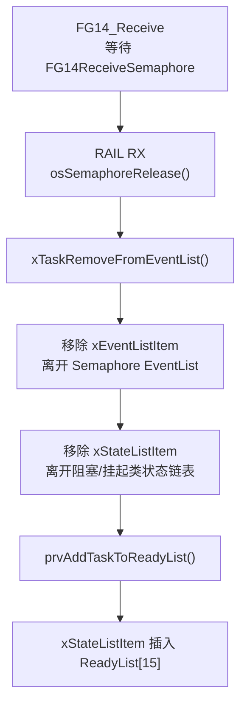

这里有一个容易混淆的点：

> Task 进入 ReadyList，不代表 CPU 已经开始执行它。

进入 ReadyList 只是说：

```
这个 Task 已经具备运行条件，可以被 Scheduler 选择。
```

真正是否马上运行，取决于：

```
它的优先级是否高于当前正在运行的 Task
configUSE_PREEMPTION 是否开启
是否触发了 PendSV
```

### 3.3 uxTopReadyPriority 的作用

在本工程中：

```c
#define configUSE_PORT_OPTIMISED_TASK_SELECTION 0
```

所以使用通用 C 版本的优先级记录方式：

```c
// tasks.c:135
#define taskRECORD_READY_PRIORITY( uxPriority ) \
{                                               \
    if( ( uxPriority ) > uxTopReadyPriority )   \
    {                                           \
        uxTopReadyPriority = ( uxPriority );    \
    }                                           \
}
```

`uxTopReadyPriority` 不是一个 Task，也不是一个链表。它只是一个数：

```
当前已知最高的 Ready 优先级
```

当 `FG14_Receive_Task` 被插入 ReadyList[15] 时：

```c
taskRECORD_READY_PRIORITY(15);
```

如果此前最高 Ready 优先级是 14，那么：

```
uxTopReadyPriority: 14 -> 15
```

这一步的意义是减少 Scheduler 搜索范围。下一次 `taskSELECT_HIGHEST_PRIORITY_TASK()` 不需要从 55 一直扫下来，而是从 `uxTopReadyPriority` 开始检查。

---

## §4 Scheduler 如何选 Task

### 4.1 选择入口：taskSELECT_HIGHEST_PRIORITY_TASK()

本工程没有启用 port optimized selection：

```c
#define configUSE_PORT_OPTIMISED_TASK_SELECTION 0
```

所以使用 `tasks.c` 中的通用选择宏：

```c
// tasks.c:147
#define taskSELECT_HIGHEST_PRIORITY_TASK()                                \
{                                                                         \
    UBaseType_t uxTopPriority = uxTopReadyPriority;                       \
                                                                          \
    while( listLIST_IS_EMPTY( &( pxReadyTasksLists[ uxTopPriority ] ) ) ) \
    {                                                                     \
        configASSERT( uxTopPriority );                                    \
        --uxTopPriority;                                                  \
    }                                                                     \
                                                                          \
    listGET_OWNER_OF_NEXT_ENTRY( pxCurrentTCB, &( pxReadyTasksLists[ uxTopPriority ] ) ); \
    uxTopReadyPriority = uxTopPriority;                                                   \
}
```

它做了三件事：

1. 从 `uxTopReadyPriority` 开始检查。
2. 如果这个优先级的 ReadyList 是空的，就向低优先级递减。
3. 找到最高非空 ReadyList 后，从里面取下一个 TCB，让 `pxCurrentTCB` 指向它。

这一节涉及的三个对象可以压成一张表：

| 对象 | 在 Scheduler 路径里的作用 | 本工程例子 |
|---|---|---|
| `pxReadyTasksLists[]` | 保存所有 Ready Task 的候选池 | `FG14_Receive` 回到 `ReadyList[15]` |
| `taskSELECT_HIGHEST_PRIORITY_TASK()` | 找到最高非空 ReadyList，并取出下一个 owner | 从 `ReadyList[15]` 取出 `FG14_Receive TCB` |
| `pxCurrentTCB` | 保存 Scheduler 的选择结果 | `pxCurrentTCB = FG14_Receive TCB` |

展开成更直白的伪代码：

```c
uxTopPriority = uxTopReadyPriority;

while (ReadyList[uxTopPriority] is empty) {
    uxTopPriority--;
}

pxCurrentTCB = ReadyList[uxTopPriority].next_owner;
uxTopReadyPriority = uxTopPriority;
```

注意最后赋值的是：

```c
pxCurrentTCB = ...
```

不是：

```c
jump_to_task_function();
restore_registers();
load_stack_pointer();
```

这就是本文的主模型：Scheduler 只选 TCB。

### 4.2 为什么本工程会选 FG14_Receive

假设某一刻 `FG14_Send_Task` 正在运行，系统状态近似是：

```
pxCurrentTCB = FG14_Send TCB
FG14_Send priority = 14
```

此时 RAIL RX 收到基站下行包：

```
RAIL RX
  ↓
osSemaphoreRelease(FG14ReceiveSemaphoreHandle)
  ↓
xTaskRemoveFromEventList()
  ↓
FG14_Receive 插入 ReadyList[15]
  ↓
uxTopReadyPriority = 15
```

现在 Scheduler 面前的 ReadyList 是：

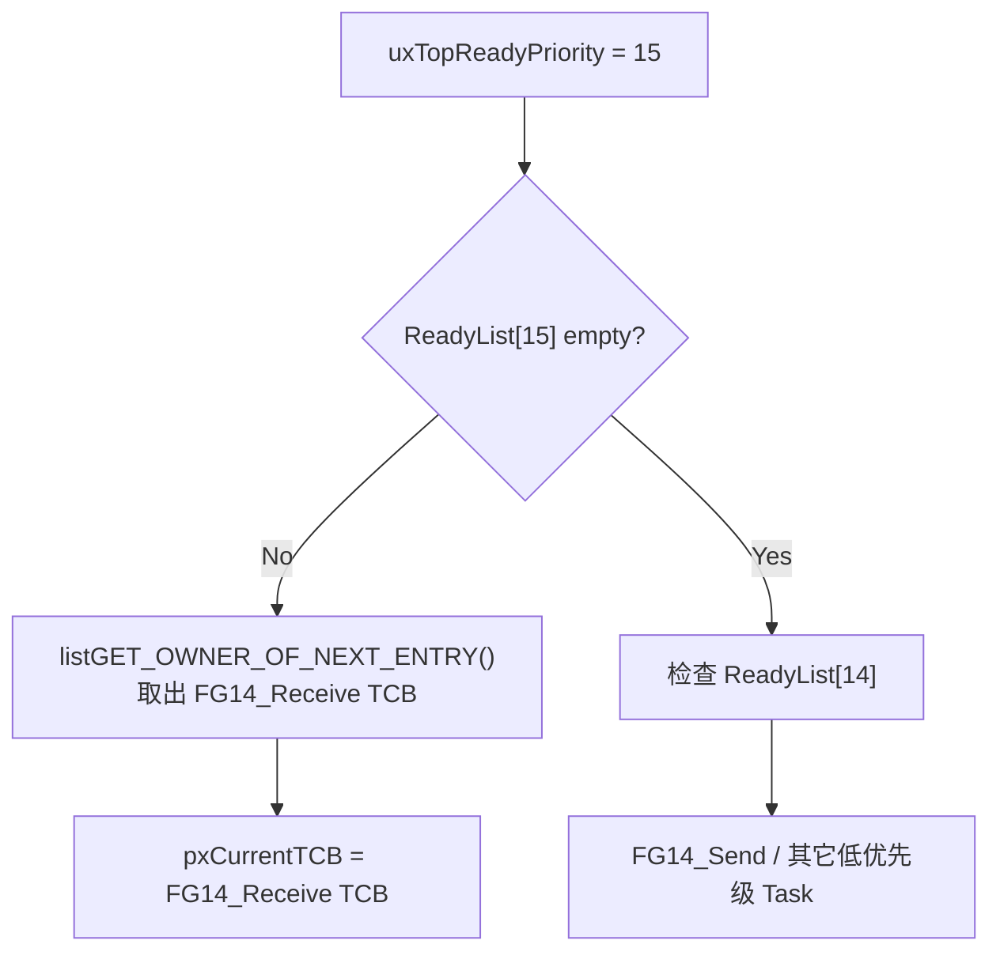

因为 ReadyList[15] 非空，所以不会继续向下找。

这就解释了：

| 为什么不是 | 原因 |
|---|---|
| `FG14_Send_Task` | 它是优先级 14，低于 15 |
| `BG22_Receive_Task` | 它是优先级 13，更低 |
| `Idle Task` | 它是优先级 0，只在没有更高优先级 Ready Task 时运行 |
| `apploader_Task` | 创建后被 `vTaskSuspend()`，通常不在 ReadyList |

所以答案非常机械：

```
最高非空 ReadyList = ReadyList[15]
ReadyList[15] 中的 owner = FG14_Receive TCB
pxCurrentTCB = FG14_Receive TCB
```

### 4.3 ReadyList 里取的是“下一个 owner”

选择 TCB 的宏是：

```c
// list.h:292
#define listGET_OWNER_OF_NEXT_ENTRY( pxTCB, pxList )                                           \
{                                                                                              \
    List_t * const pxConstList = ( pxList );                                                   \
    ( pxConstList )->pxIndex = ( pxConstList )->pxIndex->pxNext;                               \
    if( ( void * ) ( pxConstList )->pxIndex == ( void * ) &( ( pxConstList )->xListEnd ) )     \
    {                                                                                          \
        ( pxConstList )->pxIndex = ( pxConstList )->pxIndex->pxNext;                           \
    }                                                                                          \
    ( pxTCB ) = ( pxConstList )->pxIndex->pvOwner;                                             \
}
```

这个宏不是只拿链表头。它会推进 `pxIndex`：

```
pxIndex = pxIndex->pxNext
  ↓
如果碰到 xListEnd，就再跳到下一个真实节点
  ↓
pxTCB = pxIndex->pvOwner
```

这就是同优先级轮转的基础。

如果 ReadyList[15] 里只有 `FG14_Receive_Task` 一个节点，那么每次取出来还是它。

如果 ReadyList[15] 里有两个 Task：

```
ReadyList[15]:
  TaskA.xStateListItem
  TaskB.xStateListItem
```

那么 `listGET_OWNER_OF_NEXT_ENTRY()` 会让 `pxIndex` 在 TaskA 和 TaskB 之间前进。Scheduler 选择的仍然是最高优先级，但同一优先级内部不是永远拿第一个，而是沿链表游标轮转。

---

## §5 抢占式调度：高优先级 Ready Task 出现时发生什么

### 5.1 本工程开启抢占

```c
// config/FreeRTOSConfig.h
#define configUSE_PREEMPTION 1
```

这意味着：

> 当前正在运行的 Task，不一定能一直运行到自己主动阻塞或 yield。只要更高优先级 Task 变成 Ready，内核就可以请求切换。

工程场景：

```
FG14_Send_Task 正在运行
  ↓
RAIL RX 到达
  ↓
osSemaphoreRelease(FG14ReceiveSemaphoreHandle)
  ↓
FG14_Receive_Task 被唤醒
  ↓
FG14_Receive priority 15 > FG14_Send priority 14
  ↓
请求重新调度
```

关键判断在 `xTaskRemoveFromEventList()`：

```c
// tasks.c:3260
if( pxUnblockedTCB->uxPriority > pxCurrentTCB->uxPriority )
{
    xReturn = pdTRUE;
    xYieldPending = pdTRUE;
}
else
{
    xReturn = pdFALSE;
}
```

对应工程变量：

```
pxUnblockedTCB = FG14_Receive TCB
pxUnblockedTCB->uxPriority = 15

pxCurrentTCB = FG14_Send TCB
pxCurrentTCB->uxPriority = 14
```

判断结果：

```
15 > 14
  ↓
xReturn = pdTRUE
xYieldPending = pdTRUE
```

`xReturn = pdTRUE` 的意思是：

```
调用者应该知道：刚刚唤醒了一个比当前 Task 更高优先级的 Task。
```

`xYieldPending = pdTRUE` 的意思是：

```
即使调用者没有立刻触发 yield，内核也记住“有一次调度请求待处理”。
```

### 5.2 抢占不是在 xTaskRemoveFromEventList 里完成的

这点很关键。

`xTaskRemoveFromEventList()` 做了：

```
EventList -> ReadyList
比较优先级
设置 xYieldPending
返回是否需要切换
```

也就是说，这里只是把“需要调度”这件事标记出来，并把 Task 放回候选池；它仍然没有执行上下文切换。

但它没有：

```
保存 FG14_Send 的 R4~R11
恢复 FG14_Receive 的 R4~R11
切换 PSP
跳到 FG14_Receive_Task
```

如果当前路径最终决定要切换，Cortex-M port 会挂起 PendSV。例如本工程 port 中有：

```c
// portable/GCC/ARM_CM33_NTZ/non_secure/portmacro.h:227
#define portNVIC_INT_CTRL_REG     ( *( ( volatile uint32_t * ) 0xe000ed04 ) )
#define portNVIC_PENDSVSET_BIT    ( 1UL << 28UL )
#define portEND_SWITCHING_ISR( xSwitchRequired ) \
    if( xSwitchRequired ) portNVIC_INT_CTRL_REG = portNVIC_PENDSVSET_BIT
```

以及普通 yield：

```c
// portable/GCC/ARM_CM33_NTZ/non_secure/port.c:722
void vPortYield( void )
{
    portNVIC_INT_CTRL_REG = portNVIC_PENDSVSET_BIT;
    __asm volatile ( "dsb" ::: "memory" );
    __asm volatile ( "isb" );
}
```

这说明“请求上下文切换”的硬件动作是：

```
设置 NVIC ICSR 寄存器的 PENDSVSET 位
```

但 PendSV 里面具体怎样保存/恢复寄存器，不属于本文展开范围。

### 5.3 工程抢占链路

把上面串起来：

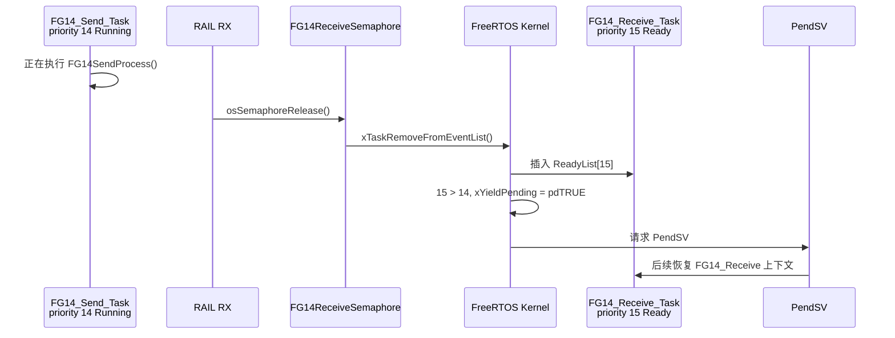

这里 Scheduler 的选择结果是确定的：

```
pxCurrentTCB = FG14_Receive TCB
```

但“CPU 什么时候真的跳过去”，要看当前是否在中断、临界区、调度锁，以及 PendSV 何时被硬件接收执行。

本文只保留这个边界：

```
Scheduler 决定谁
PendSV 负责切过去
```

---

## §6 时间片轮转：同优先级 Task 如何共享 CPU

### 6.1 本工程开启时间片

```c
// config/FreeRTOSConfig.h
#define configUSE_TIME_SLICING 1
```

但时间片有一个重要前提：

> 时间片只发生在同优先级 Ready Task 之间。

它不会让优先级 14 的 `FG14_Send_Task` 跟优先级 15 的 `FG14_Receive_Task` 平分 CPU。

本工程中：

```
FG14_Receive priority = 15
FG14_Send    priority = 14
BG22_Receive priority = 13
Idle         priority = 0
```

所以正常情况下，时间片不会在这几个任务之间轮转。它们是严格优先级抢占关系。

### 6.2 Tick 中的时间片判断

Tick 发生时，内核会进入 `xTaskIncrementTick()`。这里不展开 SysTick 和 DelayedList，后续第 004 篇会专门讲。本文只看时间片判断：

```c
// tasks.c:2882
#if ( ( configUSE_PREEMPTION == 1 ) && ( configUSE_TIME_SLICING == 1 ) )
{
    if( listCURRENT_LIST_LENGTH( &( pxReadyTasksLists[ pxCurrentTCB->uxPriority ] ) ) > ( UBaseType_t ) 1 )
    {
        xSwitchRequired = pdTRUE;
    }
}
#endif
```

翻译成运行行为：

```
当前 Task 的优先级 = pxCurrentTCB->uxPriority
  ↓
查看 ReadyList[当前优先级] 里有几个 Task
  ↓
如果 > 1
  ↓
说明同优先级还有别人 Ready
  ↓
请求一次调度
```

注意这里检查的是：

```c
pxReadyTasksLists[ pxCurrentTCB->uxPriority ]
```

不是所有 ReadyList。

### 6.3 同优先级轮转示例

假设系统里有两个优先级 15 的任务：

```
TaskA priority = 15
TaskB priority = 15
```

ReadyList[15]：

```
xListEnd <-> TaskA.xStateListItem <-> TaskB.xStateListItem <-> xListEnd
```

每次 Tick 判断发现：

```
listCURRENT_LIST_LENGTH(&pxReadyTasksLists[15]) > 1
```

于是请求调度。真正选择时仍走：

```c
listGET_OWNER_OF_NEXT_ENTRY(pxCurrentTCB, &pxReadyTasksLists[15]);
```

这个宏推进 `pxIndex`，于是形成轮转：

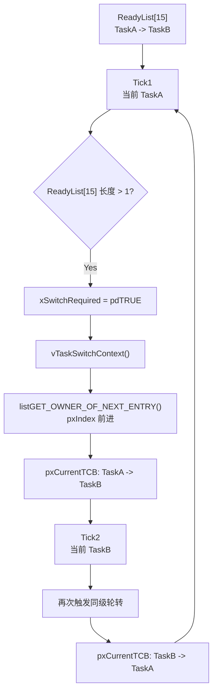

再强调一遍：

```
时间片轮转 = 同优先级内部轮转
高优先级压低优先级 = 抢占
```

所以如果 `FG14_Receive_Task` 是 Ready 状态，`FG14_Send_Task` 不会靠时间片拿到 CPU。除非：

```
FG14_Receive_Task 阻塞
或挂起
或主动让出后不再 Ready
```

---

## §7 调度触发点

### 7.1 触发调度不等于已经切换上下文

FreeRTOS 中很多路径都会“触发调度”。但触发调度通常只是：

```
设置 xYieldPending
返回 xSwitchRequired
调用 taskYIELD()
设置 PendSV pending
```

它不等于已经完成 CPU 上下文切换。

可以把它分成两层：

| 层级 | 含义 |
|---|---|
| 调度请求 | 发现可能需要换 Task |
| 上下文切换 | PendSV 真正保存/恢复寄存器和 PSP |

本文只研究调度请求到 `pxCurrentTCB` 更新。

### 7.2 常见触发点

| 触发点 | 工程/内核场景 | 做了什么 |
|---|---|---|
| Tick | 1ms RTOS tick | 处理超时唤醒、同优先级时间片 |
| Yield | Task 主动让出 | 请求 Scheduler 重新选择 |
| Block | 当前 Task 等信号量/队列/延时 | 当前 Task 离开 ReadyList，需要选别人 |
| Unblock | 信号量/队列/通知唤醒 Task | 被唤醒 Task 进入 ReadyList，可能抢占 |
| Resume | `vTaskResume()` / `xTaskResumeFromISR()` | Suspended Task 回到 ReadyList |
| Task Create | 新 Task 创建完成 | 新 TCB 进入 ReadyList，可能优先级更高 |

对本工程最重要的是 Unblock：

```
RAIL RX
  ↓
osSemaphoreRelease()
  ↓
xTaskRemoveFromEventList()
  ↓
FG14_Receive Ready
  ↓
请求调度
```

### 7.3 Tick 触发调度

Tick 中有两类和 Scheduler 有关的动作：

1. 某个延时到期的 Task 被移回 ReadyList。
2. 当前优先级 ReadyList 中有多个 Task，需要时间片轮转。

相关代码：

```c
// tasks.c:2856
prvAddTaskToReadyList( pxTCB );

#if ( configUSE_PREEMPTION == 1 )
{
    if( pxTCB->uxPriority >= pxCurrentTCB->uxPriority )
    {
        xSwitchRequired = pdTRUE;
    }
}
#endif
```

以及时间片：

```c
// tasks.c:2885
if( listCURRENT_LIST_LENGTH( &( pxReadyTasksLists[ pxCurrentTCB->uxPriority ] ) ) > 1 )
{
    xSwitchRequired = pdTRUE;
}
```

这里不展开 DelayedList 的排序和 tick overflow，那是第 004 篇的主题。

### 7.4 创建 Task 触发调度

如果调度器已经在运行，新建 Task 之后会判断是否需要抢占当前任务：

```c
// tasks.c:1149
if( xSchedulerRunning != pdFALSE )
{
    if( pxCurrentTCB->uxPriority < pxNewTCB->uxPriority )
    {
        taskYIELD_IF_USING_PREEMPTION();
    }
}
```

对应运行行为：

```
新 Task 创建
  ↓
进入 ReadyList[uxPriority]
  ↓
如果新 Task 优先级高于当前 Task
  ↓
请求调度
```

本工程启动阶段创建 Task 时，调度器还没有真正运行，所以 `prvAddNewTaskToReadyList()` 会先维护 `pxCurrentTCB`，让调度器启动时能从最高优先级的已创建任务开始。

### 7.5 Block 触发调度

当当前 Task 因为等待信号量而阻塞时，它会离开 ReadyList。比如 `FG14_Receive_Task` 处理完 RF 包后，再次执行：

```c
osSemaphoreAcquire(FG14ReceiveSemaphoreHandle, portMAX_DELAY)
```

如果此时没有新的 RF 包，它会重新进入等待状态。

对 Scheduler 来说：

```
当前 Running Task 不再 Ready
  ↓
必须从 ReadyList 中选另一个 Task
```

这就是为什么工程中的 Task 几乎都写成：

```c
for(;;)
{
    osSemaphoreAcquire(..., portMAX_DELAY);
    Process();
}
```

没有事件时它们不会空转吃 CPU，而是把自己从 Ready 候选池里拿走。

---

## §8 Idle Task：为什么系统永远有任务可运行

### 8.1 Idle Task 由内核创建

应用层创建完自己的 Task 后，启动调度器时，FreeRTOS 会创建 Idle Task：

```c
// tasks.c:2021
void vTaskStartScheduler( void )
{
    /* Add the idle task at the lowest priority. */

#if ( configSUPPORT_STATIC_ALLOCATION == 1 )
    xIdleTaskHandle = xTaskCreateStatic(
        prvIdleTask,
        configIDLE_TASK_NAME,
        ulIdleTaskStackSize,
        ( void * ) NULL,
        portPRIVILEGE_BIT,
        pxIdleTaskStackBuffer,
        pxIdleTaskTCBBuffer );
#else
    xReturn = xTaskCreate(
        prvIdleTask,
        configIDLE_TASK_NAME,
        configMINIMAL_STACK_SIZE,
        ( void * ) NULL,
        portPRIVILEGE_BIT,
        &xIdleTaskHandle );
#endif
}
```

Idle Task 优先级为 0：

```
tskIDLE_PRIORITY = 0
```

所以它挂在：

```
pxReadyTasksLists[0]
```

### 8.2 为什么系统不会出现“无 Task 可运行”

假设某个时刻：

```
FG14_Receive_Task 等 FG14ReceiveSemaphore
FG14_Send_Task    等 FG14SendSemaphore
BG22_Receive_Task 等 BG22ReceiveSemaphore
apploader_Task    Suspended
```

那么应用任务都不在 ReadyList 中。

ReadyList 近似是：

```
ReadyList[15] empty
ReadyList[14] empty
ReadyList[13] empty
ReadyList[12] empty
...
ReadyList[0]  Idle
```

Scheduler 从 `uxTopReadyPriority` 向下找到最后，会找到 `ReadyList[0]`：

```
pxCurrentTCB = Idle TCB
```

于是 CPU 运行 Idle Task。

Idle Task 的入口：

```c
// tasks.c:3468
static portTASK_FUNCTION( prvIdleTask, pvParameters )
{
    ( void ) pvParameters;

    for( ; ; )
    {
        prvCheckTasksWaitingTermination();
        ...
    }
}
```

它不是“没用的空函数”。它至少负责：

```
清理已删除任务的 TCB/Stack
执行 Idle Hook
配合低功耗 tickless idle
兜底保证 Scheduler 永远能选出一个 TCB
```

### 8.3 工程中的 Idle 场景

本工程是事件驱动结构：

```
RF 下行包 -> FG14_Receive
发送事件 -> FG14_Send
SPI/BLE 数据 -> BG22_Receive
OTA -> apploader
```

没有事件时，Task 都应该 Block 或 Suspended。此时 Idle Running 是好事，说明系统没有忙等。

一个健康状态可能是：

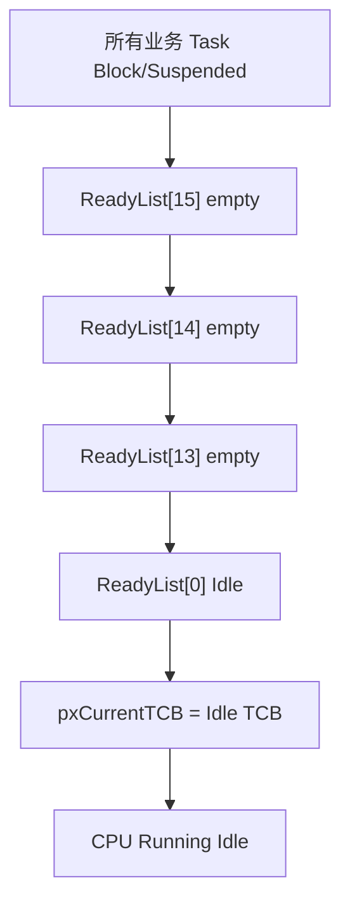

如果你调试时发现 Idle 从来没有运行，反而要警惕：

```
是否有任务在 while(1) 里忙等
是否有信号量 acquire 超时时间写成 0 后反复轮询
是否有高优先级 Task 没有 Block 点
```

---

## §9 vTaskSwitchContext：真正的 Scheduler 入口

### 9.1 vTaskSwitchContext 做什么

`vTaskSwitchContext()` 是 FreeRTOS 中负责选择下一个 Task 的核心函数：

```c
// tasks.c:3055
void vTaskSwitchContext( void )
{
    if( uxSchedulerSuspended != ( UBaseType_t ) pdFALSE )
    {
        xYieldPending = pdTRUE;
    }
    else
    {
        xYieldPending = pdFALSE;
        traceTASK_SWITCHED_OUT();

        taskCHECK_FOR_STACK_OVERFLOW();

        taskSELECT_HIGHEST_PRIORITY_TASK();

        traceTASK_SWITCHED_IN();
    }
}
```

为了抓主线，可以压缩成：

```c
void vTaskSwitchContext(void)
{
    if (scheduler_suspended) {
        xYieldPending = pdTRUE;
        return;
    }

    xYieldPending = pdFALSE;
    taskSELECT_HIGHEST_PRIORITY_TASK();
}
```

核心动作还是：

```c
taskSELECT_HIGHEST_PRIORITY_TASK();
```

也就是：

```
根据 ReadyList 更新 pxCurrentTCB
```

### 9.2 vTaskSwitchContext 不做什么

它不做这些事：

| 不做的事 | 谁做 |
|---|---|
| 保存当前 Task 的 R4~R11 | PendSV |
| 保存 PSP 到当前 TCB | PendSV |
| 从新 TCB 读取 pxTopOfStack | PendSV |
| 恢复新 Task 的寄存器 | PendSV |
| 从异常返回进入新 Task | PendSV / Cortex-M 异常返回机制 |

它做的是这些事：

| 做的事 | 意义 |
|---|---|
| 检查调度器是否 suspended | 如果调度锁中，只记录 pending |
| 清除 `xYieldPending` | 本次准备处理调度请求 |
| 检查栈溢出 | 可选配置路径 |
| 调用 `taskSELECT_HIGHEST_PRIORITY_TASK()` | 选择新的 `pxCurrentTCB` |
| trace hook | 调试/统计钩子 |

所以在本文主线中：

```
vTaskSwitchContext()
  ↓
taskSELECT_HIGHEST_PRIORITY_TASK()
  ↓
pxCurrentTCB = FG14_Receive TCB
```

这个结果随后被 PendSV 使用。

### 9.3 Scheduler suspended 时的行为

如果系统处于调度锁中：

```c
vTaskSuspendAll();
...
xTaskResumeAll();
```

那么 `vTaskSwitchContext()` 看到：

```c
uxSchedulerSuspended != pdFALSE
```

它不会立刻选择新任务，而是：

```c
xYieldPending = pdTRUE;
```

意思是：

```
现在不能切
但需要记住：后面恢复调度时要处理这次切换请求
```

这和本工程 `FG14_Send_Task` 中某些发送临界流程有关：发送期间可能使用调度锁保护一段不能被任务切换打断的逻辑。注意调度锁不等于关中断，中断仍然可能来，唤醒动作可能被延后到恢复调度时处理。

本文不展开 `xPendingReadyList` 的完整细节，只保留结论：

```
Scheduler suspended 时，不直接改动 Ready/Delayed 主链表的敏感路径；
相关唤醒会被延后，恢复调度时再归并并处理 pending yield。
```

---

## §10 Scheduler 与 PendSV 的边界

### 10.1 总流程图

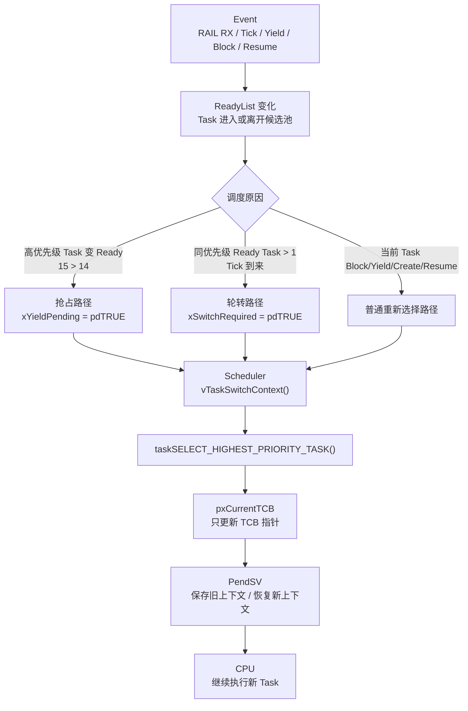

这张图是本文的最终模型。

### 10.2 本工程主线复盘

从 RF 包到 `FG14_Receive_Task` 被选中：

```
1. RAIL 收到完整 RF 包
2. sl_rail_util_on_event() 设置 packet_recieved
3. app_process_action() 释放 FG14ReceiveSemaphoreHandle
4. Semaphore/Queue 释放路径唤醒等待者
5. xTaskRemoveFromEventList() 取出 FG14_Receive TCB
6. FG14_Receive.xStateListItem 插入 ReadyList[15]
7. taskRECORD_READY_PRIORITY(15) 更新 uxTopReadyPriority
8. 若当前 Task 优先级低于 15，xYieldPending = pdTRUE
9. 后续进入 vTaskSwitchContext()
10. taskSELECT_HIGHEST_PRIORITY_TASK() 找到 ReadyList[15]
11. listGET_OWNER_OF_NEXT_ENTRY() 通过 pvOwner 取出 FG14_Receive TCB
12. pxCurrentTCB = FG14_Receive TCB
13. PendSV 后续根据 pxCurrentTCB 恢复该 Task
```

这条链路里，Scheduler 的职责只覆盖第 9~12 步：

```
查看 ReadyList
选出 TCB
更新 pxCurrentTCB
```

### 10.3 Scheduler 和 PendSV 的分工

| 阶段 | 负责者 | 核心对象 | 结果 |
|---|---|---|---|
| Task 变 Ready | Queue/Semaphore/Task API | `xStateListItem` | Task 进入 ReadyList |
| 选择下一个 Task | Scheduler | `pxReadyTasksLists[]` / `uxTopReadyPriority` | `pxCurrentTCB` 指向新 TCB |
| 请求切换 | Port 层 | `PENDSVSET` | PendSV pending |
| 保存/恢复上下文 | PendSV | `pxTopOfStack` / PSP / 寄存器 | CPU 执行新 Task |

一句话：

> Scheduler 决定“下一个是谁”；PendSV 负责“真的切过去”。

这也是为什么本文不深入 PendSV 汇编。因为在理解 Scheduler 时，最重要的不是寄存器保存顺序，而是：

```
ReadyList 中有哪些候选 TCB
uxTopReadyPriority 指向哪个最高优先级
taskSELECT_HIGHEST_PRIORITY_TASK() 怎样取 owner
pxCurrentTCB 最终指向谁
```

### 10.4 最终回答：为什么 FG14_Receive 会被选中

回到全文最开始的问题：

> 为什么 `FG14_Receive_Task` 会被选中？

因为在 RF 包到达后：

```
FG14_Receive 被信号量唤醒
  ↓
它的 xStateListItem 被插入 ReadyList[15]
  ↓
uxTopReadyPriority 被记录为 15
  ↓
Scheduler 从 ReadyList[15] 开始检查
  ↓
ReadyList[15] 非空
  ↓
listGET_OWNER_OF_NEXT_ENTRY() 取出 FG14_Receive TCB
  ↓
pxCurrentTCB = FG14_Receive TCB
```

为什么不是 `FG14_Send_Task`？

```
FG14_Send priority = 14
低于 15
```

为什么不是 `BG22_Receive_Task`？

```
BG22_Receive priority = 13
低于 15
```

为什么不是 Idle？

```
Idle priority = 0
只有更高优先级 ReadyList 都为空时才会被选中
```

所以 Scheduler 的行为没有魔法：

```
最高优先级 Ready Task 胜出
同优先级按 ReadyList 游标轮转
最终结果写入 pxCurrentTCB
```

---

## Appendix A：关键函数速查

| 函数 / 宏 | 文件 | 在本文中的角色 |
|---|---|---|
| `osSemaphoreRelease()` | CMSIS-RTOS2 wrapper | 工程释放信号量入口 |
| `xTaskRemoveFromEventList()` | `tasks.c:3210` | 从 EventList 唤醒等待 Task，并放入 ReadyList |
| `prvAddTaskToReadyList()` | `tasks.c:232` | 把 `xStateListItem` 插入对应优先级 ReadyList |
| `taskRECORD_READY_PRIORITY()` | `tasks.c:135` | 更新 `uxTopReadyPriority` |
| `taskSELECT_HIGHEST_PRIORITY_TASK()` | `tasks.c:147` | 从 ReadyList 选择下一个 TCB |
| `listGET_OWNER_OF_NEXT_ENTRY()` | `list.h:292` | 同优先级轮转并返回 TCB owner |
| `vTaskSwitchContext()` | `tasks.c:3055` | Scheduler 的核心入口，更新 `pxCurrentTCB` |
| `vPortYield()` | `port.c:722` | 设置 PendSV pending |
| `portEND_SWITCHING_ISR()` | `portmacro.h:228` | ISR 结束时按需设置 PendSV pending |

---

## Appendix B：工程 Task 优先级表

| Task | 创建位置 | 优先级 | ReadyList | 典型唤醒源 |
|---|---|---:|---|---|
| `FG14_Receive_Task` | `FreeRTOSEntry.c:480` | 15 | `pxReadyTasksLists[15]` | `FG14ReceiveSemaphoreHandle`，RAIL RX |
| `FG14_Send_Task` | `FreeRTOSEntry.c:481` | 14 | `pxReadyTasksLists[14]` | `FG14SendSemaphoreHandle`，TIMER/缓冲区/重发 |
| `BG22_Receive_Task` | `FreeRTOSEntry.c:482` | 13 | `pxReadyTasksLists[13]` | `BG22ReceiveSemaphoreHandle`，SPI/GPIO |
| `apploader_Task` | `FreeRTOSEntry.c:484` | 12 | `pxReadyTasksLists[12]` | OTA 流程中 resume |
| `Idle Task` | `vTaskStartScheduler()` | 0 | `pxReadyTasksLists[0]` | 永远兜底 Ready |

补充：

```c
// FreeRTOSEntry.c:479
// LF_SendHandle = osThreadNew(LF_Send_Task, NULL, &LF_Send_attributes);
```

当前工程中 `LF_Send_Task` 的创建语句是注释状态，所以本文不把它放入实际调度候选池。

---

## Appendix C：Scheduler 与 PendSV 边界对照表

| 问题 | Scheduler | PendSV |
|---|---|---|
| 看 ReadyList 吗 | 是 | 否 |
| 比较优先级吗 | 是 | 否 |
| 维护 `uxTopReadyPriority` 吗 | 是 | 否 |
| 更新 `pxCurrentTCB` 吗 | 是 | 读取它 |
| 保存当前 Task 寄存器吗 | 否 | 是 |
| 恢复下一个 Task 寄存器吗 | 否 | 是 |
| 切 PSP 吗 | 否 | 是 |
| 决定下一个运行谁吗 | 是 | 否，它服从 `pxCurrentTCB` |
| 属于 C 层调度逻辑吗 | 是 | 主要是 port/汇编层 |

> 下一篇中的 SysTick / DelayedList 会回答“Blocked Task 怎样回到 ReadyList”；第 005 篇会继续深入 PendSV 如何根据 `pxCurrentTCB` 保存旧上下文、恢复新上下文。

最终模型：

```
ReadyList 决定候选范围
uxTopReadyPriority 缩小搜索入口
taskSELECT_HIGHEST_PRIORITY_TASK() 选择 TCB
vTaskSwitchContext() 更新 pxCurrentTCB
PendSV 根据 pxCurrentTCB 切换 CPU 上下文
```

下一篇建议进入：

```
004_FreeRTOS_SysTick_DelayedList_Deep_Dive.md
```

因为 Scheduler 已经回答了“Ready Task 中选谁”，下一步应该回答：

```
一个 Blocked/Delayed Task 是怎样因为 Tick 到期重新回到 ReadyList 的？
```

再下一篇进入 PendSV，就能自然回答：

```
pxCurrentTCB 已经选好了，CPU 到底怎样真正切过去？
```
