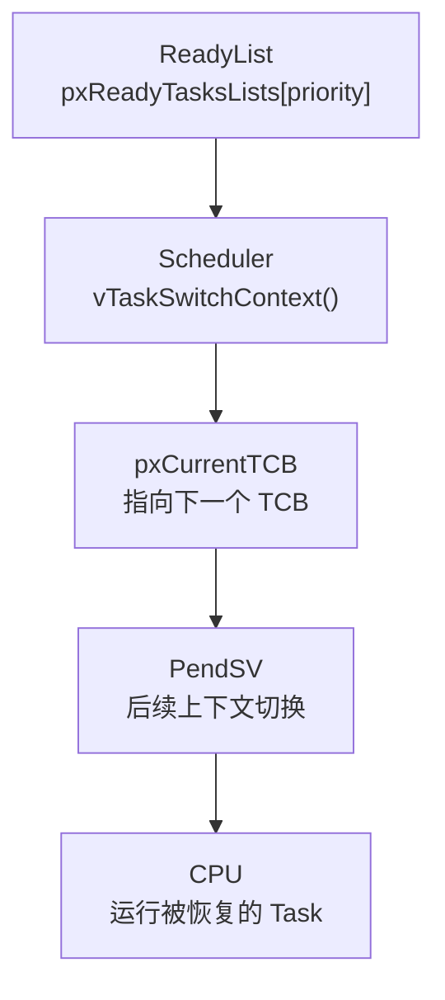
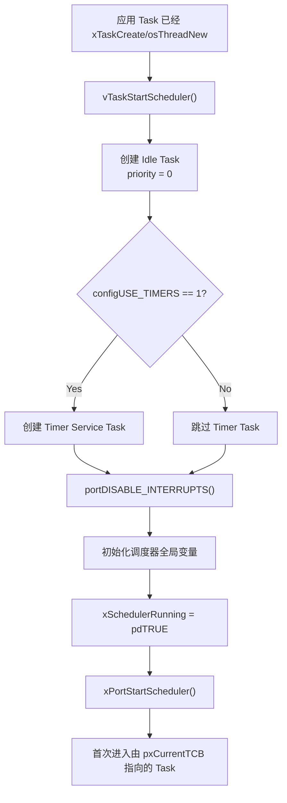
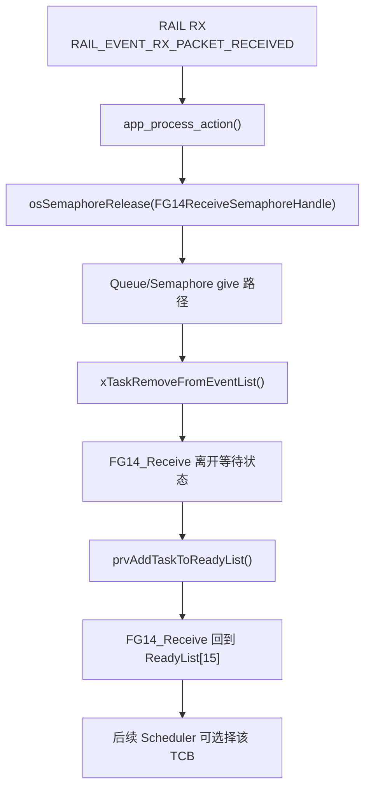
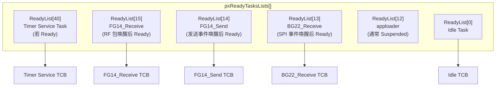
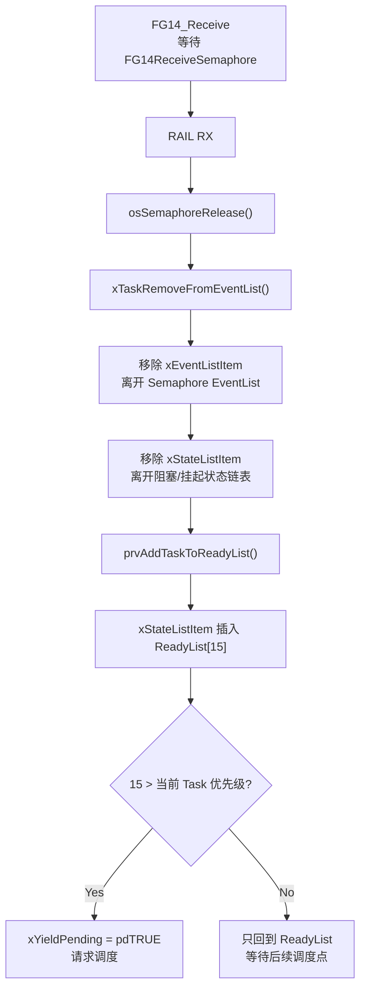
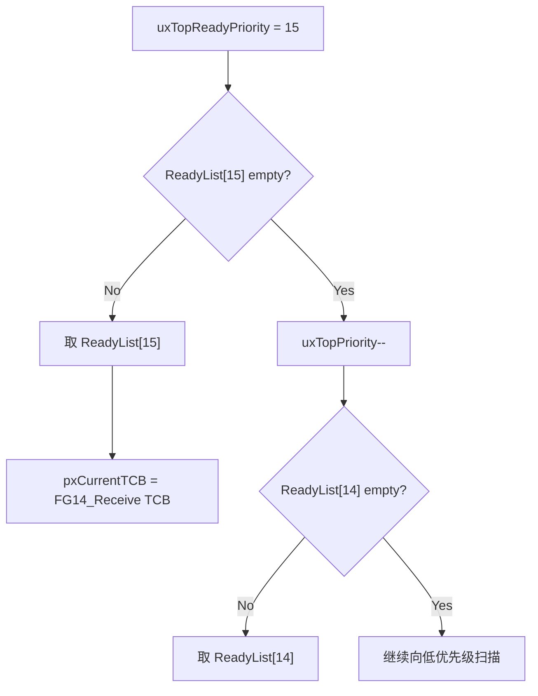
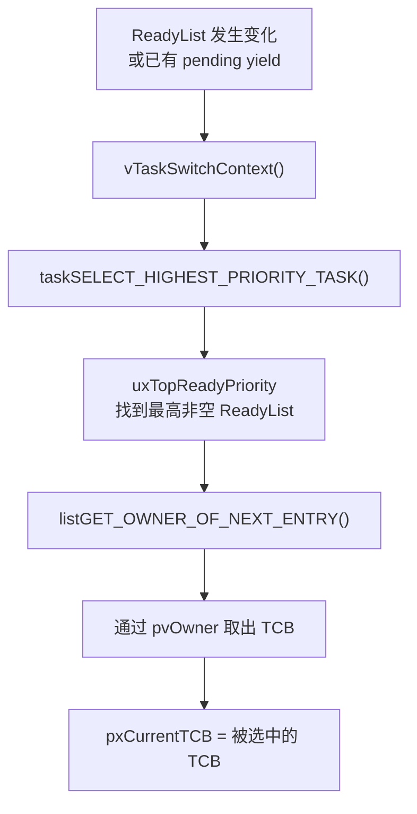
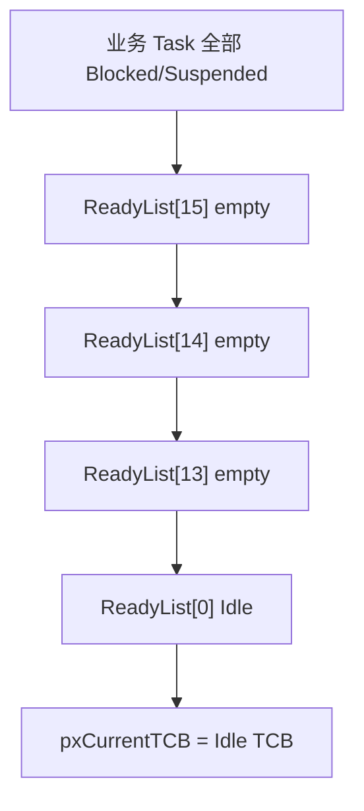
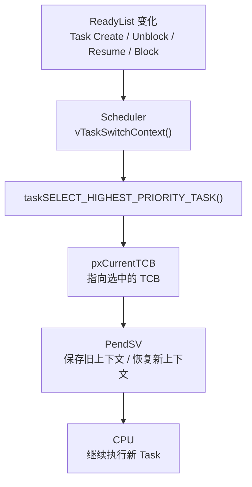

# 003 — FreeRTOS Scheduler / ReadyList 内核调度路径分析

> **How FreeRTOS Chooses The Next Task**  
> **Kernel Internal Deep Dive | FreeRTOS 10.4.3 | Cortex-M33 (ARM_CM33_NTZ) | EFR32FG23**

---

## 总览：Scheduler 只选择 TCB

本文只研究 Scheduler 核心路径：



核心结论：

```
Scheduler 不切 CPU
Scheduler 不保存寄存器
Scheduler 不恢复寄存器
Scheduler 只决定 pxCurrentTCB 应该指向哪个 TCB
```

本文聚焦：

```
Scheduler 启动
  -> Task 回 ReadyList
  -> ReadyList 按优先级组织
  -> taskSELECT_HIGHEST_PRIORITY_TASK()
  -> pxCurrentTCB 更新
  -> PendSV 边界
```

本文不展开 Tick 中断路径、延时链表实现、时间片触发条件，也不展开 PendSV 汇编压栈/出栈。

这些留给后续文档。本文只讲：当内核已经决定“需要调度”时，Scheduler 怎样从 ReadyList 中选出一个 TCB。

---

## 目录

- [§1 Scheduler 启动](#1-scheduler-启动)
- [§2 工程场景：FG14_Receive_Task 被选中](#2-工程场景fg14_receive_task-被选中)
- [§3 ReadyList 数据结构](#3-readylist-数据结构)
- [§4 Task 如何进入 ReadyList](#4-task-如何进入-readylist)
- [§5 Scheduler 核心选择](#5-scheduler-核心选择)
- [§6 抢占逻辑](#6-抢占逻辑)
- [§7 Idle Task](#7-idle-task)
- [§8 Scheduler 与 PendSV 边界](#8-scheduler-与-pendsv-边界)
- [Appendix A：关键函数速查](#appendix-a关键函数速查)
- [Appendix B：工程 Task 优先级表](#appendix-b工程-task-优先级表)
- [Appendix C：Scheduler 与 PendSV 边界对照表](#appendix-cscheduler-与-pendsv-边界对照表)

---

## §1 Scheduler 启动

### 1.1 vTaskStartScheduler() 的启动顺序

应用层创建完任务后，FreeRTOS 还没有真正开始调度。真正点火的位置是：

```c
// tasks.c:2021
void vTaskStartScheduler( void )
{
    BaseType_t xReturn;

    /* Add the idle task at the lowest priority. */
    ...

    #if ( configUSE_TIMERS == 1 )
    {
        if( xReturn == pdPASS )
        {
            xReturn = xTimerCreateTimerTask();
        }
    }
    #endif

    if( xReturn == pdPASS )
    {
        portDISABLE_INTERRUPTS();

        xNextTaskUnblockTime = portMAX_DELAY;
        xSchedulerRunning = pdTRUE;
        xTickCount = ( TickType_t ) configINITIAL_TICK_COUNT;

        portCONFIGURE_TIMER_FOR_RUN_TIME_STATS();
        traceTASK_SWITCHED_IN();

        if( xPortStartScheduler() != pdFALSE )
        {
            /* Should not reach here. */
        }
    }
}
```

这段代码的运行顺序可以压成：



注意：`vTaskStartScheduler()` 本身不是“选 Task 的算法”。它主要负责把内核运行环境准备好，然后把第一次上下文恢复交给 port 层。

### 1.2 Idle Task 的创建

Idle Task 是调度器必须创建的兜底任务。FreeRTOS 支持静态或动态创建：

```c
// tasks.c:2037
xIdleTaskHandle = xTaskCreateStatic(
    prvIdleTask,
    configIDLE_TASK_NAME,
    ulIdleTaskStackSize,
    ( void * ) NULL,
    portPRIVILEGE_BIT,
    pxIdleTaskStackBuffer,
    pxIdleTaskTCBBuffer );
```

动态分支：

```c
// tasks.c:2058
xReturn = xTaskCreate(
    prvIdleTask,
    configIDLE_TASK_NAME,
    configMINIMAL_STACK_SIZE,
    ( void * ) NULL,
    portPRIVILEGE_BIT,
    &xIdleTaskHandle );
```

Idle Task 的优先级是 0：

```
tskIDLE_PRIORITY = 0
```

它会进入：

```
pxReadyTasksLists[0]
```

这保证了系统至少永远有一个 Ready Task 可以被 Scheduler 选中。

### 1.3 Timer Service Task 简要说明

本工程配置：

```c
// config/FreeRTOSConfig.h
#define configUSE_TIMERS          1
#define configTIMER_TASK_PRIORITY 40
```

因此 `vTaskStartScheduler()` 会调用：

```c
xTimerCreateTimerTask();
```

Timer Service Task 是 FreeRTOS 软件定时器服务任务。它不是应用业务任务，但它也是一个普通 FreeRTOS Task，有自己的 TCB、栈、优先级，也会进入 ReadyList。

本工程里它的优先级是 40，高于：

```
FG14_Receive_Task = 15
FG14_Send_Task    = 14
BG22_Receive_Task = 13
apploader_Task    = 12
Idle Task         = 0
```

所以调度器刚启动时，如果 Timer Service Task 处于 Ready，它会优先于应用任务被选中。通常它运行后会阻塞在 timer command queue 上。本文后续讨论 `FG14_Receive_Task` 被选中，默认前提是 Timer Service Task 当前不在 Ready 状态，或者它已经处理完自己的事件并阻塞。

### 1.4 pxCurrentTCB 在启动前已经被维护

在调度器启动前，应用任务已经通过 `osThreadNew()` 创建。每个任务创建完成后都会进入：

```c
// tasks.c:1093
static void prvAddNewTaskToReadyList( TCB_t * pxNewTCB )
{
    taskENTER_CRITICAL();
    {
        uxCurrentNumberOfTasks++;

        if( pxCurrentTCB == NULL )
        {
            pxCurrentTCB = pxNewTCB;

            if( uxCurrentNumberOfTasks == ( UBaseType_t ) 1 )
            {
                prvInitialiseTaskLists();
            }
        }
        else
        {
            if( xSchedulerRunning == pdFALSE )
            {
                if( pxCurrentTCB->uxPriority <= pxNewTCB->uxPriority )
                {
                    pxCurrentTCB = pxNewTCB;
                }
            }
        }

        prvAddTaskToReadyList( pxNewTCB );
    }
    taskEXIT_CRITICAL();
}
```

这段代码解释了一个容易被忽略的点：

> 调度器启动前，`pxCurrentTCB` 已经在跟踪“目前创建过的最高优先级 Ready Task”。

本工程应用任务创建顺序：

```c
// FreeRTOSEntry.c:480
FG14_ReceiveHandle = osThreadNew(FG14_Receive_Task, NULL, &FG14_Receive_attributes);
FG14_SendHandle    = osThreadNew(FG14_Send_Task,    NULL, &FG14_Send_attributes);
BG22_ReceiveHandle = osThreadNew(BG22_Receive_Task, NULL, &BG22_Receive_attributes);
apploader_Handle   = osThreadNew(apploader_Task,    NULL, &apploader_attributes);

vTaskSuspend(apploader_Handle);
```

应用任务中最高的是：

```
FG14_Receive_Task priority = 15
```

如果只看应用任务，`pxCurrentTCB` 会优先指向 `FG14_Receive` 的 TCB。若 Timer Service Task 已创建且 Ready，因为其优先级为 40，它可能成为启动时实际被首次恢复的 TCB。

---

## §2 工程场景：FG14_Receive_Task 被选中

### 2.1 Task 阻塞在信号量上

`FG14_Receive_Task` 的业务逻辑是处理基站下行 RF 数据。没有 RF 包时，它阻塞在 `FG14ReceiveSemaphoreHandle`：

```c
// FreeRTOSEntry.c:221
void FG14_Receive_Task(void *argument)
{
  (void) argument;

  for(;;)
  {
    if(osOK == osSemaphoreAcquire(FG14ReceiveSemaphoreHandle, portMAX_DELAY))
    {
      FG14ReceiveProcess();
    }
  }
}
```

运行行为是：

```
没有 RF 包
  -> osSemaphoreAcquire(portMAX_DELAY)
  -> FG14_Receive_Task 不再占 CPU
  -> 内核把它放到等待信号量的状态
```

这里先不展开 `xEventListItem` 和 `xStateListItem`，只抓主线：

```
Task 等信号量
  -> 事件到来
  -> 信号量释放
  -> Task 回 ReadyList
  -> Scheduler 可以重新选它
```

### 2.2 RAIL RX 到信号量释放

RAIL 收到完整 RF 包后，本工程路径是：

```c
// app_process.c:441
if (events & RAIL_EVENT_RX_PACKET_RECEIVED) {
    RAIL_RxPacketHandle = RAIL_HoldRxPacket(rail_handle);

    if(RAIL_RX_PACKET_HANDLE_INVALID != RAIL_RxPacketHandle)
    {
        packet_recieved = true;

        if(apploader_flag != true)
        {
            app_process_action(rail_handle);
        }
    }
}
```

进入 `app_process_action()` 后释放信号量：

```c
// app_process.c:379
void app_process_action(RAIL_Handle_t rail_handle)
{
  if (packet_recieved) {
    packet_recieved = false;
    state = S_PACKET_RECEIVED;
  }

  switch (state) {
    case S_PACKET_RECEIVED:
      if(System_Init_Finished_Flag == 1)
      {
          stat = osSemaphoreRelease(FG14ReceiveSemaphoreHandle);
      }
      state = S_IDLE;
      break;
  }
}
```

从内核视角看，`osSemaphoreRelease()` 不是直接调用 `FG14_Receive_Task()`。它只是让等待该信号量的 Task 重新具备运行条件。

### 2.3 主线图



这条链路里，`FG14_Receive_Task` 被选中不是因为它被 RAIL 回调直接执行，而是因为：

```
FG14_Receive priority = 15
FG14_Receive 回到 ReadyList[15]
当前更高优先级 Task 不 Ready
Scheduler 扫描 ReadyList 时选中它
```

---

## §3 ReadyList 数据结构

### 3.1 pxReadyTasksLists[configMAX_PRIORITIES]

FreeRTOS 用一个数组保存所有 Ready Task：

```c
// tasks.c:357
PRIVILEGED_DATA static List_t pxReadyTasksLists[ configMAX_PRIORITIES ];
```

本工程：

```c
// config/FreeRTOSConfig.h
#define configMAX_PRIORITIES 56
```

所以实际有 56 个 ReadyList：

```
pxReadyTasksLists[0]
pxReadyTasksLists[1]
...
pxReadyTasksLists[55]
```

每个优先级一个桶：

```
priority 15 -> pxReadyTasksLists[15]
priority 14 -> pxReadyTasksLists[14]
priority 13 -> pxReadyTasksLists[13]
priority 0  -> pxReadyTasksLists[0]
```

这不是“所有 Ready Task 放一条链表里排序”，而是“按优先级提前分桶”。

### 3.2 List_t 是链表头

每一个 ReadyList 元素都是一个 `List_t`：

```c
// list.h:179
typedef struct xLIST
{
    volatile UBaseType_t uxNumberOfItems;
    ListItem_t * pxIndex;
    MiniListItem_t xListEnd;
} List_t;
```

字段意义：

| 字段 | 在 ReadyList 中的作用 |
|---|---|
| `uxNumberOfItems` | 当前优先级下有几个 Ready Task |
| `pxIndex` | 在同优先级 ReadyList 内取“下一个 owner”的游标 |
| `xListEnd` | 哨兵节点，维持双向循环链表 |

这个 `List_t` 不是 TCB，也不是 Task 函数。它只是链表头。真正挂进去的是 TCB 内部的链表节点。

### 3.3 ReadyList 保存 xStateListItem

TCB 中有两个重要 ListItem：

```c
ListItem_t xStateListItem;
ListItem_t xEventListItem;
```

这里不重复第 002 篇的 TCB 细节，只说明在 Scheduler 路径里的职责：

| 节点 | 用途 |
|---|---|
| `xStateListItem` | 表示 Task 当前处于哪个状态链表，如 Ready、Blocked、Suspended |
| `xEventListItem` | 表示 Task 正在等待哪个事件对象，如 Queue/Semaphore |

ReadyList 中保存的是：

```
TCB.xStateListItem
```

而不是：

```
Task 函数指针
Task 名字
Task 栈地址
```

通过 `xStateListItem.pvOwner`，Scheduler 可以从链表节点反推出 TCB：

```c
// list.h:155
struct xLIST_ITEM
{
    TickType_t xItemValue;
    struct xLIST_ITEM * pxNext;
    struct xLIST_ITEM * pxPrevious;
    void * pvOwner;
    struct xLIST * pxContainer;
};
```

关系是：

```
ReadyList[15]
  -> FG14_Receive_TCB.xStateListItem
      -> pvOwner
          -> FG14_Receive_TCB
```

### 3.4 工程 ReadyList 示意



业务路径中重点看：

```
RAIL RX 到来
  -> FG14_Receive 回 ReadyList[15]
  -> 若没有 ReadyList[40] 等更高优先级任务 Ready
  -> Scheduler 选择 ReadyList[15] 中的 TCB
```

---

## §4 Task 如何进入 ReadyList

### 4.1 prvAddTaskToReadyList()

FreeRTOS 把 Task 放入 ReadyList 的核心宏是：

```c
// tasks.c:232
#define prvAddTaskToReadyList( pxTCB )                                                                 \
    traceMOVED_TASK_TO_READY_STATE( pxTCB );                                                           \
    taskRECORD_READY_PRIORITY( ( pxTCB )->uxPriority );                                                \
    vListInsertEnd( &( pxReadyTasksLists[ ( pxTCB )->uxPriority ] ), &( ( pxTCB )->xStateListItem ) ); \
    tracePOST_MOVED_TASK_TO_READY_STATE( pxTCB )
```

它做三件事：

```
记录 Ready 优先级
  -> 把 TCB.xStateListItem 插入 ReadyList[uxPriority]
  -> 这个 TCB 成为 Scheduler 候选
```

对 `FG14_Receive_Task` 来说：

```
pxTCB->uxPriority = 15
  -> 插入 pxReadyTasksLists[15]
```

### 4.2 taskRECORD_READY_PRIORITY()

本工程没有启用 port optimized selection：

```c
// config/FreeRTOSConfig.h
#define configUSE_PORT_OPTIMISED_TASK_SELECTION 0
```

所以使用通用 C 版本：

```c
// tasks.c:135
#define taskRECORD_READY_PRIORITY( uxPriority ) \
{                                               \
    if( ( uxPriority ) > uxTopReadyPriority )   \
    {                                           \
        uxTopReadyPriority = ( uxPriority );    \
    }                                           \
}
```

`uxTopReadyPriority` 是一个“当前已知最高 Ready 优先级”的数值，不是 TCB，也不是链表。

例如：

```
当前 uxTopReadyPriority = 14
FG14_Receive 回 ReadyList[15]
taskRECORD_READY_PRIORITY(15)
uxTopReadyPriority = 15
```

这让 Scheduler 下次选择时可以从 15 开始扫描，而不是从 55 或 0 重新做全量判断。

### 4.3 vListInsertEnd()

真正把 Task 接到 ReadyList 尾部的是：

```c
vListInsertEnd(
    &( pxReadyTasksLists[ pxTCB->uxPriority ] ),
    &( pxTCB->xStateListItem )
);
```

注意插入的是：

```
pxTCB->xStateListItem
```

不是：

```
pxTCB 本体
```

ReadyList 通过 `xStateListItem.pvOwner` 找回 TCB。这个设计让同一个 TCB 可以通过不同 ListItem 同时表达不同关系：

```
xStateListItem -> 当前状态链表
xEventListItem -> 等待的事件对象链表
```

### 4.4 xTaskRemoveFromEventList()

信号量释放时，如果有 Task 正在等待，会进入：

```c
// tasks.c:3210
BaseType_t xTaskRemoveFromEventList( const List_t * const pxEventList )
{
    TCB_t * pxUnblockedTCB;
    BaseType_t xReturn;

    pxUnblockedTCB = listGET_OWNER_OF_HEAD_ENTRY( pxEventList );
    configASSERT( pxUnblockedTCB );

    ( void ) uxListRemove( &( pxUnblockedTCB->xEventListItem ) );

    if( uxSchedulerSuspended == ( UBaseType_t ) pdFALSE )
    {
        ( void ) uxListRemove( &( pxUnblockedTCB->xStateListItem ) );
        prvAddTaskToReadyList( pxUnblockedTCB );
    }
    else
    {
        vListInsertEnd( &( xPendingReadyList ), &( pxUnblockedTCB->xEventListItem ) );
    }

    if( pxUnblockedTCB->uxPriority > pxCurrentTCB->uxPriority )
    {
        xReturn = pdTRUE;
        xYieldPending = pdTRUE;
    }
    else
    {
        xReturn = pdFALSE;
    }

    return xReturn;
}
```

对应本工程：

```
pxEventList
  = FG14ReceiveSemaphoreHandle 内部等待接收的事件链表

pxUnblockedTCB
  = FG14_Receive 的 TCB

uxListRemove(&xEventListItem)
  = 离开信号量等待链表

uxListRemove(&xStateListItem)
  = 离开阻塞/挂起类状态链表

prvAddTaskToReadyList(pxUnblockedTCB)
  = 进入 ReadyList[15]
```

如果被唤醒的 Task 优先级高于当前 Task：

```c
if( pxUnblockedTCB->uxPriority > pxCurrentTCB->uxPriority )
{
    xReturn = pdTRUE;
    xYieldPending = pdTRUE;
}
```

这只是“请求调度”。它还没有切 CPU，也没有保存/恢复寄存器。

### 4.5 唤醒链路图



---

## §5 Scheduler 核心选择

### 5.1 vTaskSwitchContext() 做什么

`vTaskSwitchContext()` 是 Scheduler 选择 TCB 的核心入口：

```c
// tasks.c:3055
void vTaskSwitchContext( void )
{
    if( uxSchedulerSuspended != ( UBaseType_t ) pdFALSE )
    {
        xYieldPending = pdTRUE;
    }
    else
    {
        xYieldPending = pdFALSE;
        traceTASK_SWITCHED_OUT();

        taskCHECK_FOR_STACK_OVERFLOW();

        taskSELECT_HIGHEST_PRIORITY_TASK();

        traceTASK_SWITCHED_IN();
    }
}
```

压缩成主线：

```c
void vTaskSwitchContext(void)
{
    if (scheduler_suspended) {
        xYieldPending = pdTRUE;
        return;
    }

    xYieldPending = pdFALSE;
    taskSELECT_HIGHEST_PRIORITY_TASK();
}
```

它做：

```
检查调度器是否 suspended
  -> 清 pending yield
  -> 可选栈溢出检查
  -> 调用 taskSELECT_HIGHEST_PRIORITY_TASK()
  -> 更新 pxCurrentTCB
```

它不做：

```
不保存 R4~R11
不切 PSP
不恢复新 Task 寄存器
不执行异常返回
```

这些属于 PendSV。

### 5.2 taskSELECT_HIGHEST_PRIORITY_TASK()

本工程使用通用 C 版本：

```c
// tasks.c:147
#define taskSELECT_HIGHEST_PRIORITY_TASK()                                \
{                                                                         \
    UBaseType_t uxTopPriority = uxTopReadyPriority;                       \
                                                                          \
    while( listLIST_IS_EMPTY( &( pxReadyTasksLists[ uxTopPriority ] ) ) ) \
    {                                                                     \
        configASSERT( uxTopPriority );                                    \
        --uxTopPriority;                                                  \
    }                                                                     \
                                                                          \
    listGET_OWNER_OF_NEXT_ENTRY( pxCurrentTCB, &( pxReadyTasksLists[ uxTopPriority ] ) ); \
    uxTopReadyPriority = uxTopPriority;                                                   \
}
```

逻辑是：

```
从 uxTopReadyPriority 开始
  -> 如果 ReadyList[uxTopPriority] 空，就向低优先级扫描
  -> 找到最高非空 ReadyList
  -> 从该 ReadyList 里取下一个 owner
  -> pxCurrentTCB = owner
```

对 `FG14_Receive_Task`：

```
FG14_Receive 回到 ReadyList[15]
uxTopReadyPriority = 15
ReadyList[15] 非空
listGET_OWNER_OF_NEXT_ENTRY()
pxCurrentTCB = FG14_Receive TCB
```

### 5.3 uxTopReadyPriority 扫描 ReadyList

扫描示意：



这就是为什么只要 `FG14_Receive` 已经 Ready，并且没有更高优先级 Ready Task，它就会优先于：

```
FG14_Send    priority = 14
BG22_Receive priority = 13
Idle         priority = 0
```

### 5.4 同优先级轮转逻辑（不涉及 Tick）

`taskSELECT_HIGHEST_PRIORITY_TASK()` 最后调用：

```c
listGET_OWNER_OF_NEXT_ENTRY( pxCurrentTCB, &( pxReadyTasksLists[ uxTopPriority ] ) );
```

宏定义：

```c
// list.h:292
#define listGET_OWNER_OF_NEXT_ENTRY( pxTCB, pxList )                                           \
{                                                                                              \
    List_t * const pxConstList = ( pxList );                                                   \
    ( pxConstList )->pxIndex = ( pxConstList )->pxIndex->pxNext;                               \
    if( ( void * ) ( pxConstList )->pxIndex == ( void * ) &( ( pxConstList )->xListEnd ) )     \
    {                                                                                          \
        ( pxConstList )->pxIndex = ( pxConstList )->pxIndex->pxNext;                           \
    }                                                                                          \
    ( pxTCB ) = ( pxConstList )->pxIndex->pvOwner;                                             \
}
```

这个宏每执行一次，都会推进该 `List_t` 的 `pxIndex`：

```
pxIndex = pxIndex->pxNext
  -> 如果遇到 xListEnd 哨兵，就跳过
  -> pxTCB = pxIndex->pvOwner
```

假设同一个 ReadyList 里有两个同优先级 Task：

```
ReadyList[15]:
xListEnd <-> TaskA.xStateListItem <-> TaskB.xStateListItem <-> xListEnd
```

Scheduler 每次需要从 ReadyList[15] 重新选择时：

```
第一次 listGET_OWNER_OF_NEXT_ENTRY -> TaskA
第二次 listGET_OWNER_OF_NEXT_ENTRY -> TaskB
第三次 listGET_OWNER_OF_NEXT_ENTRY -> TaskA
```

这里讲的是“取下一个 TCB 的机制”。至于什么时候触发这次重新选择，本文不展开；Tick 驱动同优先级时间片的触发条件放到下一篇。

### 5.5 Scheduler 选择图



---

## §6 抢占逻辑

### 6.1 本工程开启抢占

```c
// config/FreeRTOSConfig.h
#define configUSE_PREEMPTION 1
```

抢占式调度的核心含义是：

> 当一个更高优先级 Task 变成 Ready 时，当前低优先级 Task 不需要主动让出 CPU，内核可以请求重新调度。

工程场景：

```
FG14_Send 正在运行，priority = 14
RAIL RX 到达
FG14_Receive 被信号量唤醒，priority = 15
15 > 14
xYieldPending = pdTRUE
```

代码位置：

```c
// tasks.c:3260
if( pxUnblockedTCB->uxPriority > pxCurrentTCB->uxPriority )
{
    xReturn = pdTRUE;
    xYieldPending = pdTRUE;
}
```

### 6.2 抢占不是上下文切换本身

这里的“抢占”先表现为：

```
高优先级 Task 回 ReadyList
  -> xYieldPending = pdTRUE
  -> 后续进入 Scheduler
  -> pxCurrentTCB 更新为高优先级 Task
```

Scheduler 做到这里就停了：

```
pxCurrentTCB = FG14_Receive TCB
```

真正保存旧 Task 上下文、恢复新 Task 上下文，是 PendSV 负责。

### 6.3 Idle Task 作为兜底

如果所有业务 Task 都不 Ready：

```
FG14_Receive Blocked
FG14_Send Blocked
BG22_Receive Blocked
apploader Suspended
Timer Service Blocked
```

Scheduler 最终会找到：

```
ReadyList[0] -> Idle Task
```

这不是异常，而是正常空闲状态。

---

## §7 Idle Task

### 7.1 Idle Task 的创建

Idle Task 由 `vTaskStartScheduler()` 自动创建：

```c
// tasks.c:2037
xIdleTaskHandle = xTaskCreateStatic(
    prvIdleTask,
    configIDLE_TASK_NAME,
    ulIdleTaskStackSize,
    ( void * ) NULL,
    portPRIVILEGE_BIT,
    pxIdleTaskStackBuffer,
    pxIdleTaskTCBBuffer );
```

或动态创建：

```c
// tasks.c:2058
xReturn = xTaskCreate(
    prvIdleTask,
    configIDLE_TASK_NAME,
    configMINIMAL_STACK_SIZE,
    ( void * ) NULL,
    portPRIVILEGE_BIT,
    &xIdleTaskHandle );
```

Idle Task 入口：

```c
// tasks.c:3468
static portTASK_FUNCTION( prvIdleTask, pvParameters )
{
    ( void ) pvParameters;

    for( ; ; )
    {
        prvCheckTasksWaitingTermination();
        ...
    }
}
```

### 7.2 Idle Task 的职责

Idle Task 至少有三个工程意义：

| 职责 | 工程意义 |
|---|---|
| 兜底 Ready Task | 保证 Scheduler 永远能选出一个 TCB |
| 清理删除任务 | 回收已删除 Task 的 TCB/Stack |
| Idle Hook / 低功耗入口 | 系统空闲时执行背景逻辑或低功耗准备 |

对本工程来说，如果系统没有 RF 包、没有 BLE/SPI 数据、没有发送事件，业务 Task 都应该阻塞。此时 Idle Running 是健康状态，说明系统没有忙等。



---

## §8 Scheduler 与 PendSV 边界

### 8.1 总边界图



Scheduler 的输出是：

```
pxCurrentTCB
```

PendSV 的输入是：

```
pxCurrentTCB
```

这就是二者的接口。

### 8.2 职责对比

| 问题 | Scheduler | PendSV |
|---|---|---|
| 看 ReadyList 吗 | 是 | 否 |
| 比较优先级吗 | 是 | 否 |
| 维护 `uxTopReadyPriority` 吗 | 是 | 否 |
| 更新 `pxCurrentTCB` 吗 | 是 | 读取它 |
| 保存当前 Task 寄存器吗 | 否 | 是 |
| 恢复下一个 Task 寄存器吗 | 否 | 是 |
| 切 PSP 吗 | 否 | 是 |
| 决定下一个运行谁吗 | 是 | 否，它服从 `pxCurrentTCB` |

最终模型：

```
ReadyList 决定候选范围
uxTopReadyPriority 缩小扫描入口
taskSELECT_HIGHEST_PRIORITY_TASK() 选择 TCB
vTaskSwitchContext() 更新 pxCurrentTCB
PendSV 根据 pxCurrentTCB 完成上下文切换
```

本文到这里为止。下一篇再进入 Tick、延时链表和时间片触发条件，回答：

```
Blocked Task 如何因为时间到期重新回到 ReadyList？
```

再下一篇进入 PendSV，回答：

```
pxCurrentTCB 已经选好了，CPU 如何真正切过去？
```

---

## Appendix A：关键函数速查

| 函数 / 宏 | 文件 | 在本文中的角色 |
|---|---|---|
| `vTaskStartScheduler()` | `tasks.c:2021` | 启动调度器，创建 Idle/Timer Task，初始化运行标志 |
| `xTimerCreateTimerTask()` | `timers.c` | 创建 Timer Service Task |
| `prvAddNewTaskToReadyList()` | `tasks.c:1093` | 新建 Task 后加入 ReadyList，并在启动前维护 `pxCurrentTCB` |
| `prvInitialiseTaskLists()` | `tasks.c:3680` | 初始化 Ready/Delayed/Pending/Suspended 等内核链表 |
| `osSemaphoreRelease()` | CMSIS-RTOS2 wrapper | 工程释放信号量入口 |
| `xTaskRemoveFromEventList()` | `tasks.c:3210` | 从事件等待链表唤醒 Task |
| `prvAddTaskToReadyList()` | `tasks.c:232` | 将 `xStateListItem` 插入对应优先级 ReadyList |
| `taskRECORD_READY_PRIORITY()` | `tasks.c:135` | 更新 `uxTopReadyPriority` |
| `vTaskSwitchContext()` | `tasks.c:3055` | Scheduler 核心入口 |
| `taskSELECT_HIGHEST_PRIORITY_TASK()` | `tasks.c:147` | 从 ReadyList 选择下一个 TCB |
| `listGET_OWNER_OF_NEXT_ENTRY()` | `list.h:292` | 在同一 ReadyList 中推进游标并取 owner |

---

## Appendix B：工程 Task 优先级表

| Task | 创建位置 | 优先级 | ReadyList | 典型状态 |
|---|---|---:|---|---|
| Timer Service Task | `vTaskStartScheduler()` / `xTimerCreateTimerTask()` | 40 | `pxReadyTasksLists[40]` | 通常等待 timer command queue |
| `FG14_Receive_Task` | `FreeRTOSEntry.c:480` | 15 | `pxReadyTasksLists[15]` | 等 RF 下行信号量，释放后 Ready |
| `FG14_Send_Task` | `FreeRTOSEntry.c:481` | 14 | `pxReadyTasksLists[14]` | 等发送信号量 |
| `BG22_Receive_Task` | `FreeRTOSEntry.c:482` | 13 | `pxReadyTasksLists[13]` | 等 SPI/BG22 接收信号量 |
| `apploader_Task` | `FreeRTOSEntry.c:484` | 12 | `pxReadyTasksLists[12]` | 创建后通常 `vTaskSuspend()` |
| Idle Task | `vTaskStartScheduler()` | 0 | `pxReadyTasksLists[0]` | 永远兜底 Ready |

补充：

```c
// FreeRTOSEntry.c:479
// LF_SendHandle = osThreadNew(LF_Send_Task, NULL, &LF_Send_attributes);
```

当前工程中 `LF_Send_Task` 创建语句是注释状态，所以本文不把它放入实际调度候选池。

---

## Appendix C：Scheduler 与 PendSV 边界对照表

| 维度 | Scheduler | PendSV |
|---|---|---|
| 所在层 | FreeRTOS C 内核逻辑 | Cortex-M port / 异常处理 |
| 核心函数 | `vTaskSwitchContext()` | `PendSV_Handler` |
| 输入 | ReadyList、`uxTopReadyPriority` | `pxCurrentTCB` |
| 输出 | 新的 `pxCurrentTCB` | CPU 上下文已切到新 Task |
| 是否看优先级 | 是 | 否 |
| 是否处理链表 | 是 | 否 |
| 是否保存寄存器 | 否 | 是 |
| 是否恢复寄存器 | 否 | 是 |
| 是否切换 PSP | 否 | 是 |
| 一句话 | 决定下一个是谁 | 真的切过去 |

一句话收尾：

> Scheduler 负责选 TCB；PendSV 负责把 CPU 切到这个 TCB 保存的上下文。
