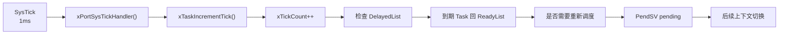
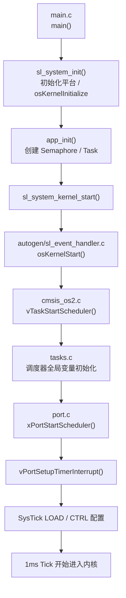
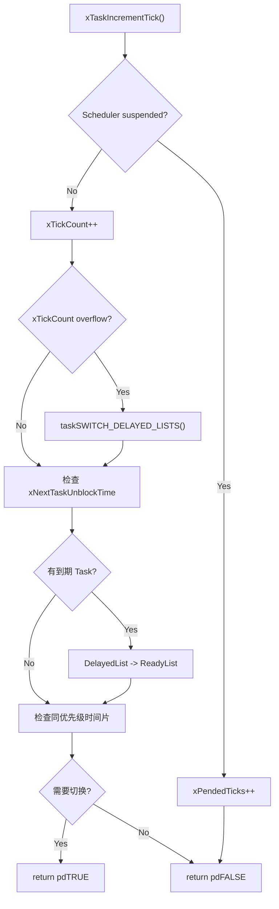
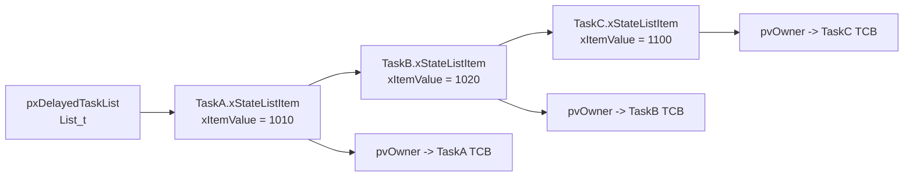
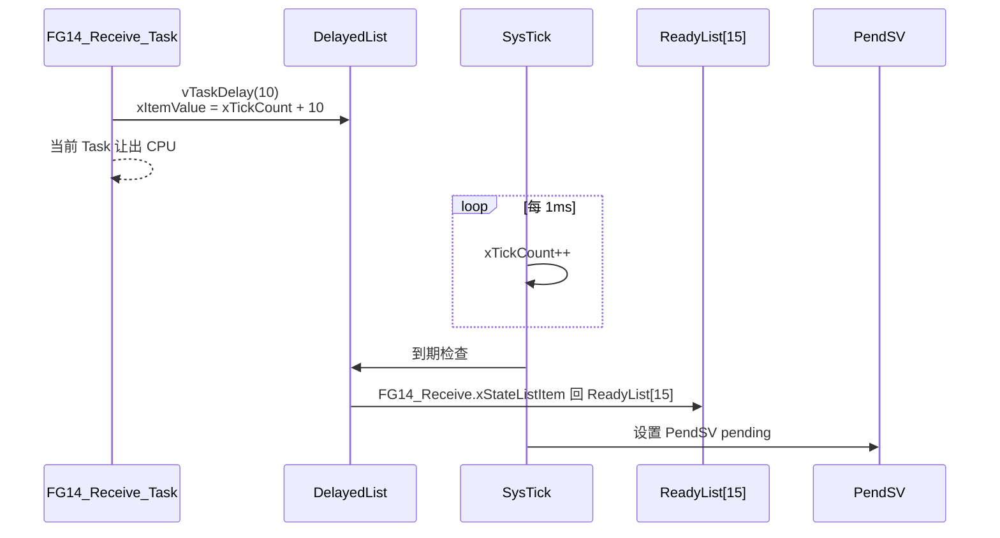
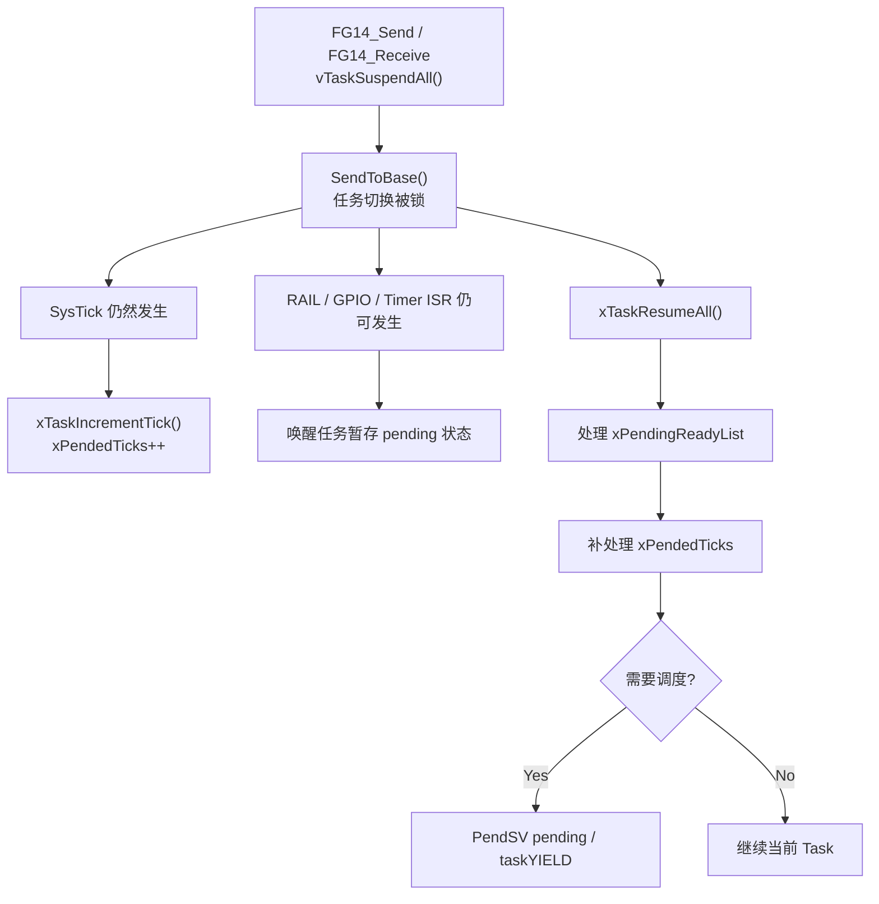
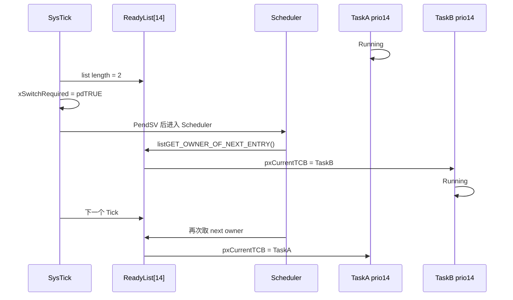
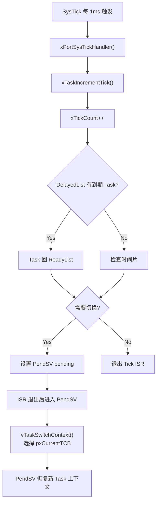

# 004 — FreeRTOS Tick / DelayedList / Time Slicing 内核深度分析

> **How Time Enters The Scheduler**  
> Kernel Internal Deep Dive | FreeRTOS 10.4.3 | Cortex-M33 | EFR32FG23 | Gecko SDK 4.1.2

---

## 总览：Tick 把“时间”送进 Scheduler

前三篇已经把链路走到了这里：

```text
001 Semaphore
  -> 事件如何唤醒 Task

002 Task / TCB
  -> 被调度的对象是 TCB

003 Scheduler / ReadyList
  -> Scheduler 如何从 ReadyList 选出 pxCurrentTCB
```

但是还剩一个关键问题：

```text
Scheduler 什么时候会被重新触发？
```

本文回答这个问题。



一句话模型：

```text
Tick 不负责选择最终 Task。
Tick 负责推进时间，并在必要时请求 Scheduler / PendSV。
```

本文聚焦：

```text
Tick 启动
  -> xTickCount 计数
  -> vTaskDelay / osDelay 进入 DelayedList
  -> Tick 到期回 ReadyList
  -> 同优先级时间片触发
  -> PendSV 请求
```

本文不展开：

```text
PendSV 如何保存 R4-R11
PendSV 如何恢复 pxTopOfStack
Queue / Semaphore 的完整等待链表
Tickless idle 的低功耗细节
```

这些放到后续文档。

---

## 目录

- [§1 工程里 Tick 从哪里启动](#1-工程里-tick-从哪里启动)
- [§2 SysTick 中断真正做了什么](#2-systick-中断真正做了什么)
- [§3 xTaskIncrementTick：Tick 进入内核](#3-xtaskincrementticktick-进入内核)
- [§4 DelayedList：Task 如何按时间排队](#4-delayedlisttask-如何按时间排队)
- [§5 工程里的 vTaskDelay / osDelay](#5-工程里的-vtaskdelay--osdelay)
- [§6 调度锁期间 Tick 怎么处理](#6-调度锁期间-tick-怎么处理)
- [§7 同优先级时间片轮转](#7-同优先级时间片轮转)
- [§8 Tick 与 PendSV 的边界](#8-tick-与-pendsv-的边界)
- [Appendix A：关键函数速查](#appendix-a关键函数速查)
- [Appendix B：工程 Tick 配置表](#appendix-b工程-tick-配置表)
- [Appendix C：工程 delay 场景表](#appendix-c工程-delay-场景表)

---

## §1 工程里 Tick 从哪里启动

### 1.1 从 main() 进入 RTOS

本工程不是手写 `vTaskStartScheduler()`，而是走 Silicon Labs + CMSIS-RTOS2 包装层。

工程入口在 `main.c`：

```c
int main(void)
{
    sl_system_init();
    app_init();

#if defined(SL_CATALOG_KERNEL_PRESENT)
    sl_system_kernel_start();
#endif
}
```

`autogen/sl_event_handler.c` 中：

```c
void sl_kernel_start(void)
{
  osKernelStart();
}
```

CMSIS-RTOS2 wrapper 中：

```c
osStatus_t osKernelStart(void)
{
    if (KernelState == osKernelReady) {
        SVC_Setup();
        KernelState = osKernelRunning;
        vTaskStartScheduler();
    }
}
```

所以本工程 Tick 的启动上游是：

```text
main()
  -> sl_system_init()
  -> app_init()
  -> sl_system_kernel_start()
  -> osKernelStart()
  -> vTaskStartScheduler()
  -> xPortStartScheduler()
  -> vPortSetupTimerInterrupt()
  -> SysTick 开始工作
```



### 1.2 vTaskStartScheduler() 里 Tick 还没真正跑起来

`vTaskStartScheduler()` 的核心不是 Tick 中断处理，而是启动内核运行环境。

精简后的关键逻辑：

```c
portDISABLE_INTERRUPTS();

xNextTaskUnblockTime = portMAX_DELAY;
xSchedulerRunning = pdTRUE;
xTickCount = ( TickType_t ) configINITIAL_TICK_COUNT;

if( xPortStartScheduler() != pdFALSE )
{
    /* 不应返回 */
}
```

这里有三个和 Tick 强相关的全局变量：

| 变量 | 启动时的值 | 作用 |
|---|---:|---|
| `xTickCount` | `configINITIAL_TICK_COUNT`，通常 0 | RTOS 当前时间 |
| `xNextTaskUnblockTime` | `portMAX_DELAY` | 下一个最早到期的阻塞 Task 时间 |
| `xSchedulerRunning` | `pdTRUE` | 标记调度器已经进入运行态 |

注意这个顺序：

```text
先关中断
  -> 初始化 xTickCount
  -> 调 xPortStartScheduler()
  -> port 层配置 SysTick
  -> 启动第一个 Task
  -> 第一个 Task 运行后中断恢复
  -> SysTick 才能周期性打进来
```

### 1.3 xPortStartScheduler() 配置 SysTick

本工程使用 Cortex-M33 non-secure port：

```text
gecko_sdk_4.1.2/util/third_party/freertos/kernel/portable/GCC/ARM_CM33_NTZ/non_secure/port.c
```

`xPortStartScheduler()` 关键逻辑：

```c
BaseType_t xPortStartScheduler(void)
{
    portNVIC_SHPR3_REG |= portNVIC_PENDSV_PRI;
    portNVIC_SHPR3_REG |= portNVIC_SYSTICK_PRI;

    vPortSetupTimerInterrupt();

    ulCriticalNesting = 0;
    vStartFirstTask();
}
```

这里做了三件事：

| 步骤 | 作用 |
|---|---|
| 设置 PendSV 优先级 | 让 PendSV 作为最低优先级异常，专门做上下文切换 |
| 设置 SysTick 优先级 | 让 Tick 使用内核中断优先级 |
| 调 `vPortSetupTimerInterrupt()` | 真正配置产生 Tick 的硬件定时器 |

### 1.4 vPortSetupTimerInterrupt() 让 SysTick 每 1ms 进一次中断

本工程配置：

```c
// config/FreeRTOSConfig.h
#define configTICK_RATE_HZ 1000
```

port 层默认 weak 实现：

```c
void vPortSetupTimerInterrupt(void)
{
    portNVIC_SYSTICK_CTRL_REG = 0UL;
    portNVIC_SYSTICK_CURRENT_VALUE_REG = 0UL;

    portNVIC_SYSTICK_LOAD_REG =
        ( configSYSTICK_CLOCK_HZ / configTICK_RATE_HZ ) - 1UL;

    portNVIC_SYSTICK_CTRL_REG =
        portNVIC_SYSTICK_CLK_BIT |
        portNVIC_SYSTICK_INT_BIT |
        portNVIC_SYSTICK_ENABLE_BIT;
}
```

因此：

```text
configTICK_RATE_HZ = 1000
  -> 1 秒 1000 次 tick
  -> 1 tick = 1ms
```

如果 `SystemCoreClock = 78MHz`，则：

```text
SysTick LOAD = 78,000,000 / 1000 - 1
             = 77,999
```

也就是 SysTick 从 77999 向下数到 0，触发一次 Tick 中断，然后重新装载。

### 1.5 Tick 什么时候开始计时？

这个问题要分成两个层面：

```text
SysTick 计数器什么时候 enable？
SysTick 中断什么时候真正进入 FreeRTOS？
```

在 `vPortSetupTimerInterrupt()` 中：

```text
portNVIC_SYSTICK_ENABLE_BIT
```

已经把 SysTick 计数器打开。

但在 `vTaskStartScheduler()` 进入 `xPortStartScheduler()` 前，FreeRTOS 已经 `portDISABLE_INTERRUPTS()`。所以这时即使 SysTick 硬件开始计数，中断也不会立刻打断内核启动过程。

真正开始周期性进入 Tick ISR 的时间点是：

```text
vStartFirstTask()
  -> 恢复第一个 Task 的初始异常返回现场
  -> 中断状态恢复为打开
  -> SysTick 到期后进入 SysTick_Handler
```

所以工程运行视角是：

```text
osKernelStart()
  -> vTaskStartScheduler()
  -> xTickCount = 0
  -> SysTick 硬件被配置
  -> 第一个 Task 启动
  -> 从此每 1ms 进入一次 Tick 中断
```

### 1.6 本工程没有启用 tickless idle

`config/FreeRTOSConfig.h` 中：

```c
#if defined(SL_CATALOG_POWER_MANAGER_PRESENT)
#define configUSE_TICKLESS_IDLE 1
#else
#define configUSE_TICKLESS_IDLE 0
#endif
```

而 `autogen/sl_component_catalog.h` 当前没有定义 `SL_CATALOG_POWER_MANAGER_PRESENT`。

因此本工程实际是：

```text
configUSE_TICKLESS_IDLE = 0
```

这意味着系统正常运行时，SysTick 不会因为 Idle 而主动停掉一串 tick。本文可以按“每 1ms 一个 Tick 中断”理解。

---

## §2 SysTick 中断真正做了什么

### 2.1 名字映射：SysTick_Handler 与 xPortSysTickHandler

本工程 `FreeRTOSConfig.h` 中：

```c
#define SysTick_Handler xPortSysTickHandler
```

这会影响 FreeRTOS port 层源码里的函数名字。

同时 CMSIS wrapper `cmsis_os2.c` 做了一层包装：

```c
#undef SysTick_Handler

extern void xPortSysTickHandler(void);

void SysTick_Handler(void)
{
    SysTick->CTRL;

    if (xTaskGetSchedulerState() != taskSCHEDULER_NOT_STARTED) {
        xPortSysTickHandler();
    }
}
```

因此最终运行逻辑是：

```text
硬件 SysTick 异常
  -> CMSIS SysTick_Handler()
  -> 清 SysTick overflow flag
  -> 调 xPortSysTickHandler()
  -> FreeRTOS port 层 Tick ISR
```

### 2.2 FreeRTOS Tick ISR

port 层 Tick handler 的核心逻辑：

```c
void xPortSysTickHandler(void)
{
    uint32_t ulPreviousMask;

    ulPreviousMask = portSET_INTERRUPT_MASK_FROM_ISR();

    if( xTaskIncrementTick() != pdFALSE )
    {
        portNVIC_INT_CTRL_REG = portNVIC_PENDSVSET_BIT;
    }

    portCLEAR_INTERRUPT_MASK_FROM_ISR( ulPreviousMask );
}
```

这个函数做两件事：

```text
1. 调 xTaskIncrementTick()
   -> 推进内核时间
   -> 检查是否有 Task 到期
   -> 检查是否需要时间片切换

2. 如果 xTaskIncrementTick() 返回 pdTRUE
   -> 设置 PendSV pending
   -> 请求后续上下文切换
```

Tick ISR 自己不做寄存器切换。

它只是：

```text
发现可能需要切换
  -> 挂 PendSV
```

真正保存旧 Task 栈、恢复新 Task 栈，是下一篇 PendSV 的主题。

---

## §3 xTaskIncrementTick：Tick 进入内核

### 3.1 xTaskIncrementTick 的主线

`tasks.c` 中：

```c
BaseType_t xTaskIncrementTick(void)
{
    BaseType_t xSwitchRequired = pdFALSE;

    if( uxSchedulerSuspended == pdFALSE )
    {
        xTickCount++;

        if( xTickCount == 0 )
        {
            taskSWITCH_DELAYED_LISTS();
        }

        if( xTickCount >= xNextTaskUnblockTime )
        {
            /* 检查 DelayedList 头部到期 Task */
        }

        #if ( configUSE_PREEMPTION && configUSE_TIME_SLICING )
        {
            if( ReadyList[pxCurrentTCB->uxPriority].length > 1 )
            {
                xSwitchRequired = pdTRUE;
            }
        }
        #endif

        if( xYieldPending != pdFALSE )
        {
            xSwitchRequired = pdTRUE;
        }
    }
    else
    {
        ++xPendedTicks;
    }

    return xSwitchRequired;
}
```

它不是简单的 `xTickCount++`。

更准确地说，`xTaskIncrementTick()` 是 Tick 进入 Scheduler 前的时间管理入口。



### 3.2 xTickCount 是 RTOS 的软件时间

`xTickCount` 每次 Tick 中断增加 1。

本工程：

```c
#define configTICK_RATE_HZ 1000
```

所以：

```text
xTickCount 每 1ms 增加 1
```

如果某个时刻：

```text
xTickCount = 1000
```

说明 RTOS 已经运行了约 1000 个 tick，也就是约 1 秒。

它不是硬件计数器本身。硬件是 SysTick；`xTickCount` 是 FreeRTOS 在软件里维护的“内核时间”。

### 3.3 xNextTaskUnblockTime 是快速过滤器

每次 Tick 都扫描整个 DelayedList 会很浪费。

所以 FreeRTOS 维护：

```c
static volatile TickType_t xNextTaskUnblockTime;
```

含义：

```text
当前 DelayedList 中，最早一个会到期的时间
```

Tick 来时先判断：

```c
if( xConstTickCount >= xNextTaskUnblockTime )
{
    /* 才进入 DelayedList 检查 */
}
```

如果当前 tick 还没到最早唤醒时间，内核不用碰 DelayedList。

举例：

```text
xTickCount = 1000
FG14_Receive_Task vTaskDelay(10)

xTimeToWake = 1010
xNextTaskUnblockTime = 1010
```

之后 tick 1001、1002、1003 ... 1009 来时：

```text
xTickCount < xNextTaskUnblockTime
```

不会扫描 DelayedList。

到 tick 1010：

```text
xTickCount >= xNextTaskUnblockTime
```

才会检查 DelayedList 头部，把到期 Task 移回 ReadyList。

---

## §4 DelayedList：Task 如何按时间排队

### 4.1 两条 DelayedList

`tasks.c` 里有两条延时链表：

```c
static List_t xDelayedTaskList1;
static List_t xDelayedTaskList2;

static List_t * volatile pxDelayedTaskList;
static List_t * volatile pxOverflowDelayedTaskList;
```

初始化时：

```c
vListInitialise(&xDelayedTaskList1);
vListInitialise(&xDelayedTaskList2);

pxDelayedTaskList = &xDelayedTaskList1;
pxOverflowDelayedTaskList = &xDelayedTaskList2;
```

这两条链表的作用：

| 链表 | 作用 |
|---|---|
| `pxDelayedTaskList` | 当前 tick 计数周期内会到期的 Task |
| `pxOverflowDelayedTaskList` | `xTimeToWake` 发生 tick 溢出后的 Task |

为什么要两条？

因为 `TickType_t` 是有限宽度。

本工程：

```c
#define configUSE_16_BIT_TICKS 0
```

所以 `TickType_t` 是 32 位。它很久才溢出一次，但内核仍然要处理溢出场景。

当 `xTickCount` 从 `0xffffffff` 回到 `0` 时：

```c
taskSWITCH_DELAYED_LISTS();
```

这个宏交换两条链表：

```c
pxTemp = pxDelayedTaskList;
pxDelayedTaskList = pxOverflowDelayedTaskList;
pxOverflowDelayedTaskList = pxTemp;
xNumOfOverflows++;
prvResetNextTaskUnblockTime();
```

### 4.2 DelayedList 保存的仍然是 xStateListItem

DelayedList 不是保存 Task 函数，也不是保存栈。

它保存的是：

```text
TCB.xStateListItem
```

这个在 002 文档已经完整解释过。这里直接沿用那个模型：

```text
TCB
  -> xStateListItem
      -> 挂 ReadyList / DelayedList / SuspendedList
  -> xEventListItem
      -> 挂 Semaphore / Queue EventList
```

在 DelayedList 中，`xStateListItem.xItemValue` 的含义变成：

```text
这个 Task 应该被唤醒的 tick 时间
```

例如：

```text
xTickCount = 1000
vTaskDelay(10)

xTimeToWake = 1010
TCB.xStateListItem.xItemValue = 1010
```

### 4.3 vTaskDelay 如何把当前 Task 放进 DelayedList

`vTaskDelay()` 精简逻辑：

```c
void vTaskDelay(const TickType_t xTicksToDelay)
{
    if( xTicksToDelay > 0 )
    {
        vTaskSuspendAll();
        {
            prvAddCurrentTaskToDelayedList(xTicksToDelay, pdFALSE);
        }
        xAlreadyYielded = xTaskResumeAll();
    }

    if( xAlreadyYielded == pdFALSE )
    {
        portYIELD_WITHIN_API();
    }
}
```

这段非常关键。

`vTaskDelay()` 不是“忙等”。它不会让 CPU 空转 10ms。

它做的是：

```text
当前 Running Task
  -> 从 ReadyList 移除
  -> 计算唤醒时间
  -> 插入 DelayedList
  -> 请求一次调度
  -> CPU 让给别的 Ready Task
```

### 4.4 prvAddCurrentTaskToDelayedList()

精简逻辑：

```c
xTimeToWake = xConstTickCount + xTicksToWait;

listSET_LIST_ITEM_VALUE(
    &( pxCurrentTCB->xStateListItem ),
    xTimeToWake
);

if( xTimeToWake < xConstTickCount )
{
    vListInsert(pxOverflowDelayedTaskList,
                &( pxCurrentTCB->xStateListItem ));
}
else
{
    vListInsert(pxDelayedTaskList,
                &( pxCurrentTCB->xStateListItem ));

    if( xTimeToWake < xNextTaskUnblockTime )
    {
        xNextTaskUnblockTime = xTimeToWake;
    }
}
```

关键点：

```text
1. 唤醒时间 = 当前 tick + 等待 tick
2. xStateListItem.xItemValue = 唤醒时间
3. vListInsert() 按 xItemValue 排序
4. 如果这个 Task 是最早到期的，就更新 xNextTaskUnblockTime
```

DelayedList 的样子：



---

## §5 工程里的 vTaskDelay / osDelay

### 5.1 osDelay 最终还是 vTaskDelay

CMSIS-RTOS2 的 `osDelay()` 是包装层。

精简逻辑：

```c
osStatus_t osDelay(uint32_t ticks)
{
    if (ticks != 0U) {
        vTaskDelay(ticks);
    }
}
```

所以：

```text
osDelay(ticks)
  -> vTaskDelay(ticks)
  -> 当前 Task 进入 DelayedList
```

在本工程：

```c
configTICK_RATE_HZ = 1000
```

所以：

```text
osDelay(10)       = 延时约 10ms
vTaskDelay(10)    = 延时约 10ms
pdMS_TO_TICKS(500)= 500 tick = 500ms
```

### 5.2 工程例子 1：FG14_Receive_Task 中 vTaskDelay(10)

`BSP/RF_Timed.c` 中，处理 `LoParaSet` 后：

```c
Data.state = Paramater_Setting(Data.ParaIndex);
vTaskDelay(10);
vTaskSuspendAll();
SendToBase(LoParaSetReturn, NULL, RF_TX_ENTER_CHANNEL4 | RF_RX_ENTER_CHANNEL4);
xTaskResumeAll();
```

这个 `vTaskDelay(10)` 的运行行为：

```text
假设当前 xTickCount = 1000
当前 Running Task = FG14_Receive_Task

vTaskDelay(10)
  -> xTimeToWake = 1010
  -> FG14_Receive_TCB.xStateListItem.xItemValue = 1010
  -> FG14_Receive 从 ReadyList[15] 移除
  -> FG14_Receive 插入 DelayedList
  -> Scheduler 选择下一个 Ready Task
```

之后：

```text
Tick 1001 到 1009
  -> FG14_Receive 仍在 DelayedList

Tick 1010
  -> xTaskIncrementTick()
  -> 发现 DelayedList 头部 xItemValue <= 1010
  -> FG14_Receive 从 DelayedList 移除
  -> FG14_Receive 插入 ReadyList[15]
  -> 因优先级 15 通常高于当前任务
  -> 请求 PendSV
```

图示：



### 5.3 工程例子 2：随机 1-5ms 退避

`BSP/RF_Timed.c` 中有这样的发送退避：

```c
vTaskDelay(rand() % 5 + 1);
vTaskSuspendAll();
SendProprietaryDataToBase(...);
xTaskResumeAll();
```

它的工程意义不是“浪费时间”，而是：

```text
发送前随机错开 1-5ms
  -> 当前 Task 暂时离开 ReadyList
  -> 给其他 Ready Task 运行机会
  -> 到期后再尝试发送
```

在 RTOS 内核里，它仍然只是：

```text
当前 TCB.xStateListItem
  -> DelayedList
  -> 到期
  -> ReadyList
```

### 5.4 工程例子 3：LF_Send_Task 的 osDelay(500ms)

`FreeRTOSEntry.c` 中：

```c
for(;;)
{
    osDelay(pdMS_TO_TICKS(500));
    LF_Transmit();
}
```

如果该 Task 被创建并运行，则路径是：

```text
pdMS_TO_TICKS(500)
  -> 500 ticks
  -> osDelay(500)
  -> vTaskDelay(500)
  -> Task 进入 DelayedList 500ms
  -> 到期后回 ReadyList
  -> 再调用 LF_Transmit()
```

这就是 RTOS 中“周期任务”的基本模型：

```text
执行一次业务
  -> delay
  -> 进入 DelayedList
  -> tick 到期
  -> 回 ReadyList
  -> 再执行
```

---

## §6 调度锁期间 Tick 怎么处理

### 6.1 本工程大量使用 vTaskSuspendAll / xTaskResumeAll

`BSP/RF_Timed.c` 中大量出现：

```c
vTaskSuspendAll();
SendToBase(...);
if(!xTaskResumeAll())
{
    taskYIELD();
}
```

这个机制在 001 文档里已经讲过一部分。这里从 Tick 角度看它。

`vTaskSuspendAll()` 的含义不是关中断。

它做的是：

```text
暂停调度器
  -> 不允许任务切换
  -> 但中断仍然可以发生
  -> SysTick 仍然可以发生
```

所以 RF 发送期间：

```text
任务切换被锁住
但 SysTick 中断仍可能进来
```

### 6.2 Scheduler suspended 时，Tick 不直接推进 xTickCount

`xTaskIncrementTick()` 中：

```c
if( uxSchedulerSuspended == pdFALSE )
{
    xTickCount++;
    /* 检查 DelayedList */
}
else
{
    ++xPendedTicks;
}
```

也就是说，当调度器被锁住时：

```text
SysTick 中断来了
  -> 不直接做完整 tick 处理
  -> 只把 xPendedTicks 加 1
```

这样可以避免在调度器锁期间改 ReadyList / DelayedList 造成状态混乱。

### 6.3 xTaskResumeAll() 统一补账

当工程调用：

```c
xTaskResumeAll();
```

内核会处理两类积压：

```text
1. xPendingReadyList
   -> 调度器锁期间被唤醒的 Task

2. xPendedTicks
   -> 调度器锁期间发生但没完整处理的 Tick
```

精简逻辑：

```c
while( listLIST_IS_EMPTY(&xPendingReadyList) == pdFALSE )
{
    pxTCB = listGET_OWNER_OF_HEAD_ENTRY(&xPendingReadyList);
    uxListRemove(&(pxTCB->xEventListItem));
    uxListRemove(&(pxTCB->xStateListItem));
    prvAddTaskToReadyList(pxTCB);

    if( pxTCB->uxPriority >= pxCurrentTCB->uxPriority )
    {
        xYieldPending = pdTRUE;
    }
}

while( xPendedTicks > 0 )
{
    if( xTaskIncrementTick() != pdFALSE )
    {
        xYieldPending = pdTRUE;
    }
    xPendedTicks--;
}

if( xYieldPending != pdFALSE )
{
    taskYIELD_IF_USING_PREEMPTION();
}
```

工程视角：



这个点对本工程很重要。

因为 `SendToBase()` 期间你想避免任务切换打断发送流程，但你并没有关中断，所以：

```text
Tick 不会丢
事件唤醒也不会丢
只是延后到 xTaskResumeAll() 统一处理
```

如果调度锁持有时间很长，`xTaskResumeAll()` 后可能立刻出现：

```text
多个 pended tick 被补处理
多个 delayed task 到期
更高优先级 task 回 ReadyList
立刻请求 PendSV
```

---

## §7 同优先级时间片轮转

### 7.1 本工程打开了时间片

配置：

```c
#define configUSE_PREEMPTION   1
#define configUSE_TIME_SLICING 1
```

含义：

```text
抢占式调度打开
同优先级时间片打开
```

但时间片只在一个条件下发生：

```text
同一个优先级 ReadyList 中有超过 1 个 Ready Task
```

### 7.2 Tick 只负责“触发一次重新选择”

`xTaskIncrementTick()` 中：

```c
#if ( configUSE_PREEMPTION == 1 && configUSE_TIME_SLICING == 1 )
{
    if( listCURRENT_LIST_LENGTH(
            &( pxReadyTasksLists[ pxCurrentTCB->uxPriority ] )
        ) > 1 )
    {
        xSwitchRequired = pdTRUE;
    }
}
#endif
```

这段只做判断：

```text
当前 Running Task 所在优先级
  -> ReadyList 中是否还有其他同优先级 Ready Task？
```

如果有：

```text
xSwitchRequired = pdTRUE
```

然后 Tick ISR：

```c
if( xTaskIncrementTick() != pdFALSE )
{
    portNVIC_INT_CTRL_REG = portNVIC_PENDSVSET_BIT;
}
```

也就是：

```text
Tick 发现同优先级可轮转
  -> 请求 PendSV
  -> PendSV 中进入 Scheduler
  -> taskSELECT_HIGHEST_PRIORITY_TASK()
  -> listGET_OWNER_OF_NEXT_ENTRY()
  -> 取同优先级 ReadyList 的下一个 TCB
```

### 7.3 listGET_OWNER_OF_NEXT_ENTRY 才是真正“取下一个”

003 文档已经讲过：

```c
listGET_OWNER_OF_NEXT_ENTRY(
    pxCurrentTCB,
    &( pxReadyTasksLists[ uxTopPriority ] )
);
```

这个宏会推进 `pxIndex`：

```text
pxIndex = pxIndex->pxNext
如果遇到 xListEnd 哨兵，就再跳过
pxCurrentTCB = pxIndex->pvOwner
```

所以同优先级轮转是两段配合：

| 阶段 | 位置 | 作用 |
|---|---|---|
| Tick 阶段 | `xTaskIncrementTick()` | 发现同优先级 Ready Task 数量大于 1，请求切换 |
| Scheduler 阶段 | `taskSELECT_HIGHEST_PRIORITY_TASK()` | 通过 `listGET_OWNER_OF_NEXT_ENTRY()` 取下一个 TCB |

不要把这两个动作混在一起。

Tick 不直接修改 `pxCurrentTCB`。

Scheduler 才修改 `pxCurrentTCB`。

### 7.4 本工程当前业务 Task 基本不会互相时间片

本工程主要任务优先级：

| Task | 优先级 |
|---|---:|
| Timer Service Task | 40 |
| `FG14_Receive_Task` | 15 |
| `FG14_Send_Task` | 14 |
| `BG22_Receive_Task` | 13 |
| `apploader_Task` | 12 |
| Idle Task | 0 |

这些优先级都不同。

因此在当前工程的主业务路径里：

```text
FG14_Receive_Task 不会和 FG14_Send_Task 做时间片轮转
FG14_Send_Task 不会和 BG22_Receive_Task 做时间片轮转
```

它们之间是优先级抢占关系，而不是同优先级 Round Robin。

真正会发生时间片的场景是：

```text
ReadyList[14] 中同时有 TaskA 和 TaskB
且当前 Running Task 也是 priority 14
```

示意：



### 7.5 Tick 到期唤醒也可能触发抢占

时间片是同优先级。

Tick 到期唤醒则可能是高优先级抢占。

例如：

```text
当前 Running = FG14_Send_Task priority 14
FG14_Receive_Task 因 vTaskDelay(10) 到期
FG14_Receive 回 ReadyList[15]

15 >= 14
  -> xSwitchRequired = pdTRUE
  -> PendSV pending
```

这不是时间片。

这是 Tick 驱动的高优先级 Task 到期抢占。

---

## §8 Tick 与 PendSV 的边界

### 8.1 Tick 负责发现，PendSV 负责切换

完整链路：



边界非常明确：

| 问题 | Tick | Scheduler | PendSV |
|---|---|---|---|
| 推进 `xTickCount` | 是 | 否 | 否 |
| 管理 DelayedList 到期 | 是 | 否 | 否 |
| 判断是否需要时间片 | 是 | 否 | 否 |
| 选择哪个 TCB | 否 | 是 | 否 |
| 更新 `pxCurrentTCB` | 否 | 是 | 读取结果 |
| 保存 / 恢复寄存器 | 否 | 否 | 是 |
| 让 CPU 真正切到新 Task | 否 | 否 | 是 |

### 8.2 工程里的完整时间事件链

以 `BSP/RF_Timed.c` 中的 `vTaskDelay(10)` 为例：

```text
FG14_Receive_Task
  -> vTaskDelay(10)
  -> prvAddCurrentTaskToDelayedList()
  -> FG14_Receive_TCB.xStateListItem 插入 DelayedList
  -> Scheduler 选择其他 Ready Task

10 个 Tick 后
  -> SysTick_Handler
  -> xTaskIncrementTick()
  -> FG14_Receive_TCB.xStateListItem 从 DelayedList 移除
  -> prvAddTaskToReadyList(FG14_Receive_TCB)
  -> ReadyList[15]
  -> xSwitchRequired = pdTRUE
  -> PendSV pending
  -> 后续 PendSV 切回 FG14_Receive_Task
```

这就是“时间进入调度器”的完整路径。

---

## Appendix A：关键函数速查

| 函数 / 宏 | 文件 | 在本文中的角色 |
|---|---|---|
| `sl_system_kernel_start()` | `main.c` / Silicon Labs system layer | 工程启动 RTOS 的入口 |
| `osKernelStart()` | `gecko_sdk_4.1.2/.../cmsis_os2.c` | CMSIS-RTOS2 启动包装 |
| `vTaskStartScheduler()` | `tasks.c` | 初始化调度器全局变量并进入 port 层 |
| `xPortStartScheduler()` | `port.c` | 配置 PendSV / SysTick 优先级，启动第一个 Task |
| `vPortSetupTimerInterrupt()` | `port.c` | 配置 SysTick LOAD / CTRL |
| `SysTick_Handler()` | `cmsis_os2.c` | CMSIS 包装层，转调 `xPortSysTickHandler()` |
| `xPortSysTickHandler()` | `port.c` | FreeRTOS Tick ISR |
| `xTaskIncrementTick()` | `tasks.c` | 推进 tick、处理 DelayedList、判断时间片 |
| `vTaskDelay()` | `tasks.c` | 当前 Task 主动进入 DelayedList |
| `prvAddCurrentTaskToDelayedList()` | `tasks.c` | 设置唤醒 tick 并插入延时链表 |
| `xTaskResumeAll()` | `tasks.c` | 恢复调度器，处理 pending ready 和 pended ticks |
| `listGET_OWNER_OF_NEXT_ENTRY()` | `list.h` | 同优先级轮转时取下一个 TCB |

---

## Appendix B：工程 Tick 配置表

| 配置 | 当前值 | 含义 |
|---|---:|---|
| `configTICK_RATE_HZ` | 1000 | 1ms 一个 RTOS tick |
| `configUSE_PREEMPTION` | 1 | 开启抢占式调度 |
| `configUSE_TIME_SLICING` | 1 | 开启同优先级时间片 |
| `configUSE_16_BIT_TICKS` | 0 | 使用 32 位 `TickType_t` |
| `configUSE_PORT_OPTIMISED_TASK_SELECTION` | 0 | 使用通用 C 版本选择最高优先级 |
| `INCLUDE_vTaskDelay` | 1 | 支持 `vTaskDelay()` |
| `INCLUDE_vTaskDelayUntil` | 1 | 支持周期绝对延时 |
| `configUSE_TICK_HOOK` | 0 | 不调用 `vApplicationTickHook()` |
| `configUSE_TICKLESS_IDLE` | 0 | 当前工程未启用 tickless idle |
| `SysTick_Handler` | `xPortSysTickHandler` 映射参与 | FreeRTOS Tick handler 入口 |

---

## Appendix C：工程 delay 场景表

| 代码位置 | 延时调用 | Tick 数 | 工程含义 | 内核行为 |
|---|---:|---:|---|---|
| `BSP/RF_Timed.c` | `vTaskDelay(10)` | 10 | 参数设置后等待约 10ms | 当前 Task 入 DelayedList |
| `BSP/RF_Timed.c` | `vTaskDelay(rand()%5+1)` | 1-5 | 私有数据发送前随机退避 | Task 短暂让出 CPU |
| `BSP/RF_Timed.c` | `vTaskDelay(Sleep_Time)` | 1-5 | 随机 sleep/backoff | 到期后回 ReadyList |
| `BSP/RF_Timed.c` | `vTaskDelay(2)` | 2 | 发送后短暂休眠 | 2ms 后唤醒 |
| `FreeRTOSEntry.c` | `osDelay(pdMS_TO_TICKS(500))` | 500 | LF 周期触发 | 500ms 周期回 Ready |
| `BSP/apploader.c` | `vTaskDelay(2)` | 2 | OTA/loader 流程短延时 | 2ms 后继续执行 |

---

## 结论

到这一篇为止，RTOS 的“时间调度链”已经完整：

```text
SysTick 硬件每 1ms 中断
  -> xPortSysTickHandler()
  -> xTaskIncrementTick()
  -> xTickCount++
  -> DelayedList 到期检查
  -> 到期 Task 回 ReadyList
  -> 时间片 / 抢占判断
  -> PendSV pending
```

对本工程来说：

```text
vTaskDelay(10)
不是 CPU 等 10ms
而是当前 Task 从 ReadyList 移到 DelayedList
等 10 个 Tick 后再回 ReadyList
```

同优先级时间片也是：

```text
Tick 发现当前优先级 ReadyList 里有多个 Task
  -> 请求切换
  -> Scheduler 通过 listGET_OWNER_OF_NEXT_ENTRY() 取下一个 TCB
```

所以本文和 003 的接口是：

```text
003 讲 Scheduler 如何选 TCB
004 讲 Tick 什么时候触发 Scheduler 再选一次
005 应该讲 PendSV 如何真的把 CPU 切到被选中的 TCB
```

