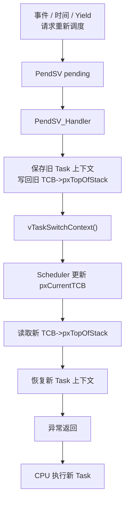
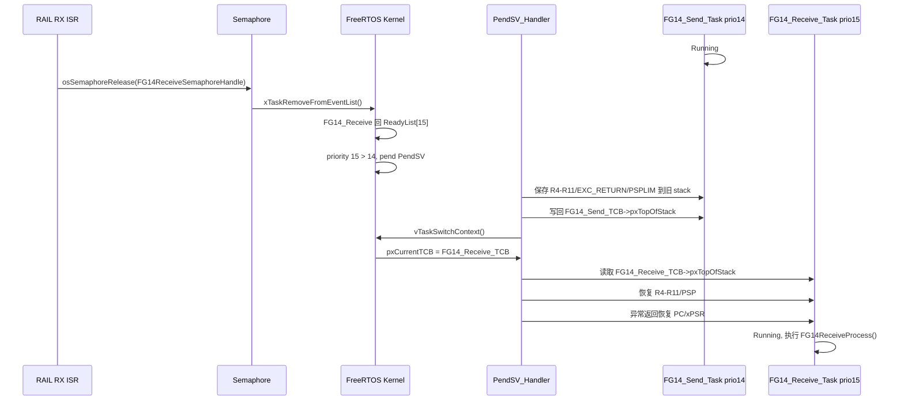
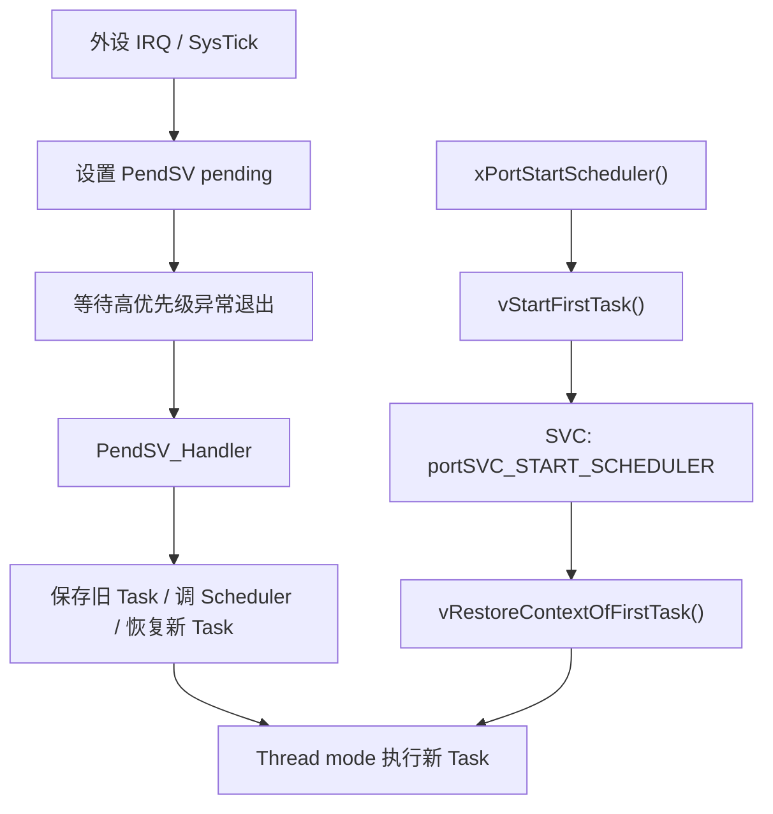
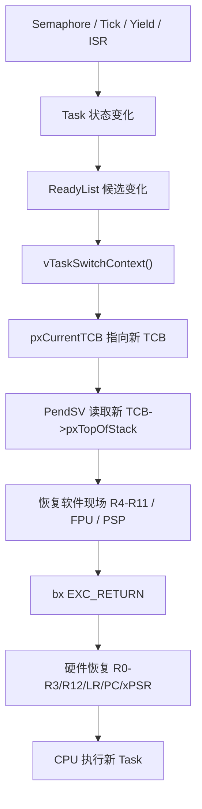

# 005 — FreeRTOS PendSV / Context Switch 内核上下文切换深度分析

> **How pxCurrentTCB Becomes Running Code**  
> Kernel Internal Deep Dive | FreeRTOS 10.4.3 | Cortex-M33 | EFR32FG23 | Gecko SDK 4.1.2

---

## 总览：PendSV 才真正切 CPU

前四篇已经把 Task 从“等待事件”推到了“被调度器选中”：

```text
Semaphore / Tick / Yield / ISR
  -> Task 状态变化
  -> ReadyList 候选变化
  -> Scheduler 更新 pxCurrentTCB
  -> PendSV pending
```

但是到这里为止，CPU 还没有真的切到新 Task。

`pxCurrentTCB` 只是一个内核全局指针。它变了，只代表 Scheduler 说：

```text
下一次应该运行这个 TCB。
```

真正让 CPU 从旧 Task 的栈现场切到新 Task 的栈现场，是 Cortex-M33 port 里的 `PendSV_Handler()`。

本文只研究这一段：

```text
PendSV_Handler
  -> 保存旧 Task 上下文到旧 Task stack
  -> 调用 vTaskSwitchContext()
  -> Scheduler 更新 pxCurrentTCB
  -> 从新 Task stack 恢复上下文
  -> 异常返回到新 Task 的 PC
```



核心结论：

```text
Scheduler 决定“下一个 TCB 是谁”。
PendSV 负责“让 CPU 真正切到这个 TCB 对应的栈现场”。
```

本工程使用的 port 文件是：

```text
gecko_sdk_4.1.2/util/third_party/freertos/kernel/portable/GCC/ARM_CM33_NTZ/non_secure/portasm.c
gecko_sdk_4.1.2/util/third_party/freertos/kernel/portable/GCC/ARM_CM33_NTZ/non_secure/port.c
```

本工程关键配置：

```c
#define configENABLE_FPU                        1
#define configENABLE_MPU                        0
#define configENABLE_TRUSTZONE                  0
#define configRUN_FREERTOS_SECURE_ONLY          1
#define configMAX_SYSCALL_INTERRUPT_PRIORITY    64
#define configKERNEL_INTERRUPT_PRIORITY         255
```

所以后面分析时要注意：

```text
FPU 保存/恢复分支会参与编译。
MPU 分支不会参与编译。
TrustZone secure context 管理分支不会参与编译。
```

---

## 目录

- [§1 前四篇留下的边界](#1-前四篇留下的边界)
- [§2 Cortex-M 异常进入与硬件自动压栈](#2-cortex-m-异常进入与硬件自动压栈)
- [§3 FreeRTOS Task 栈帧模型](#3-freertos-task-栈帧模型)
- [§4 PendSV_Handler 保存当前 Task](#4-pendsv_handler-保存当前-task)
- [§5 PendSV_Handler 调用 Scheduler](#5-pendsv_handler-调用-scheduler)
- [§6 PendSV_Handler 恢复新 Task](#6-pendsv_handler-恢复新-task)
- [§7 第一次启动 Task 与普通上下文切换](#7-第一次启动-task-与普通上下文切换)
- [§8 工程场景：FG14_Send 切到 FG14_Receive](#8-工程场景fg14_send-切到-fg14_receive)
- [§9 PendSV / SysTick / SVC 的优先级关系](#9-pendsv--systick--svc-的优先级关系)
- [§10 总结：从 pxCurrentTCB 到 CPU 执行流](#10-总结从-pxcurrenttcb-到-cpu-执行流)
- [Appendix A：PendSV_Handler 汇编逐行注释](#appendix-apendsv_handler-汇编逐行注释)
- [Appendix B：Cortex-M 异常栈帧图](#appendix-bcortex-m-异常栈帧图)
- [Appendix C：关键寄存器速查表](#appendix-c关键寄存器速查表)
- [Appendix D：首次启动 vs 普通切换对照表](#appendix-d首次启动-vs-普通切换对照表)

---

## §1 前四篇留下的边界

### 1.1 系列文档到这里已经完成的事

这一篇不要重新解释 Semaphore、ReadyList、DelayedList。

前四篇的边界可以压缩成下面这张表：

| 文档 | 已经解决的问题 | 005 如何使用它的结论 |
|---|---|---|
| `001_FreeRTOS_Semaphore_Kernel_Deep_Dive.md` | Semaphore/Queue 如何让 Task 阻塞、唤醒 | 事件会让等待 Task 回 Ready |
| `002_Task_Lifecycle_And_TCB.md` | Task 是 TCB + Stack + ListItem | PendSV 操作的是 TCB 里的 `pxTopOfStack` |
| `003_FreeRTOS_Scheduler_ReadyList_Deep_Dive.md` | Scheduler 如何选最高优先级 Ready TCB | `vTaskSwitchContext()` 返回后，`pxCurrentTCB` 已经指向新 TCB |
| `004_FreeRTOS_Tick_DelayedList_TimeSlicing_Deep_Dive.md` | Tick 如何推进时间，并请求 PendSV | Tick 只是设置 PendSV pending，不直接切 CPU |

因此 005 的入口不是 `osSemaphoreRelease()`，也不是 `xTaskIncrementTick()`。

005 的入口是：

```text
PendSV 已经被 pend 了。
CPU 即将进入 PendSV_Handler。
```

### 1.2 四个动作的职责边界

先把容易混的四件事分开：

| 动作 | 做什么 | 不做什么 |
|---|---|---|
| Tick | 推进 `xTickCount`，发现超时任务或时间片机会 | 不保存/恢复寄存器 |
| Semaphore/Queue | 改变等待任务状态，让 Task 回 Ready | 不直接运行被唤醒 Task |
| Scheduler | 选择下一个 TCB，更新 `pxCurrentTCB` | 不切 PSP，不恢复 PC |
| PendSV | 保存旧上下文，恢复新上下文 | 不决定 ReadyList 算法 |

最重要的一句话：

```text
vTaskSwitchContext() 只改 pxCurrentTCB。
PendSV_Handler 才改 PSP，才让 CPU 回到另一个 Task 的 PC。
```

---

## §2 Cortex-M 异常进入与硬件自动压栈

### 2.1 PendSV 是一个异常处理程序

在 Cortex-M 上，PendSV 不是普通 C 函数。

它是一个异常：

```text
Thread mode Task 正在运行
  -> 内核写 ICSR.PENDSVSET
  -> PendSV 进入 pending
  -> CPU 在合适时机进入 PendSV exception
  -> 执行 PendSV_Handler()
```

本工程中请求 PendSV 的典型代码有两类。

主动 yield：

```c
// port.c
void vPortYield( void )
{
    portNVIC_INT_CTRL_REG = portNVIC_PENDSVSET_BIT;

    __asm volatile ( "dsb" ::: "memory" );
    __asm volatile ( "isb" );
}
```

Tick 发现需要切换：

```c
// port.c
void SysTick_Handler( void )
{
    uint32_t ulPreviousMask;

    ulPreviousMask = portSET_INTERRUPT_MASK_FROM_ISR();
    {
        if( xTaskIncrementTick() != pdFALSE )
        {
            portNVIC_INT_CTRL_REG = portNVIC_PENDSVSET_BIT;
        }
    }
    portCLEAR_INTERRUPT_MASK_FROM_ISR( ulPreviousMask );
}
```

这里仍然只是 pending。

`portNVIC_INT_CTRL_REG = portNVIC_PENDSVSET_BIT` 的意思不是“马上切 Task”，而是：

```text
请 CPU 在异常优先级允许时进入 PendSV_Handler。
```

### 2.2 硬件自动保存的寄存器

Cortex-M 进入异常时，会自动把一部分寄存器压到当前 Thread mode 使用的栈上。

如果当前 Task 使用 PSP，那么硬件自动压到 PSP 对应的 Task stack：

```text
R0
R1
R2
R3
R12
LR
PC
xPSR
```

栈向低地址增长，异常进入后可以理解为：

```text
高地址
  xPSR
  PC
  LR
  R12
  R3
  R2
  R1
  R0
低地址 <- PSP after exception entry
```

这部分是硬件做的。

PendSV_Handler 进来时，R0-R3、R12、LR、PC、xPSR 已经在当前 Task 的栈里了。

### 2.3 为什么 FreeRTOS 还要保存 R4-R11

硬件没有自动保存所有通用寄存器。

`R4-R11` 属于软件必须保存的 callee-saved 寄存器。FreeRTOS 如果不保存它们，旧 Task 下次恢复时，局部变量、循环状态、函数调用现场都可能被新 Task 覆盖。

所以 PendSV 的保存动作分成两层：

```text
硬件自动保存：
  R0-R3, R12, LR, PC, xPSR

FreeRTOS 软件保存：
  R4-R11
  EXC_RETURN
  PSPLIM
  FPU s16-s31（如果该 Task 用过 FPU）
```

本工程 `configENABLE_FPU = 1`，所以 PendSV 还会检查 `EXC_RETURN` 的 bit[4]。如果 bit[4] 表示当前 Task 用到了 FPU 扩展现场，就额外保存/恢复 `s16-s31`。

### 2.4 MSP 与 PSP

Cortex-M 有两个常见栈指针：

| 栈指针 | 用途 |
|---|---|
| `MSP` | Main Stack Pointer，异常处理程序通常使用 |
| `PSP` | Process Stack Pointer，Thread mode 下的 Task 使用 |

FreeRTOS 的设计是：

```text
每个 Task 有自己的 PSP 和自己的 Task stack。
异常处理程序用 MSP。
PendSV_Handler 运行在异常上下文里，但它读写的是当前 Task 的 PSP。
```

这就是为什么 PendSV 第一条关键指令是：

```asm
mrs r0, psp
```

它不是读 MSP。

它要拿到的是“刚刚被打断的那个 Task 的任务栈顶”。

---

## §3 FreeRTOS Task 栈帧模型

### 3.1 TCB 的第一个字段必须是 pxTopOfStack

002 已经讲过 TCB，这里只拿 PendSV 需要的字段：

```c
// tasks.c
typedef struct tskTaskControlBlock
{
    volatile StackType_t * pxTopOfStack;

    ListItem_t xStateListItem;
    ListItem_t xEventListItem;
    UBaseType_t uxPriority;
    StackType_t * pxStack;
    char pcTaskName[ configMAX_TASK_NAME_LEN ];
} tskTCB;
```

注意源码注释要求：

```text
pxTopOfStack MUST BE THE FIRST MEMBER OF THE TCB STRUCT.
```

原因就在 portasm.c：

```asm
ldr r1, [r2]    ; r1 = pxCurrentTCB
ldr r0, [r1]    ; r0 = pxCurrentTCB->pxTopOfStack
```

汇编没有写 C 结构体偏移。

它默认：

```text
TCB 地址 + 0 = pxTopOfStack
```

如果 `pxTopOfStack` 不是 TCB 第一个字段，PendSV 会把错误字段当成栈顶，后面 `ldmia/stmdb` 就会直接破坏内存。

### 3.2 pxStack 与 pxTopOfStack 的区别

`pxStack` 和 `pxTopOfStack` 很容易混。

| 字段 | 含义 | 是否频繁变化 |
|---|---|---|
| `pxStack` | 这块 Task stack RAM 的起始位置，用于释放内存、栈检查 | 基本不变 |
| `pxTopOfStack` | 当前上下文保存到哪里，下次从哪里恢复 | 每次上下文切换都会变 |

用图表示：

```text
TCB_t
  pxStack       -> Task stack 起始地址
  pxTopOfStack  -> 当前保存现场的栈顶

Task stack
  [ 栈底 / 起始地址 ]
  ...
  [ 已保存的 R4-R11 / EXC_RETURN / 硬件异常栈帧 ]
  ^
  pxTopOfStack
```

PendSV 真正依赖的是 `pxTopOfStack`。

`pxStack` 更像这块内存的“户口本地址”，不是每次切换用来恢复寄存器的入口。

### 3.3 pxPortInitialiseStack() 伪造第一次运行现场

普通上下文切换时，Task 的栈帧来自上一次 PendSV 保存。

但新 Task 第一次运行时，还没有被打断过，也就没有真实现场。

FreeRTOS 的做法是：在创建 Task 时，提前在 Task stack 里伪造一个“像异常返回现场一样”的栈帧。

本工程 port 里：

```c
// port.c
StackType_t * pxPortInitialiseStack( StackType_t * pxTopOfStack,
                                     StackType_t * pxEndOfStack,
                                     TaskFunction_t pxCode,
                                     void * pvParameters )
{
    pxTopOfStack--;
    *pxTopOfStack = portINITIAL_XPSR;                        /* xPSR */
    pxTopOfStack--;
    *pxTopOfStack = ( StackType_t ) pxCode;                  /* PC */
    pxTopOfStack--;
    *pxTopOfStack = ( StackType_t ) portTASK_RETURN_ADDRESS; /* LR */
    pxTopOfStack--;
    *pxTopOfStack = ( StackType_t ) 0x12121212UL;            /* R12 */
    pxTopOfStack--;
    *pxTopOfStack = ( StackType_t ) 0x03030303UL;            /* R3 */
    pxTopOfStack--;
    *pxTopOfStack = ( StackType_t ) 0x02020202UL;            /* R2 */
    pxTopOfStack--;
    *pxTopOfStack = ( StackType_t ) 0x01010101UL;            /* R1 */
    pxTopOfStack--;
    *pxTopOfStack = ( StackType_t ) pvParameters;            /* R0 */
    ...
    *pxTopOfStack = portINITIAL_EXC_RETURN;                  /* EXC_RETURN */
    ...
    *pxTopOfStack = ( StackType_t ) pxEndOfStack;            /* PSPLIM */

    return pxTopOfStack;
}
```

对 `FG14_Receive_Task` 来说，伪造出来的关键值是：

```text
PC = FG14_Receive_Task
R0 = pvParameters = NULL
xPSR = portINITIAL_XPSR
EXC_RETURN = portINITIAL_EXC_RETURN
```

所以第一次恢复这个 Task 时，CPU 会像“从异常返回”一样跳到：

```c
FG14_Receive_Task(NULL)
```

这不是 FreeRTOS 手动调用 `FG14_Receive_Task()`。

它是通过伪造栈帧，让异常返回机制把 PC 恢复成 Task 入口函数。

---

## §4 PendSV_Handler 保存当前 Task

### 4.1 进入 PendSV 前，硬件已经压了一半现场

假设当前正在运行：

```text
FG14_Send_Task
```

此时发生 RAIL RX，内核最终请求 PendSV。

CPU 进入 PendSV 时，硬件已经把这几个寄存器压入 `FG14_Send_Task` 的 PSP 栈：

```text
R0, R1, R2, R3, R12, LR, PC, xPSR
```

PendSV_Handler 要补上软件部分。

### 4.2 本工程 PendSV 保存路径

实际源码：

```asm
// portasm.c
mrs r0, psp

#if ( configENABLE_FPU == 1 )
    tst lr, #0x10
    it eq
    vstmdbeq r0!, {s16-s31}
#endif

#if ( configENABLE_MPU == 1 )
    mrs r1, psplim
    mrs r2, control
    mov r3, lr
    stmdb r0!, {r1-r11}
#else
    mrs r2, psplim
    mov r3, lr
    stmdb r0!, {r2-r11}
#endif

ldr r2, pxCurrentTCBConst
ldr r1, [r2]
str r0, [r1]
```

本工程 `configENABLE_MPU = 0`，所以实际保存主线是：

```text
mrs r0, psp
  -> r0 = 当前 Task 的 PSP

tst lr, #0x10
vstmdbeq r0!, {s16-s31}
  -> 如果当前 Task 用过 FPU，保存 s16-s31

mrs r2, psplim
  -> r2 = 当前 Task 的 PSPLIM

mov r3, lr
  -> r3 = EXC_RETURN

stmdb r0!, {r2-r11}
  -> 把 PSPLIM、EXC_RETURN、R4-R11 压入当前 Task stack

ldr r2, pxCurrentTCBConst
ldr r1, [r2]
str r0, [r1]
  -> pxCurrentTCB->pxTopOfStack = r0
```

保存完成后，旧 Task 的状态是：

```text
FG14_Send_TCB
  pxTopOfStack -> FG14_Send_Task stack 中刚保存好的上下文
```

也就是说，旧 Task 下次再被选中时，PendSV 可以从这个 `pxTopOfStack` 开始恢复。

### 4.3 此时保存了什么

保存完成后，一个普通非 MPU Task 的栈大致是：

```text
高地址
  xPSR              <- 硬件异常进入保存
  PC
  LR
  R12
  R3
  R2
  R1
  R0
  s16-s31           <- 如果使用 FPU，软件保存
  R11
  R10
  R9
  R8
  R7
  R6
  R5
  R4
  EXC_RETURN        <- r3
  PSPLIM            <- r2
低地址 <- pxTopOfStack
```

这里有一个很关键的点：

```text
旧 Task 的上下文不是保存在某个全局数组里。
它就保存在旧 Task 自己的 Task stack 里。
```

`TCB->pxTopOfStack` 只是记录入口地址。

---

## §5 PendSV_Handler 调用 Scheduler

### 5.1 保存旧现场后，才允许换 pxCurrentTCB

PendSV 保存旧 Task 栈顶后，进入调度选择：

```asm
mov r0, %0
msr basepri, r0
dsb
isb
bl vTaskSwitchContext
mov r0, #0
msr basepri, r0
```

这里 `%0` 是：

```c
configMAX_SYSCALL_INTERRUPT_PRIORITY
```

本工程配置为：

```c
#define configMAX_SYSCALL_INTERRUPT_PRIORITY    64
```

所以这一段的意义是：

```text
用 BASEPRI 屏蔽会调用 FreeRTOS API 的中断等级
  -> 防止调度器正在改 pxCurrentTCB/ReadyList 时被同类内核操作打断
调用 vTaskSwitchContext()
  -> 选择下一个 TCB
清 BASEPRI
  -> 恢复可屏蔽中断
```

这里只先讲 BASEPRI 的作用，具体中断优先级和 FromISR API 边界留给 006。

### 5.2 vTaskSwitchContext() 只更新 pxCurrentTCB

`vTaskSwitchContext()` 在 `tasks.c`：

```c
void vTaskSwitchContext( void )
{
    if( uxSchedulerSuspended != ( UBaseType_t ) pdFALSE )
    {
        xYieldPending = pdTRUE;
    }
    else
    {
        xYieldPending = pdFALSE;
        traceTASK_SWITCHED_OUT();

        taskCHECK_FOR_STACK_OVERFLOW();

        taskSELECT_HIGHEST_PRIORITY_TASK();

        traceTASK_SWITCHED_IN();
    }
}
```

003 已经展开过 `taskSELECT_HIGHEST_PRIORITY_TASK()` 如何扫描 ReadyList。

005 只关心它返回后的结果：

```text
pxCurrentTCB 已经从旧 TCB 变成新 TCB。
```

例如：

```text
PendSV 进入时：
  pxCurrentTCB = &FG14_Send_TCB

vTaskSwitchContext() 返回后：
  pxCurrentTCB = &FG14_Receive_TCB
```

注意，到这里 CPU 仍然还在 PendSV_Handler 里。

它只是改变了一个全局指针，还没有恢复 `FG14_Receive_Task` 的寄存器。

---

## §6 PendSV_Handler 恢复新 Task

### 6.1 从新的 pxCurrentTCB 读取新栈顶

调度器返回后，PendSV 继续执行：

```asm
ldr r2, pxCurrentTCBConst
ldr r1, [r2]
ldr r0, [r1]
```

含义是：

```text
r2 = &pxCurrentTCB
r1 = pxCurrentTCB
r0 = pxCurrentTCB->pxTopOfStack
```

如果 Scheduler 选中了 `FG14_Receive_Task`，那么此时：

```text
r1 = &FG14_Receive_TCB
r0 = FG14_Receive_TCB->pxTopOfStack
```

### 6.2 恢复软件保存的寄存器

实际恢复路径：

```asm
#if ( configENABLE_MPU == 1 )
    ldmia r0!, {r1-r11}
#else
    ldmia r0!, {r2-r11}
#endif

#if ( configENABLE_FPU == 1 )
    tst r3, #0x10
    it eq
    vldmiaeq r0!, {s16-s31}
#endif

#if ( configENABLE_MPU == 1 )
    msr psplim, r1
    msr control, r2
#else
    msr psplim, r2
#endif

msr psp, r0
bx r3
```

本工程 `configENABLE_MPU = 0`，所以关键路径是：

```text
ldmia r0!, {r2-r11}
  -> r2 = PSPLIM
  -> r3 = EXC_RETURN
  -> r4-r11 = 新 Task 上次保存的软件寄存器

tst r3, #0x10
vldmiaeq r0!, {s16-s31}
  -> 如果新 Task 用过 FPU，恢复 s16-s31

msr psplim, r2
  -> 恢复新 Task 的栈下限

msr psp, r0
  -> PSP 指向新 Task 的硬件异常栈帧

bx r3
  -> 按 EXC_RETURN 进行异常返回
```

### 6.3 bx r3 后，硬件继续恢复

`bx r3` 不是普通函数返回。

`r3` 里放的是 `EXC_RETURN`。

Cortex-M 看到这个特殊返回值后，会执行异常返回流程，从 PSP 中自动恢复：

```text
R0
R1
R2
R3
R12
LR
PC
xPSR
```

于是 CPU 的 PC 被恢复成新 Task 的 PC。

如果新 Task 之前被打断过：

```text
PC = 它上次被打断时的下一条指令
```

如果新 Task 是第一次运行：

```text
PC = pxPortInitialiseStack() 伪造的 Task 入口函数
```

这就是 `pxCurrentTCB` 如何变成真正运行代码的过程。

---

## §7 第一次启动 Task 与普通上下文切换

### 7.1 xPortStartScheduler() 启动第一轮调度

本工程从应用层启动 RTOS 的路径是：

```text
main()
  -> sl_system_init()
  -> app_init()
      -> MX_FREERTOS_Init()
          -> osThreadNew(...)
  -> sl_system_kernel_start()
      -> osKernelStart()
          -> vTaskStartScheduler()
              -> xPortStartScheduler()
```

Cortex-M33 port 中：

```c
// port.c
BaseType_t xPortStartScheduler( void )
{
    portNVIC_SHPR3_REG |= portNVIC_PENDSV_PRI;
    portNVIC_SHPR3_REG |= portNVIC_SYSTICK_PRI;

    vPortSetupTimerInterrupt();

    ulCriticalNesting = 0;

    vStartFirstTask();

    vTaskSwitchContext();
    prvTaskExitError();

    return 0;
}
```

这里的重点是：

```text
调度器启动前，Task 已经创建完，pxCurrentTCB 已经指向最高优先级 Ready Task。
xPortStartScheduler() 配好 PendSV/SysTick 优先级和 Tick 后，调用 vStartFirstTask()。
```

### 7.2 vStartFirstTask() 用 SVC 进入第一次恢复

`vStartFirstTask()` 在 `portasm.c`：

```asm
ldr r0, xVTORConst
ldr r0, [r0]
ldr r0, [r0]
msr msp, r0
cpsie i
cpsie f
dsb
isb
svc %0
nop
```

它做两件事：

```text
1. 从向量表取初始 MSP，恢复异常栈环境。
2. 触发 SVC，进入 vPortSVCHandler_C()。
```

SVC 的 C 处理函数遇到 `portSVC_START_SCHEDULER` 后：

```c
case portSVC_START_SCHEDULER:
    #if ( configENABLE_FPU == 1 )
    {
        prvSetupFPU();
    }
    #endif

    vRestoreContextOfFirstTask();
    break;
```

本工程 `configENABLE_FPU = 1`，所以首次启动前会启用 FPU，并开启 FPCCR 的自动/懒保存机制。

### 7.3 vRestoreContextOfFirstTask() 从伪造栈帧进入 Task

第一次启动没有旧 Task，也就不需要保存旧上下文。

它只需要从当前 `pxCurrentTCB` 恢复第一个 Task：

```asm
ldr  r2, pxCurrentTCBConst2
ldr  r1, [r2]
ldr  r0, [r1]

ldm  r0!, {r1-r2}
msr  psplim, r1
movs r1, #2
msr  CONTROL, r1
adds r0, #32
msr  psp, r0
isb
mov  r0, #0
msr  basepri, r0
bx   r2
```

本工程 `configENABLE_MPU = 0`，所以这条路径的含义是：

```text
ldr r0, [pxCurrentTCB]
  -> r0 = 第一个 Task 的 pxTopOfStack

ldm r0!, {r1-r2}
  -> r1 = PSPLIM
  -> r2 = EXC_RETURN

msr CONTROL, #2
  -> Thread mode 使用 PSP

adds r0, #32
  -> 跳过伪造的 R4-R11 区域

msr psp, r0
  -> PSP 指向伪造的硬件异常栈帧

bx r2
  -> 异常返回，硬件恢复 R0-R3/R12/LR/PC/xPSR
```

因为 `pxPortInitialiseStack()` 已经把 PC 写成 Task 入口，所以异常返回后，CPU 开始执行第一个 Task。

### 7.4 首次启动与普通切换的差异

| 场景 | 栈帧来源 | `pxTopOfStack` 来源 | PC 从哪里来 |
|---|---|---|---|
| 第一次启动 Task | `pxPortInitialiseStack()` 伪造 | Task 创建时写入 TCB | Task entry function |
| 普通上下文切换 | 上一次 PendSV 保存 | PendSV 保存时写回 TCB | 被打断/阻塞前的现场 |

统一点是：

```text
最后都靠异常返回恢复 PC。
```

不同点是：

```text
第一次恢复的现场是伪造的。
普通切换恢复的现场是真实保存过的。
```

---

## §8 工程场景：FG14_Send 切到 FG14_Receive

### 8.1 工程任务优先级

本工程主要 Task：

| Task | Priority | 说明 |
|---|---:|---|
| Timer Service Task | 40 | FreeRTOS 软件定时器服务任务 |
| `FG14_Receive_Task` | 15 | 处理基站下行 RF 数据 |
| `FG14_Send_Task` | 14 | 发送 BLE 数据/心跳 |
| `BG22_Receive_Task` | 13 | SPI 读取 CH592 数据 |
| `apploader_Task` | 12 | OTA 升级，通常挂起 |
| Idle Task | 0 | 兜底任务 |

下面构造 `FG14_Send_Task -> FG14_Receive_Task` 的切换场景，默认 Timer Service Task 当前阻塞在 timer command queue 上，否则优先级 40 的 Timer Service Task 会先被 Scheduler 选中。

### 8.2 业务触发链路

工程代码中，`FG14_Receive_Task` 等待信号量：

```c
// FreeRTOSEntry.c
void FG14_Receive_Task(void *argument)
{
  for(;;)
  {
    if(osOK == osSemaphoreAcquire(FG14ReceiveSemaphoreHandle, portMAX_DELAY))
    {
      FG14ReceiveProcess();
    }
  }
}
```

RAIL 收包后：

```c
// app_process.c
void sl_rail_util_on_event(RAIL_Handle_t rail_handle, RAIL_Events_t events)
{
    if ( events & RAIL_EVENTS_RX_COMPLETION ) {
        if (events & RAIL_EVENT_RX_PACKET_RECEIVED) {
            RAIL_RxPacketHandle = RAIL_HoldRxPacket(rail_handle);
            if(RAIL_RX_PACKET_HANDLE_INVALID != RAIL_RxPacketHandle) {
                packet_recieved = true;
                if(apploader_flag != true) {
                    app_process_action(rail_handle);
                }
            }
        }
    }
}
```

`app_process_action()` 释放信号量：

```c
// app_process.c
case S_PACKET_RECEIVED:
  if(System_Init_Finished_Flag==1)
  {
      stat = osSemaphoreRelease(FG14ReceiveSemaphoreHandle);
      uint8_t coun = osSemaphoreGetCount(FG14ReceiveSemaphoreHandle);
  }
  state = S_IDLE;
  break;
```

前面 001/003 已经讲过：这个 release 最终会让等待信号量的 `FG14_Receive_Task` 回到 `ReadyList[15]`。

### 8.3 PendSV 切换全过程

现在假设：

```text
当前 Running = FG14_Send_Task priority 14
RAIL RX 唤醒 FG14_Receive_Task priority 15
```

内核路径变成：

```text
RAIL RX
  -> osSemaphoreRelease(FG14ReceiveSemaphoreHandle)
  -> xTaskRemoveFromEventList()
  -> FG14_Receive_Task 回 ReadyList[15]
  -> 15 > 当前 14
  -> 请求 PendSV
```

随后进入本文的主角：

```text
PendSV_Handler
  -> 保存 FG14_Send_Task 的 PSP 现场
  -> FG14_Send_TCB->pxTopOfStack = 保存后的栈顶
  -> vTaskSwitchContext()
  -> pxCurrentTCB = FG14_Receive_TCB
  -> 读取 FG14_Receive_TCB->pxTopOfStack
  -> 恢复 FG14_Receive_Task 的 PSP 现场
  -> 异常返回
  -> CPU 执行 FG14_Receive_Task
```



这个场景里，`osSemaphoreRelease()` 没有直接调用 `FG14ReceiveProcess()`。

真正的 CPU 路径是：

```text
信号量唤醒 Task
  -> Scheduler 选 TCB
  -> PendSV 切栈
  -> 异常返回到 Task
  -> Task 自己继续执行
```

---

## §9 PendSV / SysTick / SVC 的优先级关系

### 9.1 为什么 PendSV 要低优先级

PendSV 的设计目的就是“延后切换”。

外设 ISR 或 SysTick ISR 里通常只做：

```text
发现需要切换
  -> 设置 PendSV pending
  -> 退出 ISR
```

等所有更高优先级的中断处理完，CPU 再进入 PendSV。

这样设计的好处是：

```text
上下文切换集中在一个地方：PendSV_Handler。
外设 ISR 不需要直接保存/恢复 Task 上下文。
高优先级 ISR 不会被低优先级的上下文切换过程打断。
```

### 9.2 本 port 如何设置 PendSV / SysTick

`xPortStartScheduler()` 中：

```c
// port.c
portNVIC_SHPR3_REG |= portNVIC_PENDSV_PRI;
portNVIC_SHPR3_REG |= portNVIC_SYSTICK_PRI;
```

相关宏：

```c
#define portMIN_INTERRUPT_PRIORITY    ( 255UL )
#define portNVIC_PENDSV_PRI           ( portMIN_INTERRUPT_PRIORITY << 16UL )
#define portNVIC_SYSTICK_PRI          ( portMIN_INTERRUPT_PRIORITY << 24UL )
```

本工程配置：

```c
#define configKERNEL_INTERRUPT_PRIORITY    255
```

所以可以建立这个运行模型：

```text
外设 IRQ / SysTick
  -> 可以请求 PendSV
  -> PendSV 在较低优先级位置统一完成 Task 切换
  -> 返回 Thread mode Task
```

不要把这个理解成“SysTick 自己切 Task”。

SysTick 只是可能 pend PendSV。

### 9.3 SVC 在第一次启动中出现

SVC 在本文主要出现在第一次启动 Task：

```text
xPortStartScheduler()
  -> vStartFirstTask()
      -> svc portSVC_START_SCHEDULER
          -> vPortSVCHandler_C()
              -> vRestoreContextOfFirstTask()
```

普通运行中的 Task 切换主角是 PendSV。

SVC 不是本文的普通切换入口。



---

## §10 总结：从 pxCurrentTCB 到 CPU 执行流

把 001 到 005 串起来，完整链路是：

```text
事件 / 时间发生
  -> Task 状态变化
  -> ReadyList 候选变化
  -> Scheduler 更新 pxCurrentTCB
  -> PendSV 保存旧 Task PSP
  -> PendSV 调 vTaskSwitchContext()
  -> PendSV 读取新 Task pxTopOfStack
  -> PendSV 恢复新 Task PSP
  -> 异常返回恢复 R0-R3/R12/LR/PC/xPSR
  -> CPU 真正执行新 Task
```



最终三个核心点：

```text
pxCurrentTCB 是 Scheduler 的输出。
pxTopOfStack 是 PendSV 保存/恢复上下文的入口。
PendSV 是 FreeRTOS 在 Cortex-M 上完成 Task 切换的硬件边界。
```

对本工程来说，理解 PendSV 后，`FG14_Send_Task` 为什么会被 `FG14_Receive_Task` 抢占就不再只是“优先级更高”这句 API 解释，而是：

```text
FG14_Receive_TCB 被 Scheduler 选中
  -> pxCurrentTCB 指向 FG14_Receive_TCB
  -> PendSV 从 FG14_Receive_TCB->pxTopOfStack 恢复 PSP
  -> 异常返回恢复 PC
  -> CPU 进入 FG14_Receive_Task
```

下一篇可以继续往外扩一圈：

```text
006 Interrupt Priority / BASEPRI / FromISR API
  -> 哪些中断能调用 FreeRTOS API
  -> 为什么 ISR 里不能乱用普通 API
  -> configMAX_SYSCALL_INTERRUPT_PRIORITY 到底保护了什么

007 Queue / Message Queue
008 Mutex / Priority Inheritance
```

---

## Appendix A：PendSV_Handler 汇编逐行注释

本附录只按本工程主要编译路径解释：

```text
configENABLE_FPU = 1
configENABLE_MPU = 0
configENABLE_TRUSTZONE = 0
```

实际源码仍包含 MPU/TrustZone 条件分支，但本工程不会编译这些分支。

```asm
PendSV_Handler:

    mrs r0, psp
```

读取当前 Task 的 PSP。

此时硬件已经把 `R0-R3/R12/LR/PC/xPSR` 压到当前 Task stack，`r0` 指向硬件栈帧低地址。

```asm
    tst lr, #0x10
    it eq
    vstmdbeq r0!, {s16-s31}
```

本工程启用了 FPU。

`lr` 此时不是普通返回地址，而是 `EXC_RETURN`。bit[4] 用来判断是否存在扩展浮点上下文。

如果当前 Task 用过 FPU，则把硬件不会自动保存的软件浮点寄存器 `s16-s31` 压入 Task stack。

```asm
    mrs r2, psplim
```

读取当前 Task 的 PSP limit。

Cortex-M33 有 `PSPLIM`，用于限制 PSP 栈边界。

```asm
    mov r3, lr
```

把 `EXC_RETURN` 保存到 `r3`。

后面切换到新 Task 后，需要用新 Task 栈里保存的 `EXC_RETURN` 执行异常返回。

```asm
    stmdb r0!, {r2-r11}
```

把这些值压入当前 Task stack：

```text
r2 = PSPLIM
r3 = EXC_RETURN
r4-r11 = 软件保存寄存器
```

`stmdb r0!` 表示栈向低地址增长，并更新 `r0` 为新的栈顶。

```asm
    ldr r2, pxCurrentTCBConst
    ldr r1, [r2]
    str r0, [r1]
```

保存旧 Task 的新栈顶：

```text
r2 = &pxCurrentTCB
r1 = pxCurrentTCB = 当前旧 Task TCB
旧 TCB->pxTopOfStack = r0
```

此时旧 Task 的完整现场已经保存完。

```asm
    mov r0, %0
    msr basepri, r0
    dsb
    isb
```

进入 FreeRTOS 内核临界区。

`%0` 是 `configMAX_SYSCALL_INTERRUPT_PRIORITY`，本工程为 64。

```asm
    bl vTaskSwitchContext
```

调用 Scheduler。

返回后：

```text
pxCurrentTCB 已经指向新 Task TCB。
```

```asm
    mov r0, #0
    msr basepri, r0
```

清 BASEPRI，允许被屏蔽的中断再次进入。

```asm
    ldr r2, pxCurrentTCBConst
    ldr r1, [r2]
    ldr r0, [r1]
```

读取新 Task 的栈顶：

```text
r2 = &pxCurrentTCB
r1 = 新 Task TCB
r0 = 新 Task TCB->pxTopOfStack
```

```asm
    ldmia r0!, {r2-r11}
```

从新 Task stack 恢复：

```text
r2 = 新 Task PSPLIM
r3 = 新 Task EXC_RETURN
r4-r11 = 新 Task 软件寄存器
```

`ldmia r0!` 表示从低地址向高地址弹出，并更新 `r0`。

```asm
    tst r3, #0x10
    it eq
    vldmiaeq r0!, {s16-s31}
```

如果新 Task 上次保存过 FPU 扩展现场，则恢复 `s16-s31`。

```asm
    msr psplim, r2
```

恢复新 Task 的 PSP limit。

```asm
    msr psp, r0
```

设置 PSP。

此时 PSP 指向新 Task 的硬件异常栈帧，也就是 `R0-R3/R12/LR/PC/xPSR` 那一层。

```asm
    bx r3
```

按新 Task 的 `EXC_RETURN` 执行异常返回。

Cortex-M 硬件接管，从 PSP 自动弹出：

```text
R0, R1, R2, R3, R12, LR, PC, xPSR
```

然后 CPU 进入新 Task 的 PC。

---

## Appendix B：Cortex-M 异常栈帧图

### B.1 异常进入后硬件栈帧

```text
高地址
  xPSR
  PC
  LR
  R12
  R3
  R2
  R1
  R0
低地址 <- PSP after exception entry
```

### B.2 FreeRTOS PendSV 保存后的完整栈帧

本工程主要路径：

```text
高地址
  xPSR                  硬件保存
  PC                    硬件保存
  LR                    硬件保存
  R12                   硬件保存
  R3                    硬件保存
  R2                    硬件保存
  R1                    硬件保存
  R0                    硬件保存
  s16-s31               FPU 使用时软件保存
  R11                   软件保存
  R10                   软件保存
  R9                    软件保存
  R8                    软件保存
  R7                    软件保存
  R6                    软件保存
  R5                    软件保存
  R4                    软件保存
  EXC_RETURN            软件保存
  PSPLIM                软件保存
低地址 <- TCB->pxTopOfStack
```

### B.3 第一次启动时的伪造栈帧

`pxPortInitialiseStack()` 提前构造：

```text
高地址
  xPSR                  portINITIAL_XPSR
  PC                    Task entry function
  LR                    prvTaskExitError / portTASK_RETURN_ADDRESS
  R12                   0x12121212
  R3                    0x03030303
  R2                    0x02020202
  R1                    0x01010101
  R0                    pvParameters
  R11                   0x11111111
  R10                   0x10101010
  R9                    0x09090909
  R8                    0x08080808
  R7                    0x07070707
  R6                    0x06060606
  R5                    0x05050505
  R4                    0x04040404
  EXC_RETURN            portINITIAL_EXC_RETURN
  PSPLIM                pxEndOfStack
低地址 <- 初始 pxTopOfStack
```

本工程 `configRUN_FREERTOS_SECURE_ONLY = 1`，因此 `portINITIAL_EXC_RETURN` 走：

```c
#define portINITIAL_EXC_RETURN    ( 0xfffffffd )
```

同时 `configENABLE_TRUSTZONE = 0`，所以不会额外保存 secure context handle。

---

## Appendix C：关键寄存器速查表

| 寄存器 | 在本文中的作用 |
|---|---|
| `PSP` | 当前 Task 使用的栈指针，PendSV 通过它保存/恢复 Task 上下文 |
| `MSP` | 异常处理使用的主栈指针，`vStartFirstTask()` 会从向量表恢复 MSP |
| `LR / EXC_RETURN` | 控制异常返回行为，决定返回 Thread mode、使用 PSP、是否有 FPU 扩展现场 |
| `BASEPRI` | FreeRTOS 临界区屏蔽中断的核心寄存器，本工程 PendSV 调 Scheduler 前设置为 64 |
| `CONTROL` | 控制 Thread mode 使用 MSP/PSP；首次启动时写 `CONTROL = 2` 让 Task 使用 PSP |
| `PSPLIM` | Cortex-M33 PSP 栈下限寄存器，本 port 会随 Task 保存/恢复 |
| `xPSR` | 程序状态寄存器，异常返回时硬件自动恢复 |
| `PC` | 异常返回后继续执行的位置；首次启动时来自 Task entry function |
| `R4-R11` | 硬件不自动保存，FreeRTOS 在 PendSV 中软件保存/恢复 |
| `s16-s31` | FPU 扩展寄存器；本工程启用 FPU，Task 使用 FPU 时 PendSV 软件保存/恢复 |

---

## Appendix D：首次启动 vs 普通切换对照表

| 对比项 | 第一次启动 Task | 普通上下文切换 |
|---|---|---|
| 是否有旧 Task | 没有 | 有 |
| 是否保存旧上下文 | 不需要 | 需要，PendSV 保存旧 Task |
| 入口函数 | `vStartFirstTask()` -> SVC -> `vRestoreContextOfFirstTask()` | `PendSV_Handler()` |
| 栈帧来源 | `pxPortInitialiseStack()` 伪造 | 上一次 PendSV 保存 |
| `pxCurrentTCB` 来源 | 调度器启动前已指向最高优先级 Ready Task | `vTaskSwitchContext()` 重新选择 |
| `pxTopOfStack` 作用 | 指向伪造栈帧 | 指向真实保存栈帧 |
| PC 来源 | Task 创建时写入的入口函数 | Task 被打断时硬件保存的 PC |
| 最后动作 | `bx EXC_RETURN`，硬件恢复伪造现场 | `bx EXC_RETURN`，硬件恢复真实现场 |

最终可以把 PendSV 理解成 FreeRTOS 在 Cortex-M 上的“切栈机器”：

```text
旧 TCB->pxTopOfStack 负责存档。
新 TCB->pxTopOfStack 负责恢复。
pxCurrentTCB 决定这次从哪个 TCB 恢复。
```

